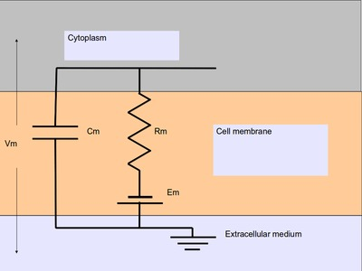

***********************************************
Getting started with python scripting for MOOSE
***********************************************

.. :Author: Subhasis Ray
.. :Date:   December 12, 2012, 
.. :Last-Updated: Jan 21, 2016
.. :By:	    Harsha Rani
		  
.. _quickstart-intro:

Introduction
============

This document describes how to use the ``moose`` module in Python
scripts or in an interactive Python shell. It aims to give you enough
overview to help you start scripting using MOOSE and extract farther
information that may be required for advanced work. Knowledge of
Python or programming in general will be helpful. If you just want to
simulate existing models in one of the supported formats, you can fire
the MOOSE GUI and locate the model file using the ``File`` menu and
load it. The GUI is described in separate document. If you
are looking for recipes for specific tasks, take a look at
:doc:`moose_cookbook`. The example code in the boxes can be entered in
a Python shell.

.. _quickstart-importing:

Importing MOOSE and accessing built-in documentation
====================================================

In a python script you import modules to access the functionalities they
provide. ::

        >>> import moose

This makes the ``moose`` module available for use in Python. You can use
Python's built-in ``help`` function to read the top-level documentation
for the moose module ::

        >>> help(moose)

This will give you an overview of the module. Press ``q`` to exit the
pager and get back to the interpreter. You can also access the
documentation for individual classes and functions this way. ::

        >>> help(moose.connect)

To list the available functions and classes you can use ``dir``
function [1]_. ::

        >>> dir(moose)

MOOSE has built-in documentation in the C++-source-code independent of
Python. The ``moose`` module has a separate ``doc`` function to extract
this documentation. ::

        >>> moose.doc(moose.Compartment)

The class level documentation will show whatever the author/maintainer
of the class wrote for documentation followed by a list of various kinds
of fields and their data types. This can be very useful in an
interactive session.

Each field can have its own detailed documentation, too. ::

        >>> moose.doc('Compartment.Rm')

Note that you need to put the class-name followed by dot followed by
field-name within quotes. Otherwise, ``moose.doc`` will receive the
field value as parameter and get confused.

.. _quickstart-creating:
Creating objects and traversing the object hierarchy
----------------------------------------------------

Different types of biological entities like neurons, enzymes, etc are
represented by classes and individual instances of those types are
objects of those classes. Objects are the building-blocks of models in
MOOSE. We call MOOSE objects ``element`` and use object and element
interchangeably in the context of MOOSE. Elements are conceptually laid
out in a tree-like hierarchical structure. If you are familiar with file
system hierarchies in common operating systems, this should be simple.

At the top of the object hierarchy sits the ``Shell``, equivalent to the
root directory in UNIX-based systems and represented by the path ``/``.
You can list the existing objects under ``/`` using the ``le`` function. ::

        >>> moose.le()
	Elements under /
	/Msgs
	/clock
	/classes
	/postmaster
	
``Msgs``, ``clock`` and ``classes`` are predefined objects in MOOSE. And
each object can contain other objects inside them. You can see them by
passing the path of the parent object to ``le`` ::

        >>> moose.le('/Msgs')
        Elements under /Msgs[0]
        /Msgs[0]/singleMsg
        /Msgs[0]/oneToOneMsg
        /Msgs[0]/oneToAllMsg
        /Msgs[0]/diagonalMsg
        /Msgs[0]/sparseMsg

Now let us create some objects of our own. This can be done by invoking
MOOSE class constructors (just like regular Python classes). ::

        >>> model = moose.Neutral('/model')
	
The above creates a ``Neutral`` object named ``model``. ``Neutral`` is
the most basic class in MOOSE. A ``Neutral`` element can act as a
container for other elements. We can create something under ``model`` ::

        >>> soma = moose.Compartment('/model/soma')
	
Every element has a unique path. This is a concatenation of the names of
all the objects one has to traverse starting with the root to reach that
element. ::

        >>> print soma.path
        /model/soma

The name of the element can be printed, too. ::

        >>> print soma.name
        soma

The ``Compartment`` elements model small sections of a neuron. Some
basic experiments can be carried out using a single compartment. Let us
create another object to act on the ``soma``. This will be a step
current generator to inject a current pulse into the soma. ::

        >>> pulse = moose.PulseGen('/model/pulse')
	
You can use ``le`` at any point to see what is there ::

        >>> moose.le('/model')
        Elements under /model
        /model/soma
        /model/pulse
	
And finally, we can create a ``Table`` to record the time series of the
soma's membrane potential. It is good practice to organize the data
separately from the model. So we do it as below ::

        >>> data = moose.Neutral('/data')
        >>> vmtab = moose.Table('/data/soma_Vm')
	
Now that we have the essential elements for a small model, we can go on
to set the properties of this model and the experimental protocol.

.. _quickstart-properties: 

Setting the properties of elements: accessing fields
====================================================

Elements have several kinds of fields. The simplest ones are the
``value fields``. These can be accessed like ordinary Python members.
You can list the available value fields using ``getFieldNames``
function ::

          >>> soma.getFieldNames('valueFinfo')

Here ``valueFinfo`` is the type name for value fields. ``Finfo`` is
short form of *field information*. For each type of field there is a
name ending with ``-Finfo``. The above will display the following
list ::

         ('this',
        'name',
        'me',
        'parent',
        'children',
        'path',
        'class',
        'linearSize',
        'objectDimensions',
        'lastDimension',
        'localNumField',
        'pathIndices',
        'msgOut',
        'msgIn',
        'Vm',
        'Cm',
        'Em',
        'Im',
        'inject',
        'initVm',
        'Rm',
        'Ra',
        'diameter',
        'length',
        'x0',
        'y0',
        'z0',
        'x',
        'y',
        'z')
	
Some of these fields are for internal or advanced use, some give access
to the physical properties of the biological entity we are trying to
model. Now we are interested in ``Cm``, ``Rm``, ``Em`` and ``initVm``.
In the most basic form, a neuronal compartment acts like a parallel
``RC`` circuit with a battery attached. Here ``R`` and ``C`` are
resistor and capacitor connected in parallel, and the battery with
voltage ``Em`` is in series with the resistor, as shown below:

   **Passive neuronal compartment**

The fields are populated with some defaults. ::

        >>> print soma.Cm, soma.Rm, soma.Vm, soma.Em, soma.initVm
        1.0 1.0 -0.06 -0.06 -0.06
	  
	
You can set the ``Cm`` and ``Rm`` fields to something realistic using
simple assignment (we follow SI unit) [2]_. ::

        >>> soma.Cm = 1e-9
        >>> soma.Rm = 1e7
        >>> soma.initVm = -0.07

Instead of writing print statements for each field, you could use the
utility function showfield to see that the changes took effect ::

        >>> moose.showfield(soma)
	[ /soma[0] ]
	diameter         = 0.0
	Ra               = 1.0
	y0               = 0.0
	Rm               = 10000000.0
	numData          = 1
	inject           = 0.0
	initVm           = -0.07
	Em               = -0.06
	y                = 0.0
	numField         = 1
	path             = /soma[0]
	dt               = 5e-05
	tick             = 4
	z0               = 0.0
	name             = soma
	Cm               = 1e-09
	x0               = 0.0
	Vm               = -0.06
	className        = Compartment
	length           = 0.0
	Im               = 0.0
	x                = 0.0
	z                = 0.0
	
Now we can setup the current pulse to be delivered to the soma ::

        >>> pulse.delay[0] = 50e-3
        >>> pulse.width[0] = 100e-3
        >>> pulse.level[0] = 1e-9
        >>> pulse.delay[1] = 1e9

This tells the pulse generator to create a 100 ms long pulse 50 ms after
the start of the simulation. The amplitude of the pulse is set to 1 nA.
We set the delay for the next pulse to a very large value (larger than
the total simulation time) so that the stimulation stops after the first
pulse. Had we set ``pulse.delay = 0`` , it would have generated a pulse
train at 50 ms intervals.

.. _quickstart-connections:

Putting them together: setting up connections
=============================================

In order for the elements to interact during simulation, we need to
connect them via messages. Elements are connected to each other using
special source and destination fields. These types are named
``srcFinfo`` and ``destFinfo``. You can query the available source and
destination fields on an element using ``getFieldNames`` as before. This
time, let us do it another way: by the class name ::

        >>> moose.getFieldNames('PulseGen', 'srcFinfo')
        ('childMsg', 'output')

This form has the advantage that you can get information about a class
without creating elements of that class.

Here ``childMsg`` is a source field that is used by the MOOSE internals
to connect child elements to parent elements. The second one is of our
interest. Check out the built-in documentation here ::

        >>> moose.doc('PulseGen.output')
        PulseGen.output: double - source field
        Current output level.

so this is the output of the pulse generator and this must be injected
into the ``soma`` to stimulate it. But where in the ``soma`` can we send
it? Again, MOOSE has some introspection built in. ::

        >>> soma.getFieldNames('destFinfo')
        ('parentMsg',
         'setThis',
         'getThis',
           ...
         'setZ',
         'getZ',
         'injectMsg',
         'randInject',
         'cable',
         'process',
         'reinit',
         'initProc',
         'initReinit',
         'handleChannel',
         'handleRaxial',
         'handleAxial')

Now that is a long list. But much of it are fields for internal or
special use. Anything that starts with ``get`` or ``set`` are internal
``destFinfo`` used for accessing value fields (we shall use one of those
when setting up data recording). Among the rest ``injectMsg`` seems to
be the most likely candidate. Use the ``connect`` function to connect
the pulse generator output to the soma input ::

          >>> m = moose.connect(pulse, 'output', soma, 'injectMsg')

``connect(source, source_field, dest, dest_field)`` creates a
``message`` from ``source`` element's ``source_field`` field to ``dest``
elements ``dest_field`` field and returns that message. Messages are
also elements. You can print them to see their identity ::

        >>> print m
        <moose.SingleMsg: id=5, dataId=733, path=/Msgs/singleMsg[733]>

You can print any element as above and the string representation will
show you the class, two numbers(\ ``id`` and ``dataId``) uniquely
identifying it among all elements, and its path. You can get some more
information about a message ::

        >>> print m.e1.path, m.e2.path, m.srcFieldsOnE1, m.destFieldsOnE2
        /model/pulse /model/soma ('output',) ('injectMsg',)

	
will confirm what you already know.

A message element has fields ``e1`` and ``e2`` referring to the elements
it connects. For single one-directional messages these are source and
destination elements, which are ``pulse`` and ``soma`` respectively. The
next two items are lists of the field names which are connected by this
message.

You could also check which elements are connected to a particular field ::

        >>> print soma.neighbors['injectMsg']
        [<moose.vec: class=PulseGen, id=729,path=/model/pulse>]
	
Notice that the list contains something called vec. We discuss this
`later <#some-more-details>`__. Also ``neighbors`` is a new kind of
field: ``lookupFinfo`` which behaves like a dictionary. Next we connect
the table to the soma to retrieve its membrane potential ``Vm``. This is
where all those ``destFinfo`` starting with ``get`` or ``set`` come in
use. For each value field ``X``, there is a ``destFinfo`` ``get{X}`` to
retrieve the value at simulation time. This is used by the table to
record the values ``Vm`` takes. ::

	>>> moose.connect(vmtab, 'requestOut', soma, 'getVm')
	<moose.SingleMsg: id=5, dataIndex=0, path=/Msgs[0]/singleMsg[0]>
	  
This finishes our model and recording setup. You might be wondering
about the source-destination relationship above. It is natural to think
that ``soma`` is the source of ``Vm`` values which should be sent to
``vmtab``. But here ``requestOut`` is a ``srcFinfo`` acting like a
reply card. This mode of obtaining data is called *pull* mode. [3]_

You can skip the next section on fine control of the timing of updates
and read :ref:`quickstart-running`.

.. _quickstart-scheduling:

Scheduling
==========

With the model all set up, we have to schedule the
simulation. Different components in a model may have different rates
of update. For example, the dynamics of electrical components require
the update intervals to be of the order 0.01 ms whereas chemical
components can be as slow as 1 s. Also, the results may depend on the
sequence of the updates of different components. These issues are
addressed in MOOSE using a clock-based update scheme. Each model
component is scheduled on a clock tick (think of multiple hands of a
clock ticking at different intervals and the object being updated at
each tick of the corresponding hand). The scheduling also guarantees
the correct sequencing of operations. For example, your Table objects
should always be scheduled *after* the computations that they are 
recording, otherwise they will miss the outcome of the latest calculation.

MOOSE has a central clock element (``/clock``) to manage
time. Clock has a set of ``Tick`` elements under it that take care of
advancing the state of each element with time as the simulation
progresses. Every element to be included in a simulation must be
assigned a tick. Each tick can have a different ticking interval
(``dt``) that allows different elements to be updated at different
rates. 

By default, every object is assigned a clock tick with reasonable default
timesteps as soon it is created::

    Class type                      tick    dt
    Electrical computations:        0-7     50 microseconds
    electrical compartments,
    V and ligand-gated ion channels,
    Calcium conc and Nernst,
    stimulus generators and tables,
    HSolve.

    Table (to plot elec. signals)   8       100 microseconds

    Diffusion solver                10      0.01 seconds
    Chemical computations:          11-17   0.1 seconds
    Pool, Reac, Enz, MMEnz,
    Func, Function, 
    Gsolve, Ksolve,
    Stats (to do stats on outputs)  

    Table2 (to plot chem. signals)  18      1 second

    HDF5DataWriter                  30      1 second
    Postmaster (for parallel        31      0.01 seconds
    computations)

There are 32 available clock ticks. Numbers 20 to 29 are
unassigned so you can use them for whatever purpose you like.

If you want fine control over the scheduling, there are three things
you can do.

    * Alter the 'tick' field on the object
    * Alter the dt associated with a given tick, using the 
      **moose.setClock( tick, newdt)** command
    * Go through a wildcard path of objects reassigning there clock ticks,
      using **moose.useClock( path, newtick, function)**.

Here we discuss these in more detail. 

**Altering the 'tick' field**

Every object knows which tick and dt it uses::

    >>> a = moose.Pool( '/a' )
    >>> print a.tick, a.dt
    13 0.1

The ``tick`` field on every object can be changed, and the object will
adopt whatever clock dt is used for that tick. The ``dt`` field is
readonly, because changing it would have side-effects on every object
associated with the current tick.

Ticks **-1** and **-2** are special: They both tell the object that it is
disabled (not scheduled for any operations). An object with a 
tick of **-1** will be left alone entirely. A tick of **-2** is used in
solvers to indicate that should the solver be removed, the object will
revert to its default tick.

**Altering the dt associated with a given tick**

We initialize the ticks and set their ``dt`` values using the
``setClock`` function. ::

        >>> moose.setClock(0, 0.025e-3)
        >>> moose.setClock(1, 0.025e-3)
        >>> moose.setClock(2, 0.25e-3)
	
This will initialize tick #0 and tick #1 with ``dt = 25`` μs and tick #2
with ``dt = 250`` μs. Thus all the elements scheduled on ticks #0 and 1
will be updated every 25 μs and those on tick #2 every 250 μs. We use
the faster clocks for the model components where finer timescale is
required for numerical accuracy and the slower clock to sample the
values of ``Vm``.

Note that if you alter the dt associated with a given tick, this will
affect the update time for *all* the objects using that clock tick. If
you're unsure that you want to do this, use one of the vacant ticks.

**Assigning clock ticks to all objects in a wildcard path**

To assign tick #2 to the table for recording ``Vm``, we pass its
whole path to the ``useClock`` function. ::

        >>> moose.useClock(2, '/data/soma_Vm', 'process')
	
Read this as "use tick # 2 on the element at path ``/data/soma_Vm`` to
call its ``process`` method at every step". Every class that is supposed
to update its state or take some action during simulation implements a
``process`` method. And in most cases that is the method we want the
ticks to call at every time step. A less common method is ``init``,
which is implemented in some classes to interleave actions or updates
that must be executed in a specific order [4]_. The ``Compartment``
class is one such case where a neuronal compartment has to know the
``Vm`` of its neighboring compartments before it can calculate its
``Vm`` for the next step. This is done with: ::

        >>> moose.useClock(0, soma.path, 'init')
	
Here we used the ``path`` field instead of writing the path explicitly.

Next we assign tick #1 to process method of everything under ``/model``. ::

        >>> moose.useClock(1, '/model/##', 'process')
	
Here the second argument is an example of wild-card path. The ``##``
matches everything under the path preceding it at any depth. Thus if we
had some other objects under ``/model/soma``, ``process`` method of
those would also have been scheduled on tick #1. This is very useful for
complex models where it is tedious to scheduled each element
individually. In this case we could have used ``/model/#`` as well for
the path. This is a single level wild-card which matches only the
children of ``/model`` but does not go farther down in the hierarchy.

.. _quickstart-running:

Running the simulation
======================

Once the model is all set up, we can put the model to its
initial state using ::

        >>> moose.reinit()
	  
You may remember that we had changed initVm from ``-0.06`` to ``-0.07``.
The reinit call we initialize ``Vm`` to that value. You can verify that ::

        >>> print soma.Vm
        -0.07
	  
Finally, we run the simulation for 300 ms ::

        >>> moose.start(300e-3)

The data will be recorded by the ``soma_vm`` table, which is referenced
by the variable ``vmtab``. The ``Table`` class provides a numpy array
interface to its content. The field is ``vector``. So you can easily plot
the membrane potential using the `matplotlib <http://matplotlib.org/>`__
library. ::

        >>> import pylab
        >>> t = pylab.linspace(0, 300e-3, len(vmtab.vector))
        >>> pylab.plot(t, vmtab.vector)
        >>> pylab.show()
	
The first line imports the pylab submodule from matplotlib. This useful
for interactive plotting. The second line creates the time points to
match our simulation time and length of the recorded data. The third
line plots the ``Vm`` and the fourth line makes it visible. Does the
plot match your expectation?

.. _quickstart-details:

Some more details
=================

``vec``, ``melement`` and ``element``
-----------------------------------------

MOOSE elements are instances of the class ``melement``. ``Compartment``,
``PulseGen`` and other MOOSE classes are derived classes of
``melement``. All ``melement`` instances are contained in array-like
structures called ``vec``. Each ``vec`` object has a numerical
``id_`` field uniquely identifying it. An ``vec`` can have one or
more elements. You can create an array of elements ::

        >>> comp_array = moose.vec('/model/comp', n=3, dtype='Compartment')

This tells MOOSE to create an ``vec`` of 3 ``Compartment`` elements
with path ``/model/comp``. For ``vec`` objects with multiple
elements, the index in the ``vec`` is part of the element path. ::

        >>> print comp_array.path, type(comp_array)

shows that ``comp_array`` is an instance of ``vec`` class. You can
loop through the elements in an ``vec`` like a Python list ::

        >>> for comp in comp_array:
        ...    print comp.path, type(comp)
	... 

shows ::

        /model/comp[0] <type 'moose.melement'>
        /model/comp[1] <type 'moose.melement'>
        /model/comp[2] <type 'moose.melement'>

Thus elements are instances of class ``melement``. All elements in an
``vec`` share the ``id_`` of the ``vec`` which can retrieved by
``melement.getId()``.

A frequent use case is that after loading a model from a file one knows
the paths of various model components but does not know the appropriate
class name for them. For this scenario there is a function called
``element`` which converts ("casts" in programming jargon) a path or any
moose object to its proper MOOSE class. You can create additional
references to ``soma`` in the example this way ::

        x = moose.element('/model/soma')

Any MOOSE class can be extended in Python. But any additional attributes
added in Python are invisible to MOOSE. So those can be used for
functionalities at the Python level only. You can see
``moose-examples/squid/squid.py`` for an example.

``Finfos``
----------

The following kinds of ``Finfo`` are accessible in Python

-  **``valueFinfo``** : simple values. For each readable ``valueFinfo``
   ``XYZ`` there is a ``destFinfo`` ``getXYZ`` that can be used for
   reading the value at run time. If ``XYZ`` is writable then there will
   also be ``destFinfo`` to set it: ``setXYZ``. Example:
   ``Compartment.Rm``
-  **``lookupFinfo``** : lookup tables. These fields act like Python
   dictionaries but iteration is not supported. Example:
   ``Neutral.neighbors``.
-  **``srcFinfo``** : source of a message. Example:
   ``PulseGen.output``.
-  **``destFinfo``** : destination of a message. Example:
   ``Compartment.injectMsg``. Apart from being used in setting up
   messages, these are accessible as functions from Python.
   ``HHGate.setupAlpha`` is an example.
-  **``sharedFinfo``** : a composition of source and destination fields.
   Example: ``Compartment.channel``.

.. _quickstart-moving-on:

Moving on
=========

Now you know the basics of pymoose and how to access the help
system. You can figure out how to do specific things by looking at the
:doc:`moose_cookbook`.  In addition, the ``moose-examples/snippets`` directory
in your MOOSE installation has small executable python scripts that
show usage of specific classes or functionalities. Beyond that you can
browse the code in the ``moose-examples`` directory to see some more complex
models.

MOOSE is backward compatible with GENESIS and most GENESIS classes have
been reimplemented in MOOSE. There is slight change in naming (MOOSE
uses CamelCase), and setting up messages are different. But `GENESIS
documentation <http://www.genesis-sim.org/GENESIS/Hyperdoc/Manual.html>`__
is still a good source for documentation on classes that have been
ported from GENESIS.

If the built-in MOOSE classes do not satisfy your needs entirely, you
are welcome to add new classes to MOOSE. The API documentation will
help you get started. Finally, you can join the `moose mailing list
<https://lists.sourceforge.net/lists/listinfo/moose-generic>`__ and
request for help.

.. [1]
   To list the classes only, use ``moose.le('/classes')``

.. [2]
   MOOSE is unit agnostic and things should work fine as long as you use
   values all converted to a consistent unit system.

.. [3]
   This apparently convoluted implementation is for performance reason.
   Can you figure out why? *Hint: the table is driven by a slower clock
   than the compartment.*

.. [4]
   In principle any function available in a MOOSE class can be executed
   periodically this way as long as that class exposes the function for
   scheduling following the MOOSE API. So you have to consult the class'
   documentation for any nonstandard methods that can be scheduled this
   way.
