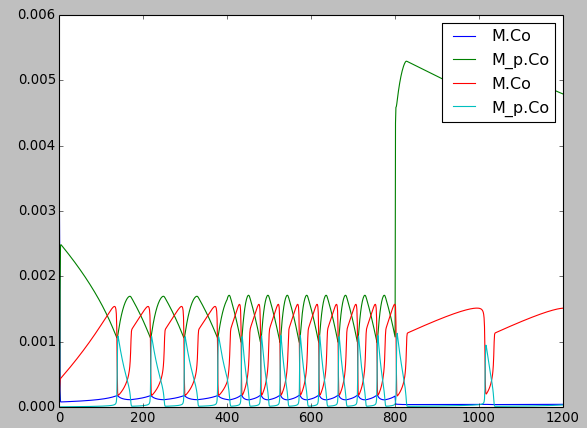
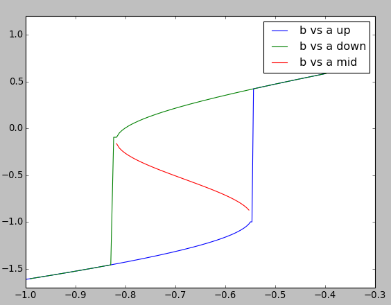
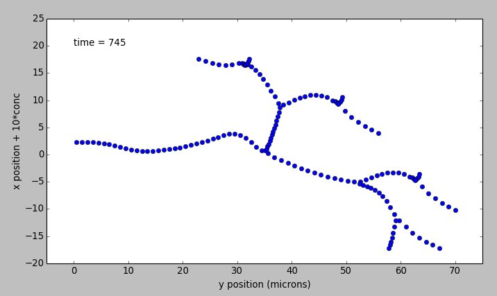

***************
Simple Examples
***************

Set-up a kinetic solver and model
---------------------------------

with Scripting
^^^^^^^^^^^^^^

.. automodule:: scriptGssaSolver
   :members:

With something else
^^^^^^^^^^^^^^^^^^^

.. automodule:: changeFuncExpression
   :members:

Building a chemical Model from Parts
------------------------------------

Disclaimer: Avoid doing this for all but the very simplest models. This
is error-prone, tedious, and non-portable. For preference use one of the
standard model formats like SBML, which MOOSE and many other tools can
read and write.

Nevertheless, it is useful to see how these models are set up.
There are several tutorials and snippets that build the entire chemical
model system using the basic MOOSE calls. The sequence of steps is
typically:

    #. Create container (chemical compartment) for model. This is typically
       a CubeMesh, a CylMesh, and if you really know what you are doing,
       a NeuroMesh.
    #. Create the reaction components: pools of molecules **moose.Pool**;
       reactions **moose.Reac**; and enzymes **moose.Enz**. Note that when
       creating an enzyme, one must also create a molecule beneath it to
       serve as the enzyme-substrate complex.  Other less-used
       components include Michaelis-Menten enzymes **moose.MMenz**, input
       tables, pulse generators and so on. These are illustrated in other
       examples. All these reaction components should be child objects
       of the compartment, since this defines what volume they will occupy.
       Specifically , a pool or reaction object must be placed somewhere
       below the compartment in the object tree for the volume to be
       set correctly and for the solvers to know what to use.
    #. Assign parameters for the components.

        * Compartments have a **volume**, and each subtype will have
          quite elaborate options for partitioning the compartment
          into voxels.
        * **Pool** s have one key parameter, the initial
          concentration **concInit**.
        * **Reac** tions have two parameters: **K**\ :sub:`f`\  and **K**\ :sub:`b`\.
        * **Enz** ymes have two primary parameters **k**\ :sub:`cat`\  and **K**\ :sub:`m`\.
          That is enough for **MMenz** ymes. Regular **Enz** ymes have
          an additional parameter **k**\ :sub:`2`\  which by default is set to 4.0
          times **k**\ :sub:`cat`\, but you may also wish to explicitly assign it
          if you know its value.

    #. Connect up the reaction system using moose messaging.
    #. Create and connect up input and output tables as needed.
    #. Create and connect up the solvers as needed. This has to be done
       in a specific order. Examples are linked below, but briefly the
       order is:

       a. Make the compartment and reaction system.
       b. Make the Ksolve or Gsolve.
       c. Make the Stoich.
       d. Assign **stoich.compartment** to the compartment
       e. Assign **stoich.ksolve** to either the Ksolve or Gsolve.
       f. Assign **stoich.path** to finally fill in the reaction system.

An example of manipulating the models is as following:

.. automodule:: scriptKineticSolver
   :members:

The recommended way to build a chemical model, of course, is to load it
in from a file format specific to such models. MOOSE understands
**SBML**, **kkit.g** (a legacy GENESIS format), and **cspace**
(a very compact format used in a large study of bistables from
Ramakrishnan and Bhalla, PLoS Comp. Biol 2008).

One key concept is that in MOOSE the components, messaging, and access
to model components is identical regardless of whether the model was
built from parts, or loaded in from a file. All that the file loaders do
is to use the file to automate the steps above. Thus the model components
and their fields are completely accessible from the script even if
the model has been loaded from a file.

Cross-Compartment Reaction Systems
----------------------------------

Frequently reaction systems span cellular (chemical) compartments.
For example, a membrane-bound molecule may be phosphorylated by a
cytosolic kinase, using soluble ATP as one of the substrates. Here the
membrane and the cytsol are different chemical compartments.
MOOSE supports such reactions. The following snippets illustrate
cross-compartment chemistry. Note that the interpretation of the rates
of enzymes and reactions does depend on which compartment they reside in.

.. automodule:: crossComptSimpleReac
   :members:

.. automodule:: crossComptOscillator
   :members:

.. automodule:: crossComptNeuroMesh
   :members:

.. automodule:: crossComptSimpleReacGSSA
   :members:

Tweaking Parameters
-------------------

.. automodule:: tweakingParameters
   :members:

Models' Demonstration
---------------------

Oscillation Model
^^^^^^^^^^^^^^^^^

.. automodule:: slowFbOsc
   :members:

.. automodule:: repressillator
   :members:

.. automodule:: relaxationOsc
   :members:

Bistability Models
^^^^^^^^^^^^^^^^^^

MAPK feedback loop model
~~~~~~~~~~~~~~~~~~~~~~~~

.. automodule:: mapkFB
   :members:

Simple minimal bistable model
~~~~~~~~~~~~~~~~~~~~~~~~~~~~~

.. automodule:: scaleVolumes
   :members:

Strongly bistable Model
~~~~~~~~~~~~~~~~~~~~~~~

.. automodule:: strongBis
   :members:

Model of bidirectional synaptic plasticity
~~~~~~~~~~~~~~~~~~~~~~~~~~~~~~~~~~~~~~~~~~
[showing bistable chemical switch]

.. automodule:: bidirectionalPlasticity
   :members:

Reaction Diffusion Models
-------------------------

The MOOSE design for reaction-diffusion is to specify one or
more cellular 'compartments', and embed reaction systems in each of them.

A 'compartment', in the context of reaction-diffusion, is used in the
cellular sense of a biochemically defined,
volume restricted subpart of a cell. Many but not all compartments
are bounded by a cell membrane, but biochemically the membrane itself
may form a compartment. Note that this interpretation differs from that
of a 'compartment' in detailed electrical models of neurons.

A reaction system can be loaded in from any of the supported MOOSE
formats, or built within Python from MOOSE parts.

The computations for such models are done by a set of objects:
Stoich, Ksolve and Dsolve. Respectively, these handle the model
reactions and stoichiometry matrix, the reaction computations for
each voxel, and the diffusion between voxels. The 'Compartment' specifies
how the model should be spatially discretized.

[Reaction-diffusion + transport in a tapering cylinder]

.. automodule:: cylinderDiffusion
   :members:

.. automodule:: cylinderMotor
   :members:

.. automodule:: gssaCylinderDiffusion
   :members:

Neuronal Diffusion Reaction
^^^^^^^^^^^^^^^^^^^^^^^^^^^

.. automodule:: rxdFuncDiffusion
   :members:

.. automodule:: rxdReacDiffusion
   :members:

.. automodule:: rxdFuncDiffusionStoch
   :members:

A Turing Model
--------------

.. automodule:: TuringOneDim
   :members:

Reaction Diffusion in Neurons
-----------------------------

.. automodule:: reacDiffConcGradient
   :members:

.. automodule:: reacDiffBranchingNeuron
   :members:

.. automodule:: reacDiffSpinyNeuron
   :members:

.. automodule:: diffSpinyNeuron
   :members:

Manipulating Chemical Models
----------------------------

Running with different numerical methods
^^^^^^^^^^^^^^^^^^^^^^^^^^^^^^^^^^^^^^^^

.. automodule:: switchKineticSolvers
   :members:

Changing volumes
^^^^^^^^^^^^^^^^

.. automodule:: scaleVolumes
   :members:
   :noindex:

Feeding tabulated input to a model
^^^^^^^^^^^^^^^^^^^^^^^^^^^^^^^^^^

.. automodule:: analogStimTable
   :members:

Finding steady states
^^^^^^^^^^^^^^^^^^^^^

.. automodule:: findChemSteadyState
   :members:

Making a dose-response curve
^^^^^^^^^^^^^^^^^^^^^^^^^^^^

.. automodule:: chemDoseResponse
   :members:

Transport in branching dendritic tree
-------------------------------------

.. automodule:: transportBranchingNeuron
   :members:
