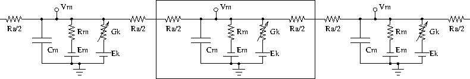

****************
Neuron Modeling
****************

Neurons are modelled as equivalent electrical circuits. The morphology
of a neuron can be broken into isopotential compartments connected by
axial resistances R\ :sub:`a`\  denoting the cytoplasmic
resistance. In each compartment, the neuronal membrane is represented as
a capacitance C\ :sub:`m`\  with a shunt leak resistance
R\ :sub:`m`\ . Electrochemical gradient (due to ion pumps)
across the leaky membrane causes a voltage drive E\ :sub:`m`\ ,
that hyperpolarizes the inside of the cell membrane compared to the
outside.

Each voltage dependent ion channel, present on the membrane, is modelled
as a voltage dependent conductance G\ :sub:`k`\  with gating
kinetics, in series with an electrochemical voltage drive (battery)
E\ :sub:`k`\ , across the membrane capacitance
C\ :sub:`m`\ , as in the figure below.

--------------------------------------------------------

   **Equivalent circuit of neuronal compartments**

--------------------------------------------------------

Neurons fire action potentials / spikes (sharp rise and fall of membrane
potential V\ :sub:`m`\ ) due to voltage dependent channels.
These result in opening of excitatory / inhibitory synaptic channels
(conductances with batteries, similar to voltage gated channels) on
other connected neurons in the network.

MOOSE can handle large networks of detailed neurons, each with
complicated channel dynamics. Further, MOOSE can integrate chemical
signalling with electrical activity. Presently, creating and simulating
these requires PyMOOSE scripting, but these will be incorporated into
the GUI in the future.

To understand channel kinetics and neuronal action potentials, run the
Squid Axon demo installed along with MOOSEGUI and consult its
help/tutorial.

Read more about compartmental modelling in the first few chapters of the
`Book of Genesis <http://www.genesis-sim.org/GENESIS/iBoG/iBoGpdf/index.html>`_.

Models can be defined in `NeuroML <http://www.neuroml.org>`_, an XML
format which is mostly supported across simulators. Channels, neuronal
morphology (compartments), and networks can be specified using various
levels of NeuroML, namely ChannelML, MorphML and NetworkML. Importing of
cell models in the `GENESIS <http://www.genesis-sim.org/GENESIS>`_
.p format is supported for backwards compatibitility.

Modeling details
================

Some salient properties of neuronal building blocks in MOOSE are
described below. Variables that are updated at every simulation time
step are are listed **dynamical**. Rest are parameters.

-  **Compartment**
   When you select a compartment, you can view and edit its properties
   in the right pane. V\ :sub:`m`\  and I\ :sub:`m`\
   are plot-able.

   -  V\ :sub:`m`\
       membrane potential (across C\ :sub:`m`\ ) in Volts. It is a
       dynamical variable.
   -  C\ :sub:`m`\
       membrane capacitance in Farads.
   -  E\ :sub:`m`\
       membrane leak potential in Volts due
       to the electrochemical gradient setup by ion pumps.
   -  I\ :sub:`m`\
       current in Amperes across the membrane via leak resistance R\
       :sub:`m`\ .
   -  inject
       current in Amperes injected externally into the compartment.
   -  initVm
       initial V\ :sub:`m`\  in Volts.
   -  R\ :sub:`m`\
       membrane leak resistance in Ohms due to leaky channels.
   -  diameter
       diameter of the compartment in metres.
   -  length
       length of the compartment in metres.

-  **HHChannel**
   Hodgkin-Huxley channel with voltage dependent dynamical gates.

   -  Gbar
         peak channel conductance in Siemens.
   -  E\ :sub:`k`\
         reversal potential of the channel, due to electrochemical
         gradient of the ion(s) it allows.
   -  G\ :sub:`k`\
         conductance of the channel in Siemens.
         G\ :sub:`k`\ (t) = Gbar × X(t)\ :sup:`Xpower`\  ×
         Y(t)\ :sup:`Ypower`\  × Z(t)\ :sup:`Zpower`\

   -  I\ :sub:`k`\
         current through the channel into the neuron in Amperes.
           I\ :sub:`k`\ (t) = G\ :sub:`k`\ (t) ×
           (E\ :sub:`k`\ -V\ :sub:`m`\ (t))

   -  X, Y, Z
         gating variables (range 0.0 to 1.0) that may turn on or off as
         voltage increases with different time constants.

           dX(t)/dt = X\ :sub:`inf`\ /τ - X(t)/τ

           Here, X\ :sub:`inf`\  and τ are typically
           sigmoidal/linear/linear-sigmoidal functions of membrane
           potential V\ :sub:`m`\ , which are described in a ChannelML
           file and presently not editable from MOOSEGUI. Thus, a gate
           may open (X\ :sub:`inf`\ (V\ :sub:`m`\ ) → 1) or close (X\
           :sub:`inf`\ (V\ :sub:`m`\ ) → 0) on increasing V\ :sub:`m`\
           , with time constant τ(V\ :sub:`m`\ ).

   -  Xpower, Ypower, Zpower
         powers to which gates are raised in the G\ :sub:`k`\ (t)
         formula above.

-  **HHChannel2D**
   The Hodgkin-Huxley channel2D can have the usual voltage dependent
   dynamical gates, and also gates that depend on voltage and an
   ionic concentration, as for say Ca-dependent K conductance. It has
   the properties of HHChannel above, and a few more, similar to
   in the `GENESIS tab2Dchannel
   reference <http://www.genesis-sim.org/GENESIS/Hyperdoc/Manual-26.html#ss26.61>`_.

-  **CaConc**
   This is a pool of Ca ions in each compartment, in a shell volume
   under the cell membrane. The dynamical Ca concentration increases
   when Ca channels open, and decays back to resting with a specified
   time constant τ. Its concentration controls Ca-dependent K channels,
   etc.

   -  Ca
        Ca concentration in the pool in units mM ( i.e., mol/m\
        :sup:`3`\ ).

          d[Ca\ :sup:`2+`\ ]/dt = B × I\ :sub:`Ca`\  -
          [Ca\ :sup:`2+`\ ]/τ

   -  CaBasal/Ca_base
        Base Ca concentration to which the Ca decays
   -  tau
        time constant with which the Ca concentration decays to the base Ca level.
   -  B
        constant in the [Ca\ :sup:`2+`\ ] equation above.
   -  thick
        thickness of the Ca shell within the cell membrane which is
        used to calculate B (see Chapter 19 of `Book of GENESIS
        <http://www.genesis-sim.org/GENESIS/iBoG/iBoGpdf/index.html>`_.)
