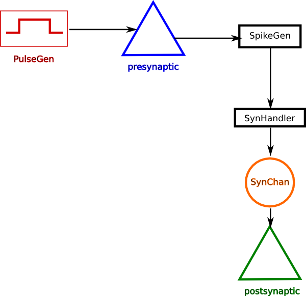
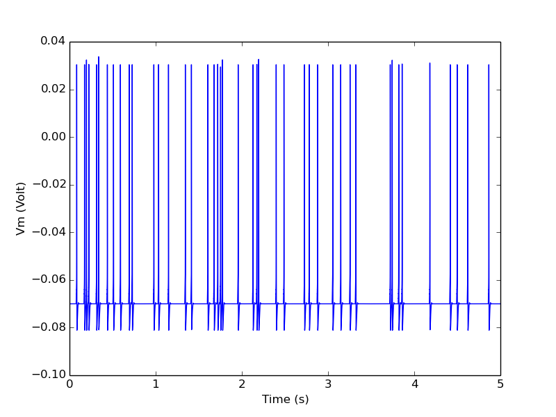

***************
Simple Examples
***************

Connecting two cells via a synapse
----------------------------------

Below is the connectivity diagram for setting up a synaptic connection
from one neuron to another. The PulseGen object is there for
stimulating the presynaptic cell as part of experimental setup. The
cells are defined as single-compartments with Hodgkin-Huxley type Na+
and K+ channels.

.. automodule:: twocells
   :members:

Multi Compartmental Leaky Neurons
---------------------------------

.. automodule:: multicomp_lif
   :members:

Providing random input to a cell
--------------------------------

.. automodule:: randomspike
   :members:

Plastic synapse
---------------

.. automodule:: STDP
   :members:

Synapse Handler for Spikes
--------------------------

.. automodule:: RandSpikeStats
   :members:

Recurrent integrate-and-fire network
------------------------------------

.. automodule:: recurrentIntFire
   :members:

Recurrent integrate-and-fire network with plasticity
----------------------------------------------------

.. automodule:: recurrentLIF
   :members:

Demonstration Models
--------------------

.. automodule:: compartment_net
   :members:

.. automodule:: compartment_net_no_array
   :members:

Building Models
---------------

.. automodule:: synapse_tutorial
   :members:
