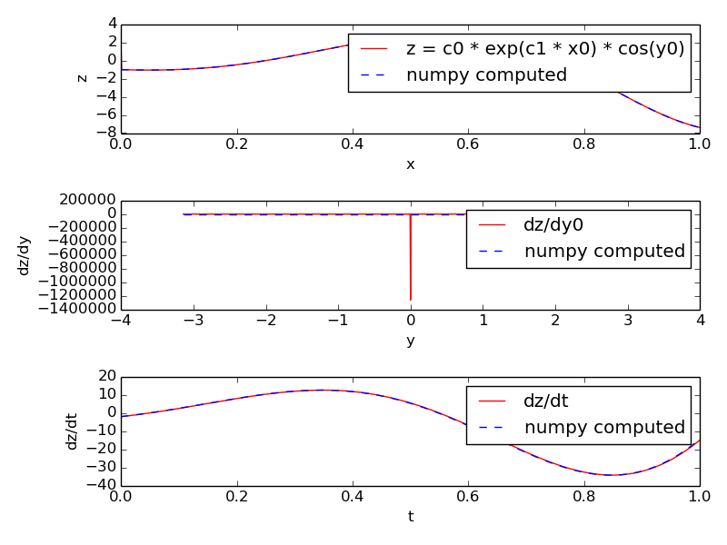

*************
MOOSE Classes
*************

Messages
^^^^^^^^

One-to-one message
""""""""""""""""""

.. automodule:: onetoonemsg
	:members:

Show the message
""""""""""""""""

.. automodule:: showmsg
  :members:

Single Message Cross
""""""""""""""""""""

.. automodule:: singlemsgcross
  :members:

Time
^^^^

Clocks
""""""

.. automodule:: showclocks
  :members:

Generating Time Data Table
""""""""""""""""""""""""""

.. automodule:: timetable
  :members:

Vectors
^^^^^^^

.. automodule:: vectors
  :members:

Data Entries
^^^^^^^^^^^^

.. automodule:: wildcard
  :members:

Interpolation
^^^^^^^^^^^^^

1-dimentional Interpolation
"""""""""""""""""""""""""""

.. automodule:: interpol
  :members:

2-dimentional interpolation
"""""""""""""""""""""""""""

.. automodule:: interpol2d
   :members:

Function
^^^^^^^^

.. automodule:: func
  :members:
  :noindex:

SymCompartment
^^^^^^^^^^^^^^

.. automodule:: symcompartment
  :members:

Tables
^^^^^^

.. automodule:: tabledemo
  :members:

Data Types
^^^^^^^^^^

HDF DataType
""""""""""""

.. automodule:: hdfdemo
  :members:

NSDF DataType
"""""""""""""

.. automodule:: nsdf
  :members:

.. automodule:: nsdf_vec
  :members:

Threading
^^^^^^^^^

.. automodule:: threading_demo
  :members:

PyMoose
^^^^^^^

.. automodule:: traub_naf
  :members:

.. _quickstart-maths:

Mathematics with MOOSE
^^^^^^^^^^^^^^^^^^^^^^

Computing an arbitrary function
^^^^^^^^^^^^^^^^^^^^^^^^^^^^^^^

.. automodule:: function
  :members:

Differential Equation Solving
^^^^^^^^^^^^^^^^^^^^^^^^^^^^^

.. automodule:: diffEqSolution
  :members:

Harmonic Oscillatory Function
^^^^^^^^^^^^^^^^^^^^^^^^^^^^^

.. automodule:: funcRateHarmonicOsc
  :members:

Lotka-Voltera Model
^^^^^^^^^^^^^^^^^^^

.. automodule:: funcReacLotkaVolterra
  :members:

.. automodule:: stochasticLotkaVolterra
  :members:

Vary Concentration with mathematical function
^^^^^^^^^^^^^^^^^^^^^^^^^^^^^^^^^^^^^^^^^^^^^

.. automodule:: funcInputToPools
  :members:
