**Rdesigneur: Building multiscale models**
==========================================

.. Upi Bhalla

.. Aug 26 2016. Updated July 2018

.. --------------

Contents
--------

.. contents::
   :depth: 3

Introduction
------------

**Rdesigneur** (Reaction Diffusion and Electrical SIGnaling in NEURons)
is an interface to the multiscale modeling capabilities in MOOSE. It is
designed to build models incorporating biochemical signaling pathways in
dendrites and spines, coupled to electrical events in neurons.
Rdesigneur assembles models from predefined parts: it delegates the
details to specialized model definition formats. Rdesigneur combines one
or more of the following cell parts to build models:

-  Neuronal morphology
-  Dendritic spines
-  Ion channels
-  Reaction systems
-  Adaptors that couple between these for multiscale models

It also folds in simulation input and output

-  Time-series stimuli for molecular concentration change and reaction rates 
-  Current and voltage clamp 
-  Synaptic input.
-  Time-series plots
-  File dumps
-  3-D neuronal graphics

Rdesigneur's main role is to specify how these are put together,
including assigning parameters for the model. Using Rdesigneur one can compactly
and quickly put together quite complex multiscale models.

Quick Start
-----------

Here we provide a few use cases, building up from a minimal model to a
reasonably complete multiscale model spanning chemical and electrical
signaling. The files for these examples are also available in
``moose-examples/tutorials/Rdesigneur``, and the file names are mentioned
as we go along.

Bare Rdesigneur: single passive compartment
~~~~~~~~~~~~~~~~~~~~~~~~~~~~~~~~~~~~~~~~~~~

*ex1_minimalModel.py*

If we don't provide any arguments at all to the Rdesigneur, it makes a
model with a single passive electrical compartment in the MOOSE path
``/model/elec/soma``. Here is how to do this:

::

    import moose
    import rdesigneur as rd
    rdes = rd.rdesigneur()
    rdes.buildModel()

To confirm that it has made a compartment with some default values we
can add a line:

::

    moose.showfields( rdes.soma )

This should produce the output:

::

    [ /model[0]/elec[0]/soma[0] ]
    diameter         = 0.0005
    fieldIndex       = 0
    Ra               = 7639437.26841
    y0               = 0.0
    Rm               = 424413.177334
    index            = 0
    numData          = 1
    inject           = 0.0
    initVm           = -0.065
    Em               = -0.0544
    y                = 0.0
    numField         = 1
    path             = /model[0]/elec[0]/soma[0]
    dt               = 0.0
    tick             = -2
    z0               = 0.0
    name             = soma
    Cm               = 7.85398163398e-09
    x0               = 0.0
    Vm               = -0.06
    className        = ZombieCompartment
    idValue          = 465
    length           = 0.0005
    Im               = 1.3194689277e-08
    x                = 0.0005
    z                = 0.0

Simulate and display current pulse to soma
~~~~~~~~~~~~~~~~~~~~~~~~~~~~~~~~~~~~~~~~~~

*ex2.0_currentPulse.py*

A more useful script would run and display the model. Rdesigneur can
help with the stimulus and the plotting. This simulation has the same
passive compartment, and current is injected as the simulation runs.
This script displays the membrane potential of the soma as it charges
and discharges.

::

    import moose
    import rdesigneur as rd
    rdes = rd.rdesigneur(
        stimList = [['soma', '1', '.', 'inject', '(t>0.1 && t<0.2) * 2e-8']],
        plotList = [['soma', '1', '.', 'Vm', 'Soma membrane potential']],
    )
    rdes.buildModel()
    moose.reinit()
    moose.start( 0.3 )
    rdes.display()

The *stimList* defines a stimulus. Each entry has five arguments:

::

    `[region_in_cell, region_expression, moose_object, parameter, expression_string]`

-  ``region_in_cell`` specifies the objects to stimulate. Here it is
   just the soma.
-  ``region_expression`` specifies a geometry based calculation to
   decide whether to apply the stimulus. The value must be >0 for the
   stimulus to be present. Here it is just 1. ``moose_object`` specifies
   the simulation object to operate upon during the stimulus. Here the
   ``.`` means that it is the soma itself. In other models it might be a
   channel on the soma, or a synapse, and so on.
-  ``parameter`` specifies the simulation parameter on the moose object
   that the stimulus will modify. Here it is the injection current to
   the soma compartment.
-  ``expression_string`` calculates the value of the parameter,
   typically as a function of time. Here we use the function
   ``(t>0.1 && t<0.2) * 2e-8`` which evaluates as 2e-8 between the times
   of 0.1 and 0.2 seconds.

To summarise this, the *stimList* here means *inject a current of 20nA
to the soma between the times of 0.1 and 0.2 s*.

The *plotList* defines what to plot. It has a similar set of arguments:

::

    `[region_in_cell, region_expression, moose_object, parameter, title_of_plot]`

These mean the same thing as for the stimList except for the title of
the plot.

The *rdes.display()* function causes the plots to be displayed.

.. figure:: ../../../../images/rdes2_passive_squid.png
   :alt: Plot for current input to passive compartment

   Plot for current input to passive compartment

When we run this we see an initial depolarization as the soma settles
from its initial -65 mV to a resting Em = -54.4 mV. These are the
original HH values, see the example above. At t = 0.1 seconds there is
another depolarization due to the current injection, and at t = 0.2
seconds this goes back to the resting potential.

Simulate and display voltage clamp stimulus to soma
~~~~~~~~~~~~~~~~~~~~~~~~~~~~~~~~~~~~~~~~~~~~~~~~~~~

*ex2.1_vclamp.py*

This model introduces the voltage clamp stimulus on a passive compartment.
As before, we add a few lines to define the stimulus and plot.
This script displays both the membrane potential, and the holding current 
of the voltage clamp circuit as
it charges and discharges the passive compartment model. 

::

    import moose
    import rdesigneur as rd
    rdes = rd.rdesigneur(
        stimList = [['soma', '1', '.', 'vclamp', '-0.065 + (t>0.1 && t<0.2) * 0.02' ]],
        plotList = [
            ['soma', '1', '.', 'Vm', 'Soma membrane potential'],
            ['soma', '1', 'vclamp', 'current', 'Soma holding current'],
        ]
    )
    rdes.buildModel()
    moose.reinit()
    moose.start( 0.3 )
    rdes.display()

Here the *stimList* line tells the system to deliver a voltage clamp (vclamp)
on the soma, starting at -65 mV and jumping up by 20 mV between 0.1 and 0.2 
seconds. The *plotList* now includes two entries, and will generate two plots.
The first is for plotting the soma membrane potential, just to be sure that
the voltage clamp is doing its job. 

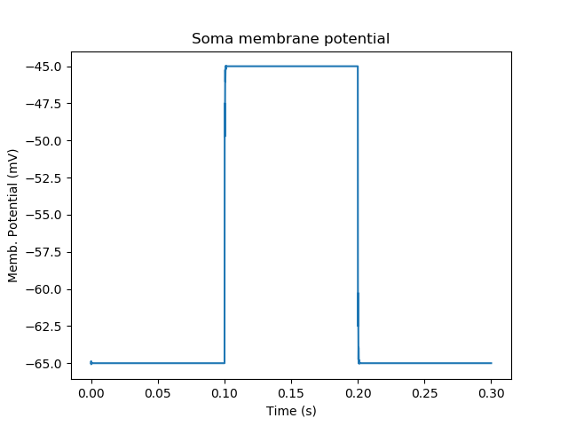

   Plot for membrane potential in voltage clamp

The second graph plots the holding current.  Note the capacitive transients.

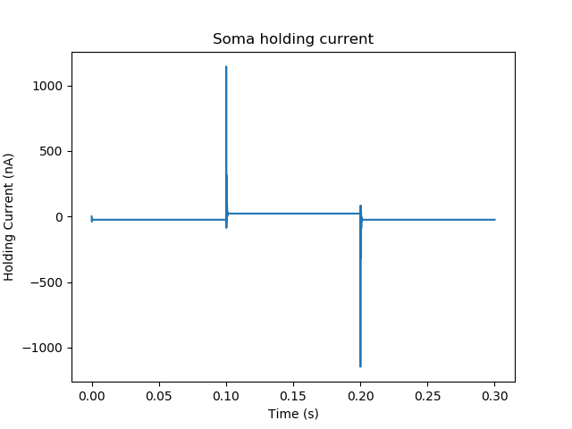

   Plot for holding current for voltage clamp

HH Squid model in a single compartment
~~~~~~~~~~~~~~~~~~~~~~~~~~~~~~~~~~~~~~

*ex3.0_squid_currentPulse.py*

Here we put the Hodgkin-Huxley squid model channels into a passive
compartment. The HH channels are predefined as prototype channels for
Rdesigneur,

::

    import moose
    import pylab
    import rdesigneur as rd
    rdes = rd.rdesigneur(
        chanProto = [['make_HH_Na()', 'Na'], ['make_HH_K()', 'K']],
        chanDistrib = [
            ['Na', 'soma', 'Gbar', '1200' ],
            ['K', 'soma', 'Gbar', '360' ]],
        stimList = [['soma', '1', '.', 'inject', '(t>0.1 && t<0.2) * 1e-8' ]],
        plotList = [['soma', '1', '.', 'Vm', 'Membrane potential']]
    )

    rdes.buildModel()
    moose.reinit()
    moose.start( 0.3 )
    rdes.display()

Here we introduce two new model specification lines:

-  **chanProto**: This specifies which ion channels will be used in the
   model. Each entry here has two fields: the source of the channel
   definition, and (optionally) the name of the channel. In this example
   we specify two channels, an Na and a K channel using the original
   Hodgkin-Huxley parameters. As the source of the channel definition we
   use the name of the Python function that builds the channel. The
   *make\_HH\_Na()* and *make\_HH\_K()* functions are predefined but we
   can also specify our own functions for making prototypes. We could
   also have specified the channel prototype using the name of a channel
   definition file in ChannelML (a subset of NeuroML) format.
-  **chanDistrib**: This specifies *where* the channels should be placed
   over the geometry of the cell. Each entry in the chanDistrib list
   specifies the distribution of parameters for one channel using four
   entries:

   ``[object_name, region_in_cell, parameter, expression_string]``

   In this case the job is almost trivial, since we just have a single
   compartment named *soma*. So the line

   ``['Na', 'soma', 'Gbar', '1200' ]``

   means *Put the Na channel in the soma, and set its maximal
   conductance density (Gbar) to 1200 Siemens/m^2*.

As before we apply a somatic current pulse. Since we now have HH
channels in the model, this generates action potentials.

.. figure:: ../../../../images/rdes3_squid.png
   :alt: Plot for HH squid simulation

   Plot for HH squid simulation

There are several interesting things to do with the model by varying stimulus
parameters:

        -  Change injection current.
        -  Put in a protocol to get rebound action potential.
        -  Put in a current ramp, and run it for a different duration
        -  Put in a frequency chirp, and see how the squid model is tuned
           to a certain frequency range.
        -  Modify channel or passive parameters. See if it still fires.
        -  Try the frequency chirp on the cell with parameters changed. Does 
           the tuning change?

HH Squid model with voltage clamp
~~~~~~~~~~~~~~~~~~~~~~~~~~~~~~~~~

*ex3.1_squid_vclamp.py*

This is the same squid model, but now we add a voltage clamp to the squid
and monitor the holding current. This stimulus line is identical to ex2.1.

::

    import moose
    import pylab
    import rdesigneur as rd
    rdes = rd.rdesigneur(
        chanProto = [['make_HH_Na()', 'Na'], ['make_HH_K()', 'K']],
        chanDistrib = [
            ['Na', 'soma', 'Gbar', '1200' ],
            ['K', 'soma', 'Gbar', '360' ]],
        stimList = [['soma', '1', '.', 'vclamp', '-0.065 + (t>0.1 && t<0.2) * 0.02' ]],
        plotList = [
            ['soma', '1', '.', 'Vm', 'Membrane potential'],
            ['soma', '1', 'vclamp', 'current', 'Soma holding current']
        ]
    )
    rdes.buildModel()
    moose.reinit()
    moose.start( 0.3 )
    rdes.display()

Here we see the classic HH current response, a downward brief deflection due to
the Na channel, and a slower upward sustained current due to the K delayed
rectifier.

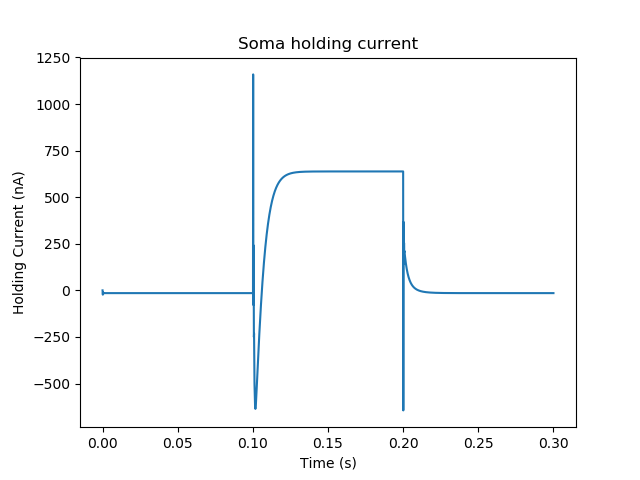

   Plot for HH squid voltage clamp pulse.

Here are some suggestions for further exploration:

        - Monitor individual channel currents through additional plots.
        - Convert this into a voltage clamp series. Easiest way to do this is
          to complete the rdes.BuildModel, then delete the Function object
          on the */model/elec/soma/vclamp*. Now you can simply set the 'command'
          field of the vclamp in a for loop, going from -ve to +ve voltages.
          Remember, SI units. You may wish to capture the plot vectors each
          cycle. The plot vectors are accessed by something like

        ``moose.element( '/model/graphs/plot1' ).vector``

HH Squid model in an axon
~~~~~~~~~~~~~~~~~~~~~~~~~

*ex3.2_squid_axon_propgn.py*

Here we put the Hodgkin-Huxley squid model into a long compartment that
is subdivided into many segments, so that we can watch action potentials
propagate. Most of this example is boilerplate code to build a spiral
axon. There is a short *rdesigneur* segment that takes the spiral axon
prototype and populates it with channels, and sets up the display. Later
examples will show you how to read morphology files to specify the
neuronal geometry.

::

    import numpy as np
    import moose
    import pylab
    import rdesigneur as rd

    numAxonSegments = 200
    comptLen = 10e-6
    comptDia = 1e-6
    RM = 1.0
    RA = 10.0
    CM = 0.01

    def makeAxonProto():
            axon = moose.Neuron( '/library/axon' )
            prev = rd.buildCompt( axon, 'soma', RM = RM, RA = RA, CM = CM, dia = 10e-6, x=0, dx=comptLen)
            theta = 0
            x = comptLen
            y = 0.0

            for i in range( numAxonSegments ):
                dx = comptLen * np.cos( theta )
                dy = comptLen * np.sin( theta )
                r = np.sqrt( x * x + y * y )
                theta += comptLen / r
                compt = rd.buildCompt( axon, 'axon' + str(i), RM = RM, RA = RA, CM = CM, x = x, y = y, dx = dx, dy = dy, dia = comptDia )
                moose.connect( prev, 'axial', compt, 'raxial' )
                prev = compt
                x += dx
                y += dy
            
            return axon

    moose.Neutral( '/library' )
    makeAxonProto()

    rdes = rd.rdesigneur(
            chanProto = [['make_HH_Na()', 'Na'], ['make_HH_K()', 'K']],
            cellProto = [['elec','axon']],
            chanDistrib = [
                ['Na', '#', 'Gbar', '1200' ],
                ['K', '#', 'Gbar', '360' ]],
            stimList = [['soma', '1', '.', 'inject', '(t>0.01 && t<0.2) * 2e-11' ]],
            plotList = [['soma', '1', '.', 'Vm', 'Membrane potential']],
            moogList = [['#', '1', '.', 'Vm', 'Vm (mV)']]
            )

    rdes.buildModel()
    moose.reinit()

    rdes.displayMoogli( 0.00005, 0.05, 0.0 )

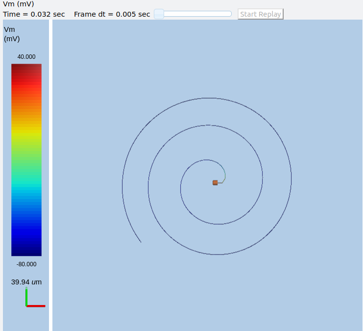

   Axon with propagating action potential

Note how we explicitly create the prototype axon on '/library', and then
specify it using the *cellProto* line in the rdesigneur. The moogList
specifies the 3-D display. See below for how to set up and use these
displays.

Action potential collision in HH Squid axon model
~~~~~~~~~~~~~~~~~~~~~~~~~~~~~~~~~~~~~~~~~~~~~~~~~

*ex3.3_AP_collision.py*

This is identical to the previous example, except that now we deliver current
injection at at two points, the soma and a point along the axon. The modified
stimulus line is:

::

        ...
        stimList = [['soma', '1', '.', 'inject', '(t>0.01 && t<0.2) * 2e-11' ],
        ['axon100', '1', '.', 'inject', '(t>0.01 && t<0.2) * 3e-11' ]],
        ...

Watch how the AP is triggered bidirectionally from the stimulus point on the
100th segment of the axon, and observe what happens when two action potentials 
bump into each other.

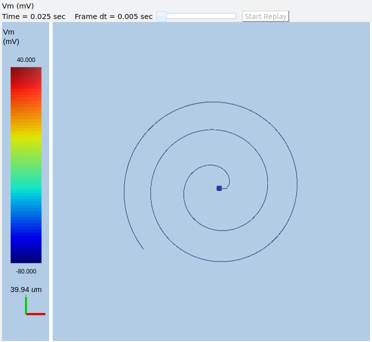

   Colliding action potentials

HH Squid model in a myelinated axon
~~~~~~~~~~~~~~~~~~~~~~~~~~~~~~~~~~~

*ex3.4_myelinated_axon.py*

This is a curious cross-species chimera model, where we embed the HH
equations into a myelinated example model. As for the regular axon
above, most of the example is boilerplate setup code. Note how we
restrict the HH channels to the nodes of Ranvier using a conditional
test for the diameter of the axon segment.

::

    import numpy as np
    import moose
    import pylab
    import rdesigneur as rd

    numAxonSegments = 405
    nodeSpacing = 100
    comptLen = 10e-6
    comptDia = 2e-6 # 2x usual
    RM = 100.0 # 10x usual
    RA = 5.0
    CM = 0.001 # 0.1x usual

    nodeDia = 1e-6
    nodeRM = 1.0
    nodeCM = 0.01

    def makeAxonProto():
        axon = moose.Neuron( '/library/axon' )
        x = 0.0
        y = 0.0
        prev = rd.buildCompt( axon, 'soma', RM = RM, RA = RA, CM = CM, dia = 10e-6, x=0, dx=comptLen)
        theta = 0
        x = comptLen

        for i in range( numAxonSegments ):
            r = comptLen
            dx = comptLen * np.cos( theta )
            dy = comptLen * np.sin( theta )
            r = np.sqrt( x * x + y * y )
            theta += comptLen / r
            if i % nodeSpacing == 0:
                compt = rd.buildCompt( axon, 'axon' + str(i), RM = nodeRM, RA = RA, CM = nodeCM, x = x, y = y, dx = dx, dy = dy, dia = nodeDia )
            else:
                compt = rd.buildCompt( axon, 'axon' + str(i), RM = RM, RA = RA, CM = CM, x = x, y = y, dx = dx, dy = dy, dia = comptDia )
            moose.connect( prev, 'axial', compt, 'raxial' )
            prev = compt
            x += dx
            y += dy
        
        return axon

    moose.Neutral( '/library' )
    makeAxonProto()

    rdes = rd.rdesigneur(
        chanProto = [['make_HH_Na()', 'Na'], ['make_HH_K()', 'K']],
        cellProto = [['elec','axon']],
        chanDistrib = [
            ['Na', '#', 'Gbar', '12000 * (dia < 1.5e-6)' ],
            ['K', '#', 'Gbar', '3600 * (dia < 1.5e-6)' ]],
        stimList = [['soma', '1', '.', 'inject', '(t>0.01 && t<0.2) * 1e-10' ]],
        plotList = [['soma,axon100,axon200,axon300,axon400', '1', '.', 'Vm', 'Membrane potential']],
        moogList = [['#', '1', '.', 'Vm', 'Vm (mV)']]
    )

    rdes.buildModel()

    for i in moose.wildcardFind( "/model/elec/#/Na" ):
        print i.parent.name, i.Gbar

    moose.reinit()

    rdes.displayMoogli( 0.00005, 0.05, 0.0 )

When you run the example, keep an eye out for a few things:

-  **saltatory conduction:** This is the way the action potential jumps
   from one node of Ranvier to the next. Between the nodes it is just
   passive propagation.
-  **Failure to propagate:** Observe that the second and fourth action
   potentials fails to trigger propagation along the axon. Here we have
   specially tuned the model properties so that this happens. With a
   larger RA of 10.0, the model will be more reliable.
-  **Speed:** Compare the propagation speed with the previous,
   unmyelinated axon. Note that the current model is larger!

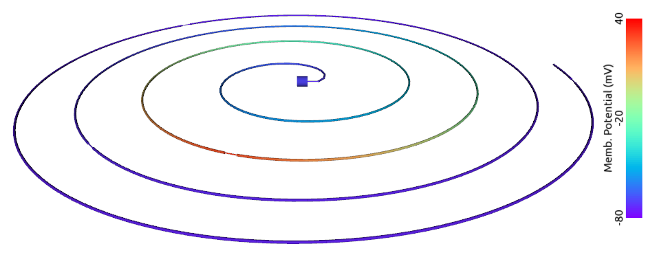

   Myelinated axon with propagating action potential

Alternate (non-squid) way to define soma
~~~~~~~~~~~~~~~~~~~~~~~~~~~~~~~~~~~~~~~~

*ex4.0_scaledSoma.py*

The default HH-squid axon is not a very convincing soma. Rdesigneur offers a
somewhat more general way to define the soma in the  cell prototype line.

::

    import moose
    import pylab
    import rdesigneur as rd
    rdes = rd.rdesigneur(
        # cellProto syntax: ['somaProto', 'name', dia, length]
        cellProto = [['somaProto', 'soma', 20e-6, 200e-6]],
        chanProto = [['make_HH_Na()', 'Na'], ['make_HH_K()', 'K']],
        chanDistrib = [
            ['Na', 'soma', 'Gbar', '1200' ],
            ['K', 'soma', 'Gbar', '360' ]],
        stimList = [['soma', '1', '.', 'inject', '(t>0.01 && t<0.05) * 1e-9' ]],
        plotList = [['soma', '1', '.', 'Vm', 'Membrane potential']],
        moogList = [['#', '1', '.', 'Vm', 'Vm (mV)']]
    )
    
    rdes.buildModel()
    soma = moose.element( '/model/elec/soma' )
    print( 'Soma dia = {}, length = {}'.format( soma.diameter, soma.length ) )
    moose.reinit()
    
    rdes.displayMoogli( 0.0005, 0.06, 0.0 )

Here the crucial line is the *cellProto* line. There are four arguments here:

        ``['somaProto', 'name', dia, length]``

        - The first argument tells the system to use a prototype soma, that is 
          a single cylindrical compartment. 
        - The second argument is the name to give the cell.
        - The third argument is the diameter. Note that this is a double, 
          not a string.
        - The fourth argument is the length of the cylinder that makes up the 
          soma. This too is a double, not a string.
          The cylinder is oriented along the x axis, with one end at (0,0,0)
          and the other end at (length, 0, 0).

This is what the soma looks like:

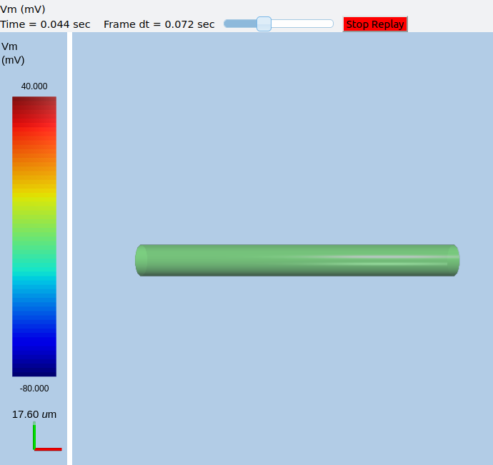

   Image of soma.

It a somewhat elongated soma, being a cylinder 10 times as long as it is wide. 

Ball-and-stick model of a neuron
~~~~~~~~~~~~~~~~~~~~~~~~~~~~~~~~

*ex4.1_ballAndStick.py*

A somewhat more electrically reasonable model of a neuron has a soma and a
single dendrite, which can itself be subdivided into segments so that it
can exhibit voltage gradients, have channel and receptor distributions, 
and so on. This is accomplished in *rdesigneur* using a variant of the
cellProto syntax.

::

    import moose
    import pylab
    import rdesigneur as rd
    rdes = rd.rdesigneur(
        # cellProto syntax: ['ballAndStick', 'name', somaDia, somaLength, dendDia, dendLength, numDendSegments ]
        # The numerical arguments are all optional
        cellProto = [['ballAndStick', 'soma', 20e-6, 20e-6, 4e-6, 500e-6, 10]],
        chanProto = [['make_HH_Na()', 'Na'], ['make_HH_K()', 'K']],
        chanDistrib = [
            ['Na', 'soma', 'Gbar', '1200' ],
            ['K', 'soma', 'Gbar', '360' ],
            ['Na', 'dend#', 'Gbar', '400' ],
            ['K', 'dend#', 'Gbar', '120' ]
            ],
        stimList = [['soma', '1', '.', 'inject', '(t>0.01 && t<0.05) * 1e-9' ]],
        plotList = [['soma', '1', '.', 'Vm', 'Membrane potential']],
        moogList = [['#', '1', '.', 'Vm', 'Vm (mV)']]
    )
    rdes.buildModel()
    soma = moose.element( '/model/elec/soma' )
    moose.reinit()
    rdes.displayMoogli( 0.0005, 0.06, 0.0 )

As before, the *cellProto* line plays a key role. Here, because we have a long
dendrite, we have a few more numerical arguments. All of the numerical 
arguments are optional.

    ``['ballAndStick', 'name', somaDia, somaLength, dendDia, dendLength, numDendSegments ]``

        - The first argument specifies a ballAndStick model: soma + dendrite.
          The length of the dendrite is along the x axis. The soma is a single
          segment, the dendrite can be more than one.
        - The second argument is the name to give the cell.
        - Arg 3 is the soma diameter, as a double.
        - Arg 4 is the length of the soma, as a double.
        - Arg 5 is the diameter of the dendrite, as a double.
        - Arg 6 is the length of the dendrite, as a double.
        - Arg 7 is the number of segments into which the dendrite should be 
          divided. This is a positive integer greater than 0.
        
This is what the ball-and-stick cell looks like:

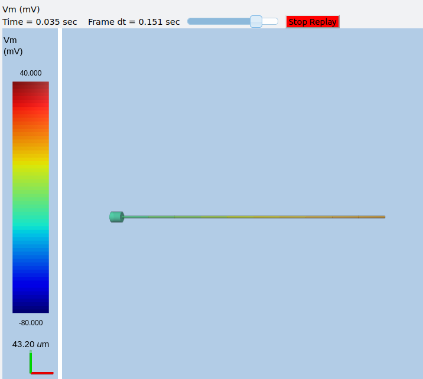

   Image of ball and stick cell.

In this version of the 3-D display, the soma is displayed as a bit blocky
rather than round.
Note that we have populated the dendrite with Na and K channels and it has
10 segments, so it supports action potential propagation. The snapshot 
illustrates this.

Here are some things to try:

        - Change the length of the dendrite
        - Change the number of segments. Explore what it does to accuracy. How
          will you know that you have an accurate model?

Benchmarking simulation speed
~~~~~~~~~~~~~~~~~~~~~~~~~~~~~

*ex4.2_ballAndStickSpeed.py*

The ball-and-stick model gives us an opportunity to check out your system
and how computation scales with model size. While we're at it we'll deliver
a sine-wave stimulus just to see how it can be done. The test model is
very similar to the previous one, ex4.1:

::

    import moose
    import pylab
    import rdesigneur as rd
    import time
    rdes = rd.rdesigneur(
        cellProto = [['ballAndStick', 'soma', 20e-6, 20e-6, 4e-6, 500e-6, 10]],
        chanProto = [['make_HH_Na()', 'Na'], ['make_HH_K()', 'K']],
        chanDistrib = [
            ['Na', 'soma', 'Gbar', '1200' ],
            ['K', 'soma', 'Gbar', '360' ],
            ['Na', 'dend#', 'Gbar', '400' ],
            ['K', 'dend#', 'Gbar', '120' ]
        ],
        stimList = [['soma', '1', '.', 'inject', '(1+cos(t/10))*(t>31.4 && t<94) * 0
    .2e-9' ]],
        plotList = [
            ['soma', '1', '.', 'Vm', 'Membrane potential'],
            ['soma', '1', '.', 'inject', 'Stimulus current']
        ],
    )
    rdes.buildModel()
    runtime = 100
    moose.reinit()
    t0= time.time()
    moose.start( runtime )
    print "Real time to run {} simulated seconds = {} seconds".format( runtime, time
    .time() - t0 )
    
    rdes.display()

While the real point of this simulation is to check speed, it does illustrate
how to deliver a stimulus shaped like a sine wave:

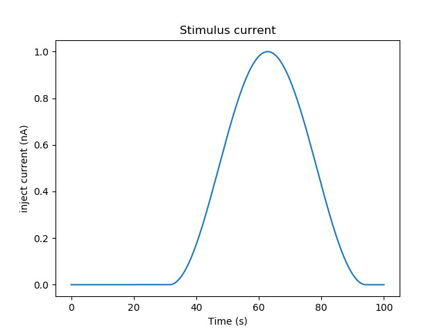

   Sine-wave shaped stimulus.

We can see that the cell has a peculiar response to this. Not surprising, as
the cell uses HH channels which are not good at rate coding.

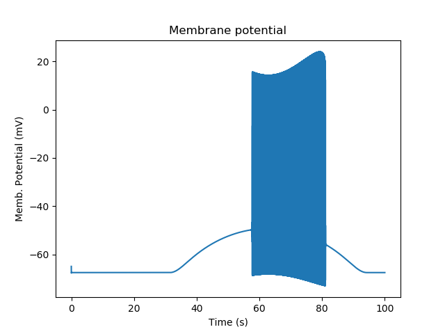

   Spiking response to sine-wave shaped stimulus.

As a reference point, on a fast 2018 laptop this benchmark runs in 5.4 seconds.
Some more things to try for benchmarking:

    - How slow does it get if you turn on the 3-D moogli display?
    - Is it costlier to run 2 compartments for 1000 seconds, or
      200 compartments for 10 seconds?

Synaptic stimulus: random (Possion)
~~~~~~~~~~~~~~~~~~~~~~~~~~~~~~~~~~~

*ex5.0_random_syn_input.py*

In this example we introduce synaptic inputs: both the receptor channels
and a means for stimulating the channels. We do this in a passive model.

::

    import moose
    import rdesigneur as rd
    rdes = rd.rdesigneur(
        cellProto = [['somaProto', 'soma', 20e-6, 200e-6]],
        chanProto = [['make_glu()', 'glu']],
        chanDistrib = [['glu', 'soma', 'Gbar', '1' ]],
        stimList = [['soma', '0.5', 'glu', 'randsyn', '50' ]],
        # Deliver stimulus to glu synapse on soma, at mean 50 Hz Poisson.
        plotList = [['soma', '1', '.', 'Vm', 'Soma membrane potential']]
    )
    rdes.buildModel()
    moose.reinit()
    moose.start( 0.3 )
    rdes.display()

Most of the rdesigneur setup uses familiar syntax.

Novelty 1: we use the default built-in glutamate receptor model, in chanProto.
We just put it in the soma at a max conductance of 1 Siemen/sq metre.

Novelty 2: We specify a new kind of stimulus in the stimList:

        ``['soma', '0.5', 'glu', 'randsyn', '50' ]``

Most of this is similar to previous stimLists.

        - arg0: 'soma': the named compartments in the cell to populate with 
          the *glu* receptor
        - arg1: '0.5': Tell the system to use a uniform synaptic weight of 0.5.
          This argument could be a more complicated expression incorporating
          spatial arguments. Here it is just uniform.
        - arg2: 'glu': Which receptor to stimulate
        - arg3: 'randsyn': Apply random (Poisson) synaptic input.
        - arg4: '50': Mean firing rate of the Poisson input. Note that this last
          argument could be a function of time and hence is quite versatile.

As the model has no voltage-gated channels, we do not see spiking.

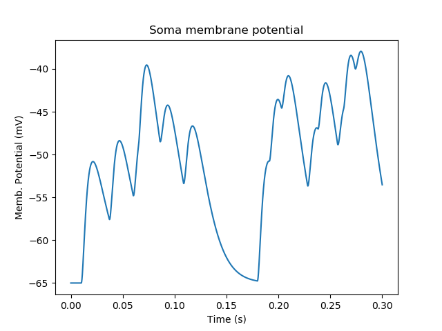
   
   Random synaptic input with a Poisson distribution.

Things to try: Vary the rate and the weight of the synaptic input.

Synaptic stimulus: periodic
~~~~~~~~~~~~~~~~~~~~~~~~~~~

*ex5.1_periodic_syn_input.py*

This is almost identical to 5.0, except that the input is now perfectly
periodic. The one change is of an argument in the stimList to say
``periodicsyn`` rather than ``randsyn``.

::

    import moose
    import rdesigneur as rd
    rdes = rd.rdesigneur(
        cellProto = [['somaProto', 'soma', 20e-6, 200e-6]],
        chanProto = [['make_glu()', 'glu']],
        chanDistrib = [['glu', 'soma', 'Gbar', '1' ]],
    
        # Deliver stimulus to glu synapse on soma, periodically at 50 Hz.
        stimList = [['soma', '0.5', 'glu', 'periodicsyn', '50' ]],
        plotList = [['soma', '1', '.', 'Vm', 'Soma membrane potential']]
    )
    rdes.buildModel()
    moose.reinit()
    moose.start( 0.3 )
    rdes.display()

As designed, we get periodically firing synaptic input.

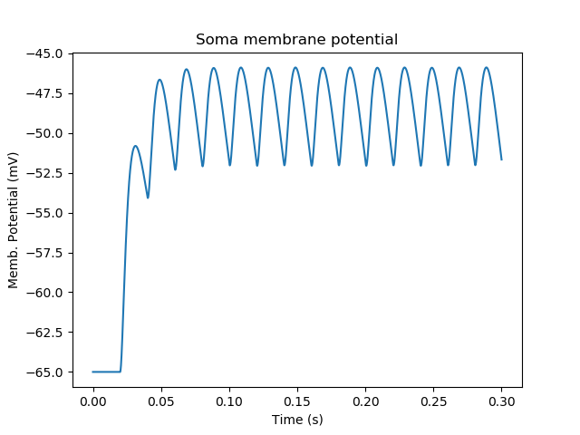
   
   Periodic synaptic input

Reaction system in a single compartment
~~~~~~~~~~~~~~~~~~~~~~~~~~~~~~~~~~~~~~~

*ex6_chem_osc.py*

Here we use the compartment as a place in which to embed a chemical
model. The chemical oscillator model is predefined in the rdesigneur
prototypes. Its general form is:

::

    s ---a---> a  // s goes to a, catalyzed by a.
    s ---a---> b  // s goes to b, catalyzed by a.
    a ---b---> s  // a goes to s, catalyzed by b.
    b -------> s  // b is degraded irreversibly to s

Here is the script:

::

    import moose
    import pylab
    import rdesigneur as rd
    rdes = rd.rdesigneur(
            turnOffElec = True,
            diffusionLength = 1e-3, # Default diffusion length is 2 microns
            chemProto = [['makeChemOscillator()', 'osc']],
            chemDistrib = [['osc', 'soma', 'install', '1' ]],
            plotList = [['soma', '1', 'dend/a', 'conc', 'a Conc'],
                ['soma', '1', 'dend/b', 'conc', 'b Conc']]
    )
    rdes.buildModel()
    b = moose.element( '/model/chem/dend/b' )
    b.concInit *= 5
    moose.reinit()
    moose.start( 200 )

    rdes.display()

In this special case we set the turnOffElec flag to True, so that
Rdesigneur only sets up chemical and not electrical calculations. This
makes the calculations much faster, since we disable electrical
calculations and delink chemical calculations from them.

We also have a line which sets the ``diffusionLength`` to 1 mm, so that
it is bigger than the 0.5 mm squid axon segment in the default
compartment. If you don't do this the system will subdivide the
compartment into the default 2 micron voxels for the purposes of putting
in a reaction-diffusion system. We discuss this case below.

Note how the *plotList* is done here. To remind you, each entry has five
arguments

::

    [region_in_cell, region_expression, moose_object, parameter, title_of_plot]

The change from the earlier usage is that the ``moose_object`` now
refers to a chemical entity, in this example the molecule *dend/a*. The
simulator builds a default chemical compartment named *dend* to hold the
reactions defined in the *chemProto*. What we do in this plot is to
select molecule *a* sitting in *dend*, and plot its concentration. Then
we do this again for molecule *b*.

After the model is built, we add a couple of lines to change the initial
concentration of the molecular pool *b*. Note its full path within
MOOSE: */model/chem/dend/b*. It is scaled up 5x to give rise to slowly
decaying oscillations.

.. figure:: ../../../../images/rdes4_osc.png
   :alt: Plot for single-compartment reaction simulation

   Plot for single-compartment reaction simulation

Reaction-diffusion system
~~~~~~~~~~~~~~~~~~~~~~~~~

*ex7.0_spatial_chem_osc.py*

In order to see what a reaction-diffusion system looks like, we assign the
``diffusionLength`` expression in the previous example to a much shorter
length, and add a couple of lines to set up 3-D graphics for the 
reaction-diffusion product:

::

    import moose
    import pylab
    import rdesigneur as rd
    rdes = rd.rdesigneur(
            turnOffElec = True,
            #This subdivides the length of the soma into 2 micron voxels
            diffusionLength = 2e-6,
            chemProto = [['makeChemOscillator()', 'osc']],
            chemDistrib = [['osc', 'soma', 'install', '1' ]],
            plotList = [['soma', '1', 'dend/a', 'conc', 'Concentration of a'],
                ['soma', '1', 'dend/b', 'conc', 'Concentration of b']],
            moogList = [['soma', '1', 'dend/a', 'conc', 'a Conc', 0, 360 ]]
    )

    rdes.buildModel()
    bv = moose.vec( '/model/chem/dend/b' )
    bv[0].concInit *= 2
    bv[-1].concInit *= 2
    moose.reinit()

    rdes.displayMoogli( 1, 400, rotation = 0, azim = np.pi/2, elev = 0.0 )

This is the new value for diffusion length.

::

        diffusionLength = 2e-3,

With this change we tell *rdesigneur* to use the diffusion length of 2 microns.
This happens to be the default too. The 500-micron axon segment is now 
subdivided into 250 voxels, each of which has a reaction system and 
diffusing molecules.
To make it more picturesque, we have added a line after the plotList, to
display the outcome in 3-D:

::

    moogList = [['soma', '1', 'dend/a', 'conc', 'a Conc', 0, 360 ]]

This line says: take the model compartments defined by ``soma`` as the
region to display, do so throughout the the geometry (the ``1``
signifies this), and over this range find the chemical entity defined by
``dend/a``. For each ``a`` molecule, find the ``conc`` and dsiplay it.
There are two optional arguments, ``0`` and ``360``, which specify the
low and high value of the displayed variable.

In order to initially break the symmetry of the system, we change the
initial concentration of molecule b at each end of the cylinder:

::

    bv[0].concInit *= 2
    bv[-1].concInit *= 2

If we didn't do this the entire system would go through a few cycles of
decaying oscillation and then reach a boring, spatially uniform, steady
state. Try putting an initial symmetry break elsewhere to see what
happens.

To display the concenctration changes in the 3-D soma as the simulation
runs, we use the line

::

    rdes.displayMoogli( 1, 400, rotation = 0, azim = np.pi/2, elev = 0.0 )

The arguments mean: *displayMoogli( frametime, runtime, rotation, azimuth, elevation )*
Here,

::

    frametime = time by which simulation advances between display updates
    runtime = Total simulated time
    rotation = angle by which display rotates in each frame, in radians.
    azimuth = Azimuth angle of view point, in radians
    elevation = elevation angle of view point, in radians

When we run this, we first get a 3-D display with the oscillating
reaction-diffusion system making its way inward from the two ends. After
the simulation ends the plots for all compartments for the whole run
come up.

.. figure:: ../../../../images/rdes5_reacdiff.png
   :alt: Display for oscillatory reaction-diffusion simulation

   Display for oscillatory reaction-diffusion simulation

For those who would rather use the much simpler matplotlib 3-D display option,
this is what the same simulation looks like:

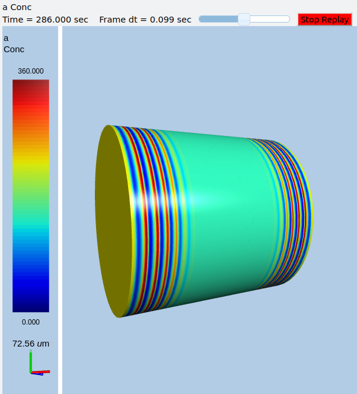

   Display for oscillatory reac-diff simulation using matplotlib

Primer on using the 3-D MOOGLI display
~~~~~~~~~~~~~~~~~~~~~~~~~~~~~~~~~~~~~~

There are two variants of the MOOGLI display. The first, named Moogli,
uses OpenGL and OpenSceneGraph. It is fast to display, slow to load, and
difficult to compile. It produces much better looking 3-D graphics.
The second is a fallback interface using mplot3d, which is a library of 
Matplotlib and so should be generally available. It is slower to display,
faster to load, but needs no special compilation. It uses stick graphics
and though it conveys much the same information, isn't as nice to look at
as the original Moogli. Its controls are more or less the same but less 
smooth than the original Moogli.

Here is a short primer on the 3-D display controls.

-  *Roll, pitch, and yaw*: Use the letters *r*, *p*, and *y*. To rotate
   backwards, use capitals.
-  *Zoom out and in*: Use the *,* and *.* keys, or their upper-case
   equivalents, *<* and *>*. Easier to remember if you think in terms of
   the upper-case.
-  *Left/right/up/down*: Arrow keys.
-  *Quit*: control-q or control-w.
-  You can also use the mouse or trackpad to control most of the above.
-  By default rdesigneur gives Moogli a small rotation each frame. It is
   the *rotation* argument in the line:

   ``displayMoogli( frametime, runtime, rotation )``

These controls operate over and above this rotation, but the rotation
continues. If you set the rotation to zero you can, with a suitable
flick of the mouse, get the image to rotate in any direction you choose
as long as the window is updating.

Diffusion of a single molecule
~~~~~~~~~~~~~~~~~~~~~~~~~~~~~~

*ex7.1_diffusive_gradient.py*

This is simply a test model to confirm that simple diffusion happens as
expected. While the model is just that of a single pool, we spend a few lines
taking snapshots of the spatial profile of this pool.

::

    import moose
    import pylab
    import re
    import rdesigneur as rd
    import matplotlib.pyplot as plt
    import numpy as np
    
    moose.Neutral( '/library' )
    moose.Neutral( '/library/diffn' )
    moose.CubeMesh( '/library/diffn/dend' )
    A = moose.Pool( '/library/diffn/dend/A' )
    A.diffConst = 1e-10
    
    rdes = rd.rdesigneur(
        turnOffElec = True,
        diffusionLength = 1e-6,
        chemProto = [['diffn', 'diffn']],
        chemDistrib = [['diffn', 'soma', 'install', '1' ]],
        moogList = [
                ['soma', '1', 'dend/A', 'conc', 'A Conc', 0, 360 ]
        ]
    )
    rdes.buildModel()
    
    rdes.displayMoogli( 1, 2, rotation = 0, azim = -np.pi/2, elev = 0.0, block = False )
    av = moose.vec( '/model/chem/dend/A' )
    for i in range(10):
        av[i].concInit = 1
    moose.reinit()
    plist = []
    for i in range( 20 ):
        plist.append( av.conc[:200] )
        moose.start( 2 )
    fig = plt.figure( figsize = ( 10, 12 ) )
    plist = np.array( plist ).T
    plt.plot( range( 0, 200 ), plist )
    plt.xlabel( "position ( microns )" )
    plt.ylabel( "concentration ( mM )" )
    plt.show( block = True )
    
    
Here are the snapshots, overlaid in a single plot:

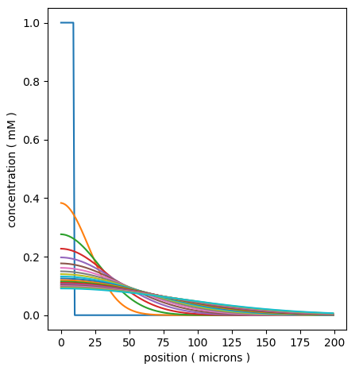

   Display for simple time-series of spread of a diffusing molecule 
   using matplotlib

Multiscale models: single compartment
~~~~~~~~~~~~~~~~~~~~~~~~~~~~~~~~~~~~~

*ex8.0_multiscale_KA_phosph.py*

The next few examples are for the multiscale modeling that is the main purpose
of rdesigneur and MOOSE as a whole. These are 'toy' examples in that the
chemical and electrical signaling is simplified, but they exhibit dynamics
that are of real interest.

The first example is of a bistable system where the feedback loop comprises of

`calcium influx -> chemical activity -> channel modulation -> electrical activity -> calcium influx.`

Calcium enters through voltage gated calcium channels, leads to enzyme 
activation and phosphorylation of a KA channel, which depolarizes the cell,
so it spikes more, so more calcium enters.

::
    
    import moose
    import pylab
    import rdesigneur as rd
    rdes = rd.rdesigneur(
        elecDt = 50e-6,
        chemDt = 0.002,
        chemPlotDt = 0.002,
        # cellProto syntax: ['somaProto', 'name', dia, length]
        cellProto = [['somaProto', 'soma', 12e-6, 12e-6]],
        chemProto = [['./chem/chanPhosphByCaMKII.g', 'chem']],
        chanProto = [
            ['make_Na()', 'Na'], 
            ['make_K_DR()', 'K_DR'], 
            ['make_K_A()', 'K_A' ],
            ['make_Ca()', 'Ca' ],
            ['make_Ca_conc()', 'Ca_conc' ]
        ],
        # Some changes to the default passive properties of the cell.
        passiveDistrib = [['.', 'soma', 'CM', '0.03', 'Em', '-0.06']],
        chemDistrib = [['chem', 'soma', 'install', '1' ]],
        chanDistrib = [
            ['Na', 'soma', 'Gbar', '300' ],
            ['K_DR', 'soma', 'Gbar', '250' ],
            ['K_A', 'soma', 'Gbar', '200' ],
            ['Ca_conc', 'soma', 'tau', '0.0333' ],
            ['Ca', 'soma', 'Gbar', '40' ]
        ],
        adaptorList = [
            [ 'dend/chan', 'conc', 'K_A', 'modulation', 0.0, 70 ],
            [ 'Ca_conc', 'Ca', 'dend/Ca', 'conc', 0.00008, 2 ]
        ],
        # Give a + pulse from 5 to 7s, and a - pulse from 20 to 21.
        stimList = [['soma', '1', '.', 'inject', '((t>5 && t<7) - (t>20 && t<21)) * 1.0e-12' ]],
        plotList = [
            ['soma', '1', '.', 'Vm', 'Membrane potential'],
            ['soma', '1', '.', 'inject', 'current inj'],
            ['soma', '1', 'K_A', 'Ik', 'K_A current'],
            ['soma', '1', 'dend/chan', 'conc', 'Unphosph K_A conc'],
            ['soma', '1', 'dend/Ca', 'conc', 'Chem Ca'],
        ],
    )
    
    rdes.buildModel()
    moose.reinit()
    moose.start( 30 )
    
    rdes.display()
    
There is only one fundamentally new element in this script:

**adaptor List:** `[source, sourceField, dest, destField, offset, scale]`
The adaptor list maps between molecular, electrical or even structural 
quantities in the simulation. At present it is linear mapping, in due course
it may evolve to an arbitrary function. 

The two adaptorLists in the above script do the following:

      ``[ 'dend/chan', 'conc', 'K_A', 'modulation', 0.0, 70 ]``:

Use the concentration of the 'chan' molecule in the 'dend' compartment, 
to modulate the conductance of the 'K_A' channel such that the basal
conductance is zero and 1 millimolar of 'chan' results in a conductance that is
70 times greater than the baseline conductance of the channel, *Gbar*.

It is advisable to use the field *'modulation'* on channels undergoing scaling,
rather than to directly assign the conductance *'Gbar'*. This is because 
*Gbar* is an absolute conductance, and therefore it is scaled to the area of
the electrical segment. This makes it difficult to keep track of. *Modulation*
is a simple multiplier term onto *Gbar*, and is therefore easier to work with.

       ``[ 'Ca_conc', 'Ca', 'dend/Ca', 'conc', 0.00008, 2 ]``:

Use the concentration of *Ca* as computed in the electrical model, to assign
the concentration of molecule *Ca* on the dendrite compartment. There is a
basal level of 80 nanomolar, and every unit of electrical *Ca* maps to 2 
millimolar of chemical *Ca*.

The arguments in the adaptorList are:

        * **Source and Dest**: Strings. These can be either a molecular or an 
          electrical object. To identify a molecular object, it should be 
          prefixed with the name of the chemical compartment, which is one 
          of *dend, spine, psd*. Thus *dend/chan* specifies a molecule 
          named *'chan'* sitting in the *'dend'* compartment.

          To identify an electrical object, just pass in its path, 
          such as '.' or *'Ca_conc'*.

          Note that the adaptors do **not** need to know anything about the 
          location.  It is assumed that the adaptors do their job wherever 
          the specified source and dest coexist. There is a subtlety here 
          due to the different length and time scales. The rule of thumb 
          is that the adaptor averages whichever one is subdivided more finely. 

            - Example 1: Molecules are typically spatially partitioned into 
              short voxels (micron-scale) compared to typical 100-micron 
              electrical 
              segments. So an adaptor going from molecules to, say, channel 
              conductance, would average all the molecular voxels that fit 
              in the electrical segment.
            - Example 2: Electrical activity is typically much faster than 
              chemical.
              So an adaptor going from an electrical entity (Ca computed from 
              channel opening) to molecules (Chemical Ca concentration) would
              average all the time-steps between updates to the molecule.

        * **Fields**: Strings. These are simply the field names on the 
          objects coupled by the adaptors.

        * **offset and scale**: Doubles. At present the adaptor is just a 
          straight-line conversion, obeying ``y = mx + c``. The computed 
          output is *y*, averaged input is *x*, offset is *c* and scale is *m*.

There is a handy new line to specify cellular passive properties:

**passiveDistrib:** `['.', path, field, value, field, value, ... ]`,

        * '.': This is just a placeholder.
        * path: String. Specifies the object whose parameters are to be changed.
        * field: String. Name of the field on the object.
        * value: String, that is the value has to be enclosed in quotes. The
          value to be assigned to the object.

With these in place, the model behavior is rather neat. It starts out silent,
then we apply 2 seconds of +ve current injection. 

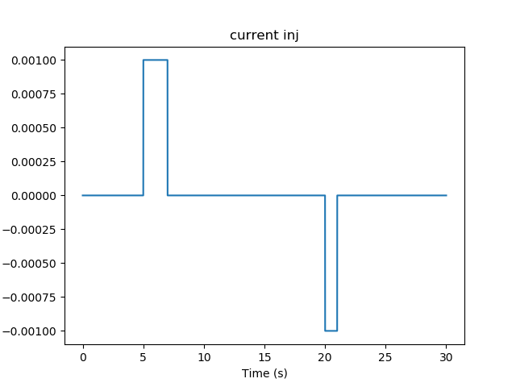

   Current injection stimuli for multiscale model.

The cell fires briskly, and keeps firing even when the current injection
drops to zero. 

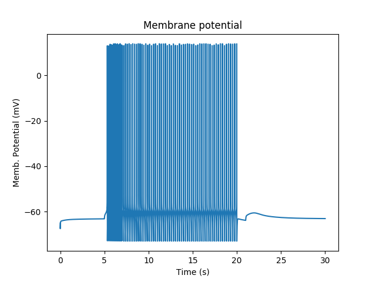

   Firing responses of cell with multiscale signaling.

The firing of the neuron leads to Ca influx.

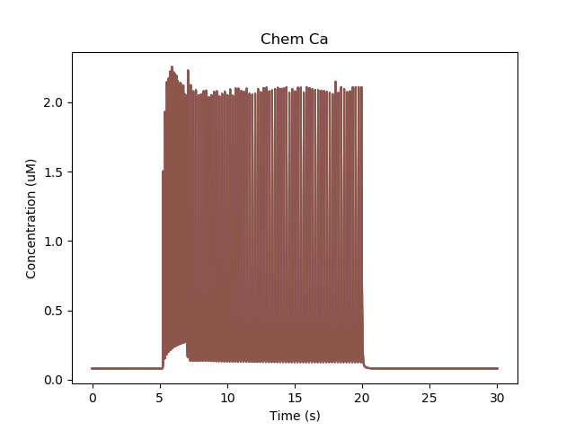

   Calcium buildup in cell due to firing.

The chemical reactions downstream of Ca lead to phosphorylation of the K_A
channel. Only the unphosphorylated K_A channel is active, so the net effect
is to reduce K_A conductance while the Ca influx persists.

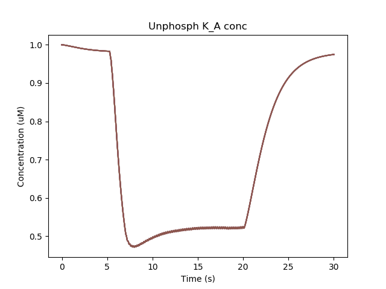

   Removal of KA channel due to phosphorylation.

Since the phosphorylated form has low conductance, the cell becomes more 
excitable and keeps firing even when the current injection is stopped. It takes
a later, -ve current injection to turn the firing off again.

Suggestions for things to do with the model:

        - Vary the adaptor settings, which couple electrical to chemical
          signaling and vice versa.
        - Play with the channel densities
        - Open the chem model in moosegui and vary its parameters too.

Multiscale model spanning PSD, spine head and dendrite
~~~~~~~~~~~~~~~~~~~~~~~~~~~~~~~~~~~~~~~~~~~~~~~~~~~~~~

*ex8.2_multiscale_glurR_phosph_3compt.py*

This is another multiscale model on similar lines to 8.0. It is structurally
and computationally more complicated, because the action is distributed between
spines and dendrites, but formally it does the same thing: it turns on and 
stays on after a strong stimulus, due to phosphorylation of a (receptor) 
channel leading to greater excitability.

`calcium influx -> chemical activity -> channel modulation -> electrical activity -> calcium influx.`

The model is bistable as long as synaptic input keeps coming along at a basal 
rate, in this case 1 Hz. 

Here we have two new lines, to do with addition of spines. These are discussed
in detail in a later example. For now it is enough to know that the
**spineProto** line defines one of the prototype spines to be used to put into
the model, and the **spineDistrib** line tells the system where to put them,
and how widely to space them.

::

    import moose
    import rdesigneur as rd
    rdes = rd.rdesigneur(
        elecDt = 50e-6,
        chemDt = 0.002,
        diffDt = 0.002,
        chemPlotDt = 0.02,
        useGssa = False,
        # cellProto syntax: ['ballAndStick', 'name', somaDia, somaLength, dendDia, d
    endLength, numDendSegments ]
        cellProto = [['ballAndStick', 'soma', 12e-6, 12e-6, 4e-6, 100e-6, 2 ]],
        chemProto = [['./chem/chanPhosph3compt.g', 'chem']],
        spineProto = [['makeActiveSpine()', 'spine']],
        chanProto = [
            ['make_Na()', 'Na'], 
            ['make_K_DR()', 'K_DR'], 
            ['make_K_A()', 'K_A' ],
            ['make_Ca()', 'Ca' ],
            ['make_Ca_conc()', 'Ca_conc' ]
        ],
        passiveDistrib = [['.', 'soma', 'CM', '0.01', 'Em', '-0.06']],
        spineDistrib = [['spine', '#dend#', '50e-6', '1e-6']],
        chemDistrib = [['chem', '#', 'install', '1' ]],
        chanDistrib = [
            ['Na', 'soma', 'Gbar', '300' ],
            ['K_DR', 'soma', 'Gbar', '250' ],
            ['K_A', 'soma', 'Gbar', '200' ],
            ['Ca_conc', 'soma', 'tau', '0.0333' ],
            ['Ca', 'soma', 'Gbar', '40' ]
        ],
        adaptorList = [
            [ 'psd/chan_p', 'n', 'glu', 'modulation', 0.1, 1.0 ],
            [ 'Ca_conc', 'Ca', 'spine/Ca', 'conc', 0.00008, 8 ]
        ],
        # Syn input basline 1 Hz, and 40Hz burst for 1 sec at t=20. Syn weight
        # is 0.5, specified in 2nd argument as a special case stimLists. 
        stimList = [['head#', '0.5','glu', 'periodicsyn', '1 + 40*(t>10 && t<11)']],
        plotList = [
            ['soma', '1', '.', 'Vm', 'Membrane potential'],
            ['#', '1', 'spine/Ca', 'conc', 'Ca in Spine'],
            ['#', '1', 'dend/DEND/Ca', 'conc', 'Ca in Dend'],
            ['#', '1', 'spine/Ca_CaM', 'conc', 'Ca_CaM'],
            ['head#', '1', 'psd/chan_p', 'conc', 'Phosph gluR'],
            ['head#', '1', 'psd/Ca_CaM_CaMKII', 'conc', 'Active CaMKII'],
        ]
    )
    moose.seed(123)
    rdes.buildModel()
    moose.reinit()
    moose.start( 25 )
    rdes.display()
    

This is how it works:

This is a ball-and-stick model with a couple of spines sitting on the dendrite.
The spines get synaptic input onto NMDARs and gluRs. There is a baseline
input rate of 1 Hz thoughout, and there is a burst at 40 Hz for 1 second at 
t = 10s.

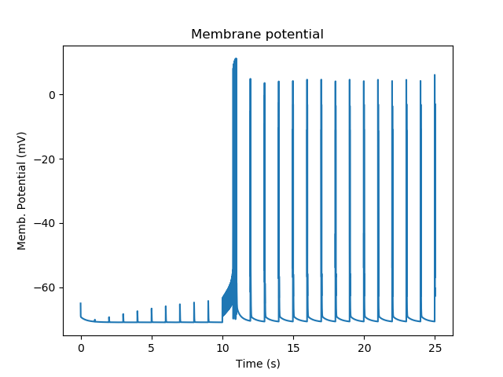

   Membrane potential responses of cell with synaptic input and multiscale signaling

At baseline, we just have small EPSPs and little Ca influx. A burst of
strong synaptic input causes Ca entry into the spine via NMDAR. 

.. figure:: ../../../../images/ex8.2_Ca_spine.png
   :alt: Calcium influx into spine.

   Calcium influx into spine.

Ca diffuses from the spine into the dendrite and spreads. In the graph below
we see how Calcium goes into the 50-odd voxels of the dendrite.

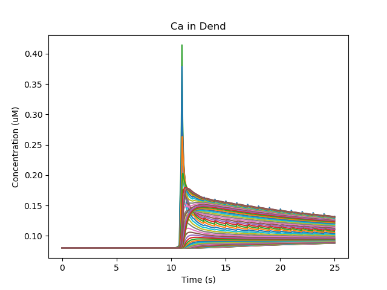

   Calcium influx and diffusion in dendrite.

The Ca influx into the spine 
triggers activation of CaMKII and its translocation to the PSD, where
it phosphorylates and increases the conductance of gluR. We have two spines
with slightly different geometry, so the CaMKII activity differs slightly.

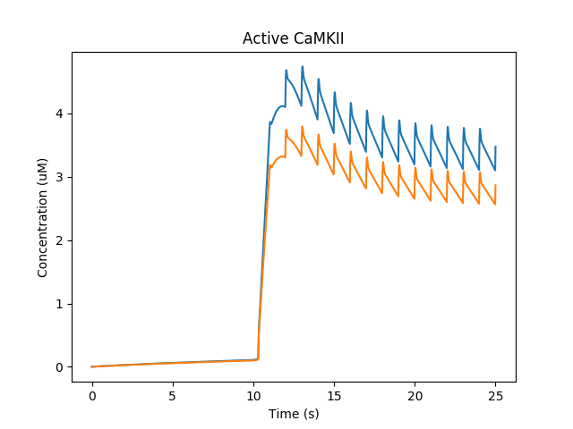

   Activation of CaMKII and translocation to PSD

Now that gluR has a greater weight, the baseline synaptic input keeps 
Ca trickling in enough to keep the CaMKII active. 

Here are the reactions:

::
        
        Ca+CaM <===> Ca_CaM;    Ca_CaM + CaMKII <===> Ca_CaM_CaMKII (all in
        spine head, except that the Ca_CaM_CaMKII translocates to the PSD)

        chan ------Ca_CaM_CaMKII-----> chan_p; chan_p ------> chan  (all in PSD)

Suggestions:

        - Add GABAR using make_GABA(), put it on soma or dendrite. Stimulate it
          after 20 s to see if you can turn off the sustained activation
        - Replace the 'periodicsyn' in stimList with 'randsyn'. This gives
          Poisson activity at the specified mean frequency. Does the switch
          remain reliable?
        - What are the limits of various parameters for this switching? You
          could try basal synaptic rate, burst rate, the various scaling factors
          for the adaptors, the densities of various channels, synaptic weight,
          and so on.
        - In real life an individual synaptic EPSP is tiny, under a millivolt.
          How many synapses would you need to achieve this kind of switching?
          You can play with # of synapses by altering the spacing between
          spines as the third argument of spineDistrib.

Multiscale model in which spine geometry changes due to signaling
~~~~~~~~~~~~~~~~~~~~~~~~~~~~~~~~~~~~~~~~~~~~~~~~~~~~~~~~~~~~~~~~~

*ex8.3_spine_vol_change.py*

This model is very similar to 8.2. The main design difference is that 
*adaptor*, instead of just modulating the gluR conductance, scales the 
entire spine cross-section area, with all sorts of electrical and chemical
ramifications. There are a lot of plots, to illustrate some of these outcomes.

::

    import moose
    import rdesigneur as rd
    rdes = rd.rdesigneur(
        elecDt = 50e-6,
        chemDt = 0.002,
        diffDt = 0.002,
        chemPlotDt = 0.02,
        useGssa = False,
        stealCellFromLibrary = True, # Simply move library model to use for sim
        cellProto = [['ballAndStick', 'soma', 12e-6, 12e-6, 4e-6, 100e-6, 2 ]],
        chemProto = [['./chem/chanPhosph3compt.g', 'chem']],
        spineProto = [['makeActiveSpine()', 'spine']],
        chanProto = [
            ['make_Na()', 'Na'], 
            ['make_K_DR()', 'K_DR'], 
            ['make_K_A()', 'K_A' ],
            ['make_Ca()', 'Ca' ],
            ['make_Ca_conc()', 'Ca_conc' ]
        ],
        passiveDistrib = [['.', 'soma', 'CM', '0.01', 'Em', '-0.06']],
        spineDistrib = [['spine', '#dend#', '50e-6', '1e-6']],
        chemDistrib = [['chem', '#', 'install', '1' ]],
        chanDistrib = [
            ['Na', 'soma', 'Gbar', '300' ],
            ['K_DR', 'soma', 'Gbar', '250' ],
            ['K_A', 'soma', 'Gbar', '200' ],
            ['Ca_conc', 'soma', 'tau', '0.0333' ],
            ['Ca', 'soma', 'Gbar', '40' ]
        ],
        adaptorList = [
            # This scales the psdArea of the spine by # of chan_p. Note that 
            # the cross-section area of the spine head is identical to psdArea.
            [ 'psd/chan_p', 'n', 'spine', 'psdArea', 0.1e-12, 0.01e-12 ],
            [ 'Ca_conc', 'Ca', 'spine/Ca', 'conc', 0.00008, 8 ]
        ],
        # Syn input basline 1 Hz, and 40Hz burst for 1 sec at t=20. Syn wt=10
        stimList = [['head#', '10','glu', 'periodicsyn', '1 + 40*(t>10 && t<11)']],
        plotList = [
            ['soma', '1', '.', 'Vm', 'Membrane potential'],
            ['#', '1', 'spine/Ca', 'conc', 'Ca in Spine'],
            ['#', '1', 'dend/DEND/Ca', 'conc', 'Ca in Dend'],
            ['head#', '1', 'psd/chan_p', 'n', 'Amount of Phospho-chan'],
            ['head#', '1', 'spine/CaMKII', 'conc', 'Conc of CaMKII in spine'],
            ['head#', '1', '.', 'Cm', 'Capacitance of spine head'],
            ['head#', '1', '.', 'Rm', 'Membrane res of spine head'],
            ['head#', '1', '.', 'Ra', 'Axial res of spine head'],
            ['head#', '1', 'glu', 'Gbar', 'Conductance of gluR'],
            ['head#', '1', 'NMDA', 'Gbar', 'Conductance of NMDAR'],
        ]
    )
    moose.seed(123)
    rdes.buildModel()
    moose.reinit()
    moose.start( 25 )
    rdes.display()
    

The key *adaptor* line is as follows:

``[ 'psd/chan_p', 'n', 'spine', 'psdArea', 0.1e-12, 0.01e-12 ]``

Here, we use the phosphorylated *chan_p* molecule in the PSD as a proxy for 
processes that control spine size. We operate on a special object called
*spine* which manages many aspects of spines in the model (see below). Here
we control the *psdArea*, which defines the cross-section area of the spine
head and by extension of the PSD too. We keep a minimum spine area of 0.1 um^2,
and a scaling factor of 0.01um^2 per phosphorylated molecule.

The reaction system is identical to the one in *ex8.2*: 

::
        
        Ca+CaM <===> Ca_CaM;    Ca_CaM + CaMKII <===> Ca_CaM_CaMKII (all in
        spine head, except that the Ca_CaM_CaMKII translocates to the PSD)

        chan ------Ca_CaM_CaMKII-----> chan_p; chan_p ------> chan  (all in PSD)

Rather than list all the 10 plots, here are a few to show what is going on.

First, just the spiking activity of the cell. Here the burst of activity is
followed by a few seconds of enhanced synaptic weight, followed by subthreshold
EPSPs:

.. figure:: ../../../../images/ex8.3_Vm.png
   :alt: Membrane potential and spiking.

   Membrane potential and spiking.

Then, we fast-forward to the amount of *chan_p* which is the molecule that
controls spine size scaling: 

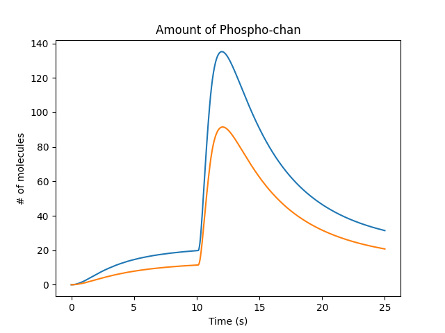

   Molecule that controles spine size

This causes some obvious outcomes. One of them is to increase the synaptic
conductance of the glutamate receptor. The system assumes that the conductance
of all channels in the PSD scales linearly with the psdArea.

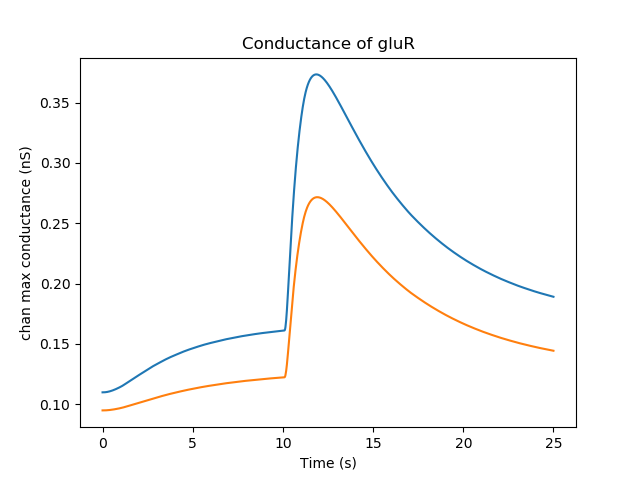

   Conductance of glutamate receptor

Here is one of several non-intuitive outcomes. Because the spine volume has
increased, the concentration of molecules in the spine is diluted out. So
the concentration of active CaMKII actually falls when the spine gets bigger.
In a more detailed model, this would be a race between the increase in spine
size and the time taken for diffusion and further reactions to replenish 
CaMKII. In the current model we don't have a diffusive coupling of CaMKII to
the dendrite, so this replenishment doesn't happen.

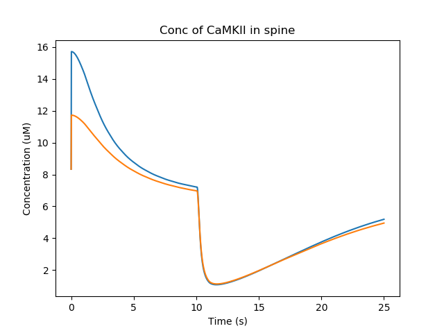

   Concentration of CaMKII in the spine

In the simulation we display several other electrical and chemical properties
that change with spine size. The diffusion properties also change since the 
cross-section areas are altered. This is harder to visualize but has large 
effects on coupling to the dendrite,
especially if the *shaftDiameter* is the parameter scaled by the signaling.

Suggestions:

        - The Spine class (instance: spine) manages several possible scaling
          targets on the spine geometry: shaftLength, shaftDiameter,
          headLength, headDiameter, psdArea, headVolume, totalLength. Try them
          out. Think about mechanisms by which molecular concentrations might
          affect each.
        - When volume changes, we assume that the molecular numbers stay
          fixed, so concentration changes. Except for buffered molecules, where
          we assume concentration remains fixed. Use this to design a bistable
          simply relying on molecules and spine geometry terms.
        - Even more interesting, use it to design an oscillator. You could look
          at Bhalla, BiophysJ 2011 for some ideas.

Morphology: Load .swc morphology file and view it
~~~~~~~~~~~~~~~~~~~~~~~~~~~~~~~~~~~~~~~~~~~~~~~~~

*ex9.0_load_neuronal_morphology_file.py*

Here we build a passive model using a morphology file in the .swc file
format (as used by NeuroMorpho.org). The morphology file is predefined
for Rdesigneur and resides in the directory ``./cells``. We apply a
somatic current pulse, and view the somatic membrane potential in a
plot, as before. To make things interesting we display the morphology in
3-D upon which we represent the membrane potential as colors.

::

    import sys
    import moose
    import rdesigneur as rd
    
    if len( sys.argv ) > 1:
        fname = sys.argv[1]
    else:
        fname = './cells/h10.CNG.swc'
    rdes = rd.rdesigneur(
        cellProto = [[fname, 'elec']],
        stimList = [['soma', '1', '.', 'inject', 't * 25e-9' ]],
        plotList = [['#', '1', '.', 'Vm', 'Membrane potential'],
                ['#', '1', 'Ca_conc', 'Ca', 'Ca conc (uM)']],
        moogList = [['#', '1', '.', 'Vm', 'Soma potential']]
    )
    rdes.buildModel()
    moose.reinit()
    rdes.displayMoogli( 0.001, 0.1, rotation = 0.02 )

Here the new concept is the cellProto line, which loads in the specified
cell model:

::

    `[ filename, cellname ]`

The system recognizes the filename extension and builds a model from the
swc file. It uses the cellname **elec** in this example.

We use a similar line as in the reaction-diffusion example, to build up
a Moogli display of the cell model:

::

    `moogList = [['#', '1', '.', 'Vm', 'Soma potential']]`

Here we have:

::

    # : the path to use for selecting the compartments to display. 
    This wildcard means use all compartments.
    1 : The expression to use for the compartments. Again, `1` means use
    all of them.
    . : Which object in the compartment to display. Here we are using the
    compartment itself, so it is just a dot.
    Vm : Field to display
    Soma potential : Title for display.

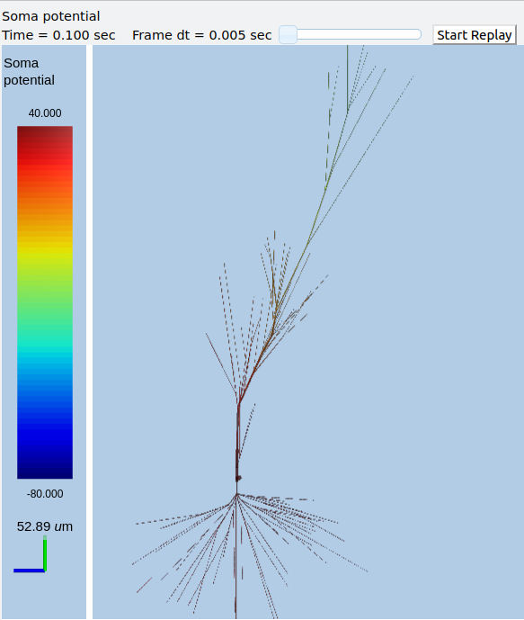

   3-D display for passive neuron

Suggestions:

        - The tutorial directory already has a number of pre-loaded files from
          NeuroMorpho. Pass them in to ex9.0 on the command line:

          `python ex9.0_load_neuronal_morphology_file.py <morpho.swc>`
        - Grab other morphology files from NeuroMorpho.org,  try them out.

Build an active neuron model by putting channels into a morphology file
~~~~~~~~~~~~~~~~~~~~~~~~~~~~~~~~~~~~~~~~~~~~~~~~~~~~~~~~~~~~~~~~~~~~~~~

*ex9.1_chans_in_neuronal_morph.py*

Here we load in a morphology file and distribute voltage-gated ion channels
over the neuron. The voltage-gated channels are obtained from a
number of channelML files, located in the ``./channels`` subdirectory.
Since we have a spatially extended neuron, we need to specify the
spatial distribution of channel densities too.

::

    import moose
    import rdesigneur as rd
    rdes = rd.rdesigneur(
        chanProto = [
            ['./chans/hd.xml'],
            ['./chans/kap.xml'],
            ['./chans/kad.xml'],
            ['./chans/kdr.xml'],
            ['./chans/na3.xml'],
            ['./chans/nax.xml'],
            ['./chans/CaConc.xml'],
            ['./chans/Ca.xml']
        ],
        cellProto = [['./cells/h10.CNG.swc', 'elec']],
        chanDistrib = [ \
            ["hd", "#dend#,#apical#", "Gbar", "50e-2*(1+(p*3e4))" ],
            ["kdr", "#", "Gbar", "p < 50e-6 ? 500 : 100" ],
            ["na3", "#soma#,#dend#,#apical#", "Gbar", "850" ],
            ["nax", "#soma#,#axon#", "Gbar", "1250" ],
            ["kap", "#axon#,#soma#", "Gbar", "300" ],
            ["kap", "#dend#,#apical#", "Gbar",
                "300*(H(100-p*1e6)) * (1+(p*1e4))" ],
            ["Ca_conc", "#", "tau", "0.0133" ],
            ["kad", "#soma#,#dend#,#apical#", "Gbar", "50" ],
            ["Ca", "#", "Gbar", "50" ]
        ],
        stimList = [['soma', '1', '.', 'inject', '(t>0.02) * 1e-9' ]],
        plotList = [['#', '1', '.', 'Vm', 'Membrane potential'],
                ['#', '1', 'Ca_conc', 'Ca', 'Ca conc (uM)']],
        moogList = [['#', '1', 'Ca_conc', 'Ca', 'Calcium conc (uM)', 0, 120],
            ['#', '1', '.', 'Vm', 'Soma potential']]
    )

    rdes.buildModel()

    moose.reinit()
    rdes.displayMoogli( 0.0002, 0.052 )

Here we make more extensive use of two concepts which we've already seen
from the single compartment squid model:

1. *chanProto*: This defines numerous channels, each of which is of the
   form:

   ``[ filename ]``

   or

   ``[ filename, channelname ]``

   or

   ``[ channelFunction(), channelname ]``

If the *channelname* is not specified the system uses the last part of
the channel name, before the filetype suffix.

2. *chanDistrib*: This defines the spatial distribution of each channel
   type. Each line is of a form that should be familiar now:

   ``[channelname, region_in_cell, parameter, expression_string]``

-  The *channelname* is the name of the prototype from *chanproto*. This
   is usually an ion channel, but in the example above you can also see
   a calcium concentration pool defined.
-  The *region\_in\_cell* is typically defined using wildcards, so that
   it generalizes to any cell morphology. For example, the plain
   wildcard ``#`` means to consider all cell compartments. The wildcard
   ``#dend#`` means to consider all compartments with the string
   ``dend`` somewhere in the name. Wildcards can be comma-separated, so
   ``#soma#,#dend#`` means consider all compartments with either soma or
   dend in their name. The naming in MOOSE is defined by the model file.
   Importantly, in **.swc** files MOOSE generates names that respect the
   classification of compartments into axon, soma, dendrite, and apical
   dendrite compartments respectively. SWC files generate compartment
   names such as:

   ::

       soma_<number>
       dend_<number>
       apical_<number>
       axon_<number>

where the number is automatically assigned by the reader. In order to
select all dendritic compartments, for example, one would use *"#dend#"*
where the *"#"* acts as a wildcard to accept any string. - The
*parameter* is usually Gbar, the channel conductance density in *S/m^2*.
If *Gbar* is zero or less, then the system economizes by not
incorporating this channel mechanism in this part of the cell.
Similarly, for calcium pools, if the *tau* is below zero then the
calcium pool object is simply not inserted into this part of the cell. -
The *expression\_string* defines the value of the parameter, such as
Gbar. This is typically a function of position in the cell. The
expression evaluator knows about several parameters of cell geometry.
All units are in metres:

-  *x*, *y* and *z* coordinates.
-  *g*, the geometrical distance from the soma
-  *p*, the path length from the soma, measured along the dendrites.
-  *dia*, the diameter of the dendrite.
-  *L*, The electrotonic length from the soma (no units).

Along with these geometrical arguments, we make liberal use of the
ternary expressions like *p < 50e-6 ? 500 : 100* or multiplying a channel
density with a logical function or Heaviside function H(x) to set up the 
channel distributions. The
expression evaluator also knows about pretty much all common algebraic,
trignometric, and logarithmic functions, should you wish to use these.

Also note the two Moogli displays. The first is the calcium
concentration. The second is the membrane potential in each compartment.
Easy!

.. figure:: ../../../../images/rdes8_active.png
   :alt: 3-D display for active neuron

   3-D display for active neuron

Suggestions:

        - Try another morphology file.
        - Try different channel distributions by editing the chanDistrib lines.
        - There are numerous predefined channels available within Rdesigneur.
          These can be defined using the following chanProto options:

          ::

                ['make_HH_Na()', 'HH_Na']
                ['make_HH_K_DR()', 'HH_K']
                ['make_Na()', 'Na']
                ['make_K_DR()', 'K_DR']
                ['make_K_A()', 'K_A']
                ['make_K_AHP()', 'K_AHP']
                ['make_K_C()', 'K_C']
                ['make_Ca()', 'Ca']
                ['make_Ca_conc()', 'Ca_conc']
                ['make_glu()', 'glu']
                ['make_GABA()', 'GABA']

          Then the chanDistrib can refer to these channels instead.
        - Deliver stimuli on the dendrites rather than the soma.

Build a spiny neuron from a morphology file and put active channels in it.
~~~~~~~~~~~~~~~~~~~~~~~~~~~~~~~~~~~~~~~~~~~~~~~~~~~~~~~~~~~~~~~~~~~~~~~~~~

*ex9.2_spines_in_neuronal_morpho.py*

This model is one step elaborated from the previous one, in that we now
also have dendritic spines. MOOSE lets one decorate a bare neuronal
morphology file with dendritic spines, specifying various geometric
parameters of their location. As before, we use an swc file for the
morphology, and the same ion channels and distribution.

::

    import moose
    import pylab
    import rdesigneur as rd
    rdes = rd.rdesigneur(
        chanProto = [
            ['./chans/hd.xml'],
            ['./chans/kap.xml'],
            ['./chans/kad.xml'],
            ['./chans/kdr.xml'],
            ['./chans/na3.xml'],
            ['./chans/nax.xml'],
            ['./chans/CaConc.xml'],
            ['./chans/Ca.xml']
        ],
        cellProto = [['./cells/h10.CNG.swc', 'elec']],
        spineProto = [['makeActiveSpine()', 'spine']],
        chanDistrib = [
            ["hd", "#dend#,#apical#", "Gbar", "50e-2*(1+(p*3e4))" ],
            ["kdr", "#", "Gbar", "p < 50e-6 ? 500 : 100" ],
            ["na3", "#soma#,#dend#,#apical#", "Gbar", "850" ],
            ["nax", "#soma#,#axon#", "Gbar", "1250" ],
            ["kap", "#axon#,#soma#", "Gbar", "300" ],
            ["kap", "#dend#,#apical#", "Gbar",
                "300*(H(100-p*1e6)) * (1+(p*1e4))" ],
            ["Ca_conc", "#", "tau", "0.0133" ],
            ["kad", "#soma#,#dend#,#apical#", "Gbar", "50" ],
            ["Ca", "#", "Gbar", "50" ]
        ],
        spineDistrib = [['spine', '#dend#,#apical#', '20e-6', '1e-6']],
        stimList = [['soma', '1', '.', 'inject', '(t>0.02) * 1e-9' ]],
        plotList = [['#', '1', '.', 'Vm', 'Membrane potential'],
                ['#', '1', 'Ca_conc', 'Ca', 'Ca conc (uM)']],
        moogList = [['#', '1', 'Ca_conc', 'Ca', 'Calcium conc (uM)', 0, 120],
            ['#', '1', '.', 'Vm', 'Soma potential']]
    )

    rdes.buildModel()

    moose.reinit()
    rdes.displayMoogli( 0.0002, 0.023 )

Spines are set up in a familiar way: we first define one (or more)
prototype spines, and then distribute these around the cell. Here is the
prototype string:

::

        [spine_proto, spinename]

*spineProto*: This is typically a function. One can define one's own,
but there are several predefined ones in rdesigneur. All these define a
spine with the following parameters:

-  head diameter 0.5 microns
-  head length 0.5 microns
-  shaft length 1 micron
-  shaft diameter of 0.2 microns
-  RM = 1.0 ohm-metre square
-  RA = 1.0 ohm-meter
-  CM = 0.01 Farads per square metre.

Here are the predefined spine prototypes:

-  *makePassiveSpine()*: This just makes a passive spine with the
   default parameters
-  *makeExcSpine()*: This makes a spine with NMDA and glu receptors, and
   also a calcium pool. The NMDA channel feeds the Ca pool.
-  *makeActiveSpine()*: This adds a Ca channel to the exc\_spine. and
   also a calcium pool.

The spine distributions are specified in a familiar way for the first
few arguments, and then there are multiple (optional) spine-specific
parameters:

*[spinename, region\_in\_cell, spacing, spacing\_distrib, size,
size\_distrib, angle, angle\_distrib ]*

Only the first two arguments are mandatory.

-  *spinename*: The prototype name
-  *region\_in\_cell*: Usual wildcard specification of names of
   compartments in which to put the spines.
-  *spacing*: Math expression to define spacing between spines. In the
   current implementation this evaluates to
   ``1/probability_of_spine_per_unit_length``. Defaults to 10 microns.
   Thus, there is a 10% probability of a spine insertion in every
   micron. This evaluation method has the drawback that it is possible
   to space spines rather too close to each other. If spacing is zero or
   less, no spines are inserted.
-  *spacing\_distrib*: Math expression for distribution of spacing. In
   the current implementation, this specifies the interval at which the
   system samples from the spacing probability above. Defaults to 1
   micron.
-  *size*: Linear scale factor for size of spine. All dimensions are
   scaled by this factor. The default spine head here is 0.5 microns in
   diameter and length. If the scale factor were to be 2, the volume
   would be 8 times as large. Defaults to 1.0.
-  *size\_distrib*: Range for size of spine. A random number R is
   computed in the range 0 to 1, and the final size used is
   ``size + (R - 0.5) * size_distrib``. Defaults to 0.5
-  *angle*: This specifies the initial angle at which the spine sticks
   out of the dendrite. If all angles were zero, they would all point
   away from the soma. Defaults to 0 radians.
-  *angle\_distrib*: Specifies a random number to add to the initial
   angle. Defaults to 2 PI radians, so the spines come out in any
   direction.

.. figure:: ../../../../images/rdes9_spiny_active.png
   :alt: 3-D display for spiny active neuron

   3-D display for spiny active neuron

Suggestions:

        - Try different spine settings. Warning: if you put in too many spines
          it will take much longer to load and run!
        - Try different spine geometry layouts.
        - See if you can deliver the current injection to the spine. Hint: the
          name of the spine compartments is 'head#' where # is the index of the
          spine.

