**Rdesigneur: Building multiscale models**
==========================================

Author: Upi Bhalla

Date: Aug 26 2016,

Last-Updated: Nov 08 2018

By: Upi Bhalla

.. --------------

Contents
--------

.. contents::
   :depth: 3

Introduction
------------

**Rdesigneur** (Reaction Diffusion and Electrical SIGnaling in NEURons)
is an interface to the multiscale modeling capabilities in MOOSE. It is
designed to build models incorporating biochemical signaling pathways in
dendrites and spines, coupled to electrical events in neurons.
Rdesigneur assembles models from predefined parts: it delegates the
details to specialized model definition formats. Rdesigneur combines one
or more of the following cell parts to build models:

-  Neuronal morphology
-  Dendritic spines
-  Ion channels
-  Reaction systems
-  Adaptors that couple between these for multiscale models

It also folds in simulation input and output

-  Time-series stimuli for molecular concentration change and reaction rates 
-  Current and voltage clamp 
-  Synaptic input.
-  Time-series plots
-  File dumps
-  3-D neuronal graphics

Rdesigneur's main role is to specify how these are put together,
including assigning parameters for the model. Using Rdesigneur one can compactly
and quickly put together quite complex multiscale models.

Rdesigneur examples
-------------------

Here we provide a few use cases, building up from a minimal model to a
reasonably complete multiscale model spanning chemical and electrical
signaling. The files for these examples are also available in
``moose-examples/tutorials/Rdesigneur``, and the file names are mentioned
as we go along.

.. _`building rdesigneur without arguments`:

Bare Rdesigneur: single passive compartment
~~~~~~~~~~~~~~~~~~~~~~~~~~~~~~~~~~~~~~~~~~~

*ex1_minimalModel.py*

If we don't provide any arguments at all to the Rdesigneur, it makes a
model with a single passive electrical compartment in the MOOSE path
``/model/elec/soma``. Here is how to do this:

::

    import moose
    import rdesigneur as rd
    rdes = rd.rdesigneur()
    rdes.buildModel()

To confirm that it has made a compartment with some default values we
can add a line:

::

    moose.showfields( rdes.soma )

This should produce the output:

::

    [ /model[0]/elec[0]/soma[0] ]
    diameter         = 0.0005
    fieldIndex       = 0
    Ra               = 7639437.26841
    y0               = 0.0
    Rm               = 424413.177334
    index            = 0
    numData          = 1
    inject           = 0.0
    initVm           = -0.065
    Em               = -0.0544
    y                = 0.0
    numField         = 1
    path             = /model[0]/elec[0]/soma[0]
    dt               = 0.0
    tick             = -2
    z0               = 0.0
    name             = soma
    Cm               = 7.85398163398e-09
    x0               = 0.0
    Vm               = -0.06
    className        = ZombieCompartment
    idValue          = 465
    length           = 0.0005
    Im               = 1.3194689277e-08
    x                = 0.0005
    z                = 0.0

Simulate and display current pulse to soma
~~~~~~~~~~~~~~~~~~~~~~~~~~~~~~~~~~~~~~~~~~

*ex2.0_currentPulse.py*

A more useful script would run and display the model. Rdesigneur can
help with the stimulus and the plotting. This simulation has the same
passive compartment, and current is injected as the simulation runs.
This script displays the membrane potential of the soma as it charges
and discharges.

::

    import moose
    import rdesigneur as rd
    rdes = rd.rdesigneur(
        stimList = [['soma', '1', '.', 'inject', '(t>0.1 && t<0.2) * 2e-8']],
        plotList = [['soma', '1', '.', 'Vm', 'Soma membrane potential']],
    )
    rdes.buildModel()
    moose.reinit()
    moose.start( 0.3 )
    rdes.display()

The *stimList* defines a stimulus. Each entry has five arguments:

::

    `[region_in_cell, region_expression, moose_object, parameter, expression_string]`

-  ``region_in_cell`` specifies the objects to stimulate. Here it is
   just the soma.
-  ``region_expression`` specifies a geometry based calculation to
   decide whether to apply the stimulus. The value must be >0 for the
   stimulus to be present. Here it is just 1. ``moose_object`` specifies
   the simulation object to operate upon during the stimulus. Here the
   ``.`` means that it is the soma itself. In other models it might be a
   channel on the soma, or a synapse, and so on.
-  ``parameter`` specifies the simulation parameter on the moose object
   that the stimulus will modify. Here it is the injection current to
   the soma compartment.
-  ``expression_string`` calculates the value of the parameter,
   typically as a function of time. Here we use the function
   ``(t>0.1 && t<0.2) * 2e-8`` which evaluates as 2e-8 between the times
   of 0.1 and 0.2 seconds.

To summarise this, the *stimList* here means *inject a current of 20nA
to the soma between the times of 0.1 and 0.2 s*.

The *plotList* defines what to plot. It has a similar set of arguments:

::

    `[region_in_cell, region_expression, moose_object, parameter, title_of_plot]`

These mean the same thing as for the stimList except for the title of
the plot.

The *rdes.display()* function causes the plots to be displayed.

.. figure:: ../../../../images/rdes2_passive_squid.png
   :alt: Plot for current input to passive compartment

   Plot for current input to passive compartment

When we run this we see an initial depolarization as the soma settles
from its initial -65 mV to a resting Em = -54.4 mV. These are the
original HH values, see the example above. At t = 0.1 seconds there is
another depolarization due to the current injection, and at t = 0.2
seconds this goes back to the resting potential.

Simulate and display voltage clamp stimulus to soma
~~~~~~~~~~~~~~~~~~~~~~~~~~~~~~~~~~~~~~~~~~~~~~~~~~~

*ex2.1_vclamp.py*

This model introduces the voltage clamp stimulus on a passive compartment.
As before, we add a few lines to define the stimulus and plot.
This script displays both the membrane potential, and the holding current 
of the voltage clamp circuit as
it charges and discharges the passive compartment model. 

::

    import moose
    import rdesigneur as rd
    rdes = rd.rdesigneur(
        stimList = [['soma', '1', '.', 'vclamp', '-0.065 + (t>0.1 && t<0.2) * 0.02' ]],
        plotList = [
            ['soma', '1', '.', 'Vm', 'Soma membrane potential'],
            ['soma', '1', 'vclamp', 'current', 'Soma holding current'],
        ]
    )
    rdes.buildModel()
    moose.reinit()
    moose.start( 0.3 )
    rdes.display()

Here the *stimList* line tells the system to deliver a voltage clamp (vclamp)
on the soma, starting at -65 mV and jumping up by 20 mV between 0.1 and 0.2 
seconds. The *plotList* now includes two entries, and will generate two plots.
The first is for plotting the soma membrane potential, just to be sure that
the voltage clamp is doing its job. 

.. figure:: ../../../../images/ex2.1_vclamp_a.png
   :alt: Plot for membrane potential in voltage clamp

   Plot for membrane potential in voltage clamp

The second graph plots the holding current.  Note the capacitive transients.

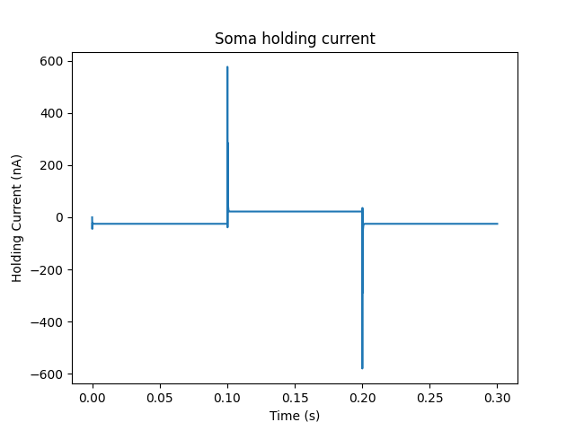

   Plot for holding current for voltage clamp

HH Squid model in a single compartment
~~~~~~~~~~~~~~~~~~~~~~~~~~~~~~~~~~~~~~

*ex3.0_squid_currentPulse.py*

Here we put the Hodgkin-Huxley squid model channels into a passive
compartment. The HH channels are predefined as prototype channels for
Rdesigneur,

::

    import moose
    import pylab
    import rdesigneur as rd
    rdes = rd.rdesigneur(
        chanProto = [['make_HH_Na()', 'Na'], ['make_HH_K()', 'K']],
        chanDistrib = [
            ['Na', 'soma', 'Gbar', '1200' ],
            ['K', 'soma', 'Gbar', '360' ]],
        stimList = [['soma', '1', '.', 'inject', '(t>0.1 && t<0.2) * 1e-8' ]],
        plotList = [['soma', '1', '.', 'Vm', 'Membrane potential']]
    )

    rdes.buildModel()
    moose.reinit()
    moose.start( 0.3 )
    rdes.display()

Here we introduce two new model specification lines:

-  **chanProto**: This specifies which ion channels will be used in the
   model. Each entry here has two fields: the source of the channel
   definition, and (optionally) the name of the channel. In this example
   we specify two channels, an Na and a K channel using the original
   Hodgkin-Huxley parameters. As the source of the channel definition we
   use the name of the Python function that builds the channel. The
   *make\_HH\_Na()* and *make\_HH\_K()* functions are predefined but we
   can also specify our own functions for making prototypes. We could
   also have specified the channel prototype using the name of a channel
   definition file in ChannelML (a subset of NeuroML) format.
-  **chanDistrib**: This specifies *where* the channels should be placed
   over the geometry of the cell. Each entry in the chanDistrib list
   specifies the distribution of parameters for one channel using four
   entries:

   ``[object_name, region_in_cell, parameter, expression_string]``

   In this case the job is almost trivial, since we just have a single
   compartment named *soma*. So the line

   ``['Na', 'soma', 'Gbar', '1200' ]``

   means *Put the Na channel in the soma, and set its maximal
   conductance density (Gbar) to 1200 Siemens/m^2*.

As before we apply a somatic current pulse. Since we now have HH
channels in the model, this generates action potentials.

.. figure:: ../../../../images/rdes3_squid.png
   :alt: Plot for HH squid simulation

   Plot for HH squid simulation

There are several interesting things to do with the model by varying stimulus
parameters:

        -  Change injection current.
        -  Put in a protocol to get rebound action potential.
        -  Put in a current ramp, and run it for a different duration
        -  Put in a frequency chirp, and see how the squid model is tuned
           to a certain frequency range.
        -  Modify channel or passive parameters. See if it still fires.
        -  Try the frequency chirp on the cell with parameters changed. Does 
           the tuning change?

HH Squid model with voltage clamp
~~~~~~~~~~~~~~~~~~~~~~~~~~~~~~~~~

*ex3.1_squid_vclamp.py*

This is the same squid model, but now we add a voltage clamp to the squid
and monitor the holding current. This stimulus line is identical to ex2.1.

::

    import moose
    import pylab
    import rdesigneur as rd
    rdes = rd.rdesigneur(
        chanProto = [['make_HH_Na()', 'Na'], ['make_HH_K()', 'K']],
        chanDistrib = [
            ['Na', 'soma', 'Gbar', '1200' ],
            ['K', 'soma', 'Gbar', '360' ]],
        stimList = [['soma', '1', '.', 'vclamp', '-0.065 + (t>0.1 && t<0.2) * 0.02' ]],
        plotList = [
            ['soma', '1', '.', 'Vm', 'Membrane potential'],
            ['soma', '1', 'vclamp', 'current', 'Soma holding current']
        ]
    )
    rdes.buildModel()
    moose.reinit()
    moose.start( 0.3 )
    rdes.display()

Here we see the classic HH current response, a downward brief deflection due to
the Na channel, and a slower upward sustained current due to the K delayed
rectifier.

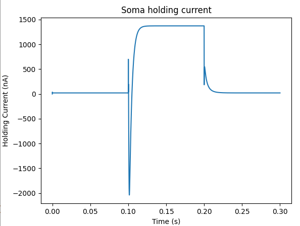

   Plot for HH squid voltage clamp pulse.

Here are some suggestions for further exploration:

        - Monitor individual channel currents through additional plots.
        - Convert this into a voltage clamp series. Easiest way to do this is
          to complete the rdes.BuildModel, then delete the Function object
          on the */model/elec/soma/vclamp*. Now you can simply set the 'command'
          field of the vclamp in a for loop, going from -ve to +ve voltages.
          Remember, SI units. You may wish to capture the plot vectors each
          cycle. The plot vectors are accessed by something like

        ``moose.element( '/model/graphs/plot1' ).vector``

HH Squid model in an axon
~~~~~~~~~~~~~~~~~~~~~~~~~

*ex3.2_squid_axon_propgn.py*

Here we put the Hodgkin-Huxley squid model into a long compartment that
is subdivided into many segments, so that we can watch action potentials
propagate. Most of this example is boilerplate code to build a spiral
axon. There is a short *rdesigneur* segment that takes the spiral axon
prototype and populates it with channels, and sets up the display. Later
examples will show you how to read morphology files to specify the
neuronal geometry.

::

    import numpy as np
    import moose
    import pylab
    import rdesigneur as rd

    numAxonSegments = 200
    comptLen = 10e-6
    comptDia = 1e-6
    RM = 1.0
    RA = 10.0
    CM = 0.01

    def makeAxonProto():
            axon = moose.Neuron( '/library/axon' )
            prev = rd.buildCompt( axon, 'soma', RM = RM, RA = RA, CM = CM, dia = 10e-6, x=0, dx=comptLen)
            theta = 0
            x = comptLen
            y = 0.0

            for i in range( numAxonSegments ):
                dx = comptLen * np.cos( theta )
                dy = comptLen * np.sin( theta )
                r = np.sqrt( x * x + y * y )
                theta += comptLen / r
                compt = rd.buildCompt( axon, 'axon' + str(i), RM = RM, RA = RA, CM = CM, x = x, y = y, dx = dx, dy = dy, dia = comptDia )
                moose.connect( prev, 'axial', compt, 'raxial' )
                prev = compt
                x += dx
                y += dy
            
            return axon

    moose.Neutral( '/library' )
    makeAxonProto()

    rdes = rd.rdesigneur(
            chanProto = [['make_HH_Na()', 'Na'], ['make_HH_K()', 'K']],
            cellProto = [['elec','axon']],
            chanDistrib = [
                ['Na', '#', 'Gbar', '1200' ],
                ['K', '#', 'Gbar', '360' ]],
            stimList = [['soma', '1', '.', 'inject', '(t>0.01 && t<0.2) * 2e-11' ]],
            plotList = [['soma', '1', '.', 'Vm', 'Membrane potential']],
            moogList = [['#', '1', '.', 'Vm', 'Vm (mV)']]
            )

    rdes.buildModel()
    moose.reinit()

    rdes.displayMoogli( 0.00005, 0.05, 0.0 )

   Axon with propagating action potential

Note how we explicitly create the prototype axon on '/library', and then
specify it using the *cellProto* line in the rdesigneur. The moogList
specifies the 3-D display. See below for how to set up and use these
displays.

Action potential collision in HH Squid axon model
~~~~~~~~~~~~~~~~~~~~~~~~~~~~~~~~~~~~~~~~~~~~~~~~~

*ex3.3_AP_collision.py*

This is identical to the previous example, except that now we deliver current
injection at at two points, the soma and a point along the axon. The modified
stimulus line is:

::

        ...
        stimList = [['soma', '1', '.', 'inject', '(t>0.01 && t<0.2) * 2e-11' ],
        ['axon100', '1', '.', 'inject', '(t>0.01 && t<0.2) * 3e-11' ]],
        ...

Watch how the AP is triggered bidirectionally from the stimulus point on the
100th segment of the axon, and observe what happens when two action potentials 
bump into each other.

   Colliding action potentials

HH Squid model in a myelinated axon
~~~~~~~~~~~~~~~~~~~~~~~~~~~~~~~~~~~

*ex3.4_myelinated_axon.py*

This is a curious cross-species chimera model, where we embed the HH
equations into a myelinated example model. As for the regular axon
above, most of the example is boilerplate setup code. Note how we
restrict the HH channels to the nodes of Ranvier using a conditional
test for the diameter of the axon segment.

::

    import numpy as np
    import moose
    import pylab
    import rdesigneur as rd

    numAxonSegments = 405
    nodeSpacing = 100
    comptLen = 10e-6
    comptDia = 2e-6 # 2x usual
    RM = 100.0 # 10x usual
    RA = 5.0
    CM = 0.001 # 0.1x usual

    nodeDia = 1e-6
    nodeRM = 1.0
    nodeCM = 0.01

    def makeAxonProto():
        axon = moose.Neuron( '/library/axon' )
        x = 0.0
        y = 0.0
        prev = rd.buildCompt( axon, 'soma', RM = RM, RA = RA, CM = CM, dia = 10e-6, x=0, dx=comptLen)
        theta = 0
        x = comptLen

        for i in range( numAxonSegments ):
            r = comptLen
            dx = comptLen * np.cos( theta )
            dy = comptLen * np.sin( theta )
            r = np.sqrt( x * x + y * y )
            theta += comptLen / r
            if i % nodeSpacing == 0:
                compt = rd.buildCompt( axon, 'axon' + str(i), RM = nodeRM, RA = RA, CM = nodeCM, x = x, y = y, dx = dx, dy = dy, dia = nodeDia )
            else:
                compt = rd.buildCompt( axon, 'axon' + str(i), RM = RM, RA = RA, CM = CM, x = x, y = y, dx = dx, dy = dy, dia = comptDia )
            moose.connect( prev, 'axial', compt, 'raxial' )
            prev = compt
            x += dx
            y += dy
        
        return axon

    moose.Neutral( '/library' )
    makeAxonProto()

    rdes = rd.rdesigneur(
        chanProto = [['make_HH_Na()', 'Na'], ['make_HH_K()', 'K']],
        cellProto = [['elec','axon']],
        chanDistrib = [
            ['Na', '#', 'Gbar', '12000 * (dia < 1.5e-6)' ],
            ['K', '#', 'Gbar', '3600 * (dia < 1.5e-6)' ]],
        stimList = [['soma', '1', '.', 'inject', '(t>0.01 && t<0.2) * 1e-10' ]],
        plotList = [['soma,axon100,axon200,axon300,axon400', '1', '.', 'Vm', 'Membrane potential']],
        moogList = [['#', '1', '.', 'Vm', 'Vm (mV)']]
    )

    rdes.buildModel()

    for i in moose.wildcardFind( "/model/elec/#/Na" ):
        print i.parent.name, i.Gbar

    moose.reinit()

    rdes.displayMoogli( 0.00005, 0.05, 0.0 )

When you run the example, keep an eye out for a few things:

-  **saltatory conduction:** This is the way the action potential jumps
   from one node of Ranvier to the next. Between the nodes it is just
   passive propagation.
-  **Failure to propagate:** Observe that the second and fourth action
   potentials fails to trigger propagation along the axon. Here we have
   specially tuned the model properties so that this happens. With a
   larger RA of 10.0, the model will be more reliable.
-  **Speed:** Compare the propagation speed with the previous,
   unmyelinated axon. Note that the current model is larger!

.. figure:: ../../../../images/rdes3.2_myelinated_axon.png
   :alt: Myelinated axon with propagating action potential

   Myelinated axon with propagating action potential

Alternate (non-squid) way to define soma
~~~~~~~~~~~~~~~~~~~~~~~~~~~~~~~~~~~~~~~~

*ex4.0_scaledSoma.py*

The default HH-squid axon is not a very convincing soma. Rdesigneur offers a
somewhat more general way to define the soma in the  cell prototype line.

::

    import moose
    import pylab
    import rdesigneur as rd
    rdes = rd.rdesigneur(
        # cellProto syntax: ['somaProto', 'name', dia, length]
        cellProto = [['somaProto', 'soma', 20e-6, 200e-6]],
        chanProto = [['make_HH_Na()', 'Na'], ['make_HH_K()', 'K']],
        chanDistrib = [
            ['Na', 'soma', 'Gbar', '1200' ],
            ['K', 'soma', 'Gbar', '360' ]],
        stimList = [['soma', '1', '.', 'inject', '(t>0.01 && t<0.05) * 1e-9' ]],
        plotList = [['soma', '1', '.', 'Vm', 'Membrane potential']],
        moogList = [['#', '1', '.', 'Vm', 'Vm (mV)']]
    )
    
    rdes.buildModel()
    soma = moose.element( '/model/elec/soma' )
    print( 'Soma dia = {}, length = {}'.format( soma.diameter, soma.length ) )
    moose.reinit()
    
    rdes.displayMoogli( 0.0005, 0.06, 0.0 )

Here the crucial line is the *cellProto* line. There are four arguments here:

        ``['somaProto', 'name', dia, length]``

        - The first argument tells the system to use a prototype soma, that is 
          a single cylindrical compartment. 
        - The second argument is the name to give the cell.
        - The third argument is the diameter. Note that this is a double, 
          not a string.
        - The fourth argument is the length of the cylinder that makes up the 
          soma. This too is a double, not a string.
          The cylinder is oriented along the x axis, with one end at (0,0,0)
          and the other end at (length, 0, 0).

This is what the soma looks like:

   Image of soma.

It a somewhat elongated soma, being a cylinder 10 times as long as it is wide. 

Ball-and-stick model of a neuron
~~~~~~~~~~~~~~~~~~~~~~~~~~~~~~~~

*ex4.1_ballAndStick.py*

A somewhat more electrically reasonable model of a neuron has a soma and a
single dendrite, which can itself be subdivided into segments so that it
can exhibit voltage gradients, have channel and receptor distributions, 
and so on. This is accomplished in *rdesigneur* using a variant of the
cellProto syntax.

::

    import moose
    import pylab
    import rdesigneur as rd
    rdes = rd.rdesigneur(
        # cellProto syntax: ['ballAndStick', 'name', somaDia, somaLength, dendDia, dendLength, numDendSegments ]
        # The numerical arguments are all optional
        cellProto = [['ballAndStick', 'soma', 20e-6, 20e-6, 4e-6, 500e-6, 10]],
        chanProto = [['make_HH_Na()', 'Na'], ['make_HH_K()', 'K']],
        chanDistrib = [
            ['Na', 'soma', 'Gbar', '1200' ],
            ['K', 'soma', 'Gbar', '360' ],
            ['Na', 'dend#', 'Gbar', '400' ],
            ['K', 'dend#', 'Gbar', '120' ]
            ],
        stimList = [['soma', '1', '.', 'inject', '(t>0.01 && t<0.05) * 1e-9' ]],
        plotList = [['soma', '1', '.', 'Vm', 'Membrane potential']],
        moogList = [['#', '1', '.', 'Vm', 'Vm (mV)']]
    )
    rdes.buildModel()
    soma = moose.element( '/model/elec/soma' )
    moose.reinit()
    rdes.displayMoogli( 0.0005, 0.06, 0.0 )

As before, the *cellProto* line plays a key role. Here, because we have a long
dendrite, we have a few more numerical arguments. All of the numerical 
arguments are optional.

    ``['ballAndStick', 'name', somaDia, somaLength, dendDia, dendLength, numDendSegments ]``

        - The first argument specifies a ballAndStick model: soma + dendrite.
          The length of the dendrite is along the x axis. The soma is a single
          segment, the dendrite can be more than one.
        - The second argument is the name to give the cell.
        - Arg 3 is the soma diameter, as a double.
        - Arg 4 is the length of the soma, as a double.
        - Arg 5 is the diameter of the dendrite, as a double.
        - Arg 6 is the length of the dendrite, as a double.
        - Arg 7 is the number of segments into which the dendrite should be 
          divided. This is a positive integer greater than 0.
        
This is what the ball-and-stick cell looks like:

   Image of ball and stick cell.

In this version of the 3-D display, the soma is displayed as a bit blocky
rather than round.
Note that we have populated the dendrite with Na and K channels and it has
10 segments, so it supports action potential propagation. The snapshot 
illustrates this.

Here are some things to try:

        - Change the length of the dendrite
        - Change the number of segments. Explore what it does to accuracy. How
          will you know that you have an accurate model?

Benchmarking simulation speed
~~~~~~~~~~~~~~~~~~~~~~~~~~~~~

*ex4.2_ballAndStickSpeed.py*

The ball-and-stick model gives us an opportunity to check out your system
and how computation scales with model size. While we're at it we'll deliver
a sine-wave stimulus just to see how it can be done. The test model is
very similar to the previous one, ex4.1:

::

    import moose
    import pylab
    import rdesigneur as rd
    import time
    rdes = rd.rdesigneur(
        cellProto = [['ballAndStick', 'soma', 20e-6, 20e-6, 4e-6, 500e-6, 10]],
        chanProto = [['make_HH_Na()', 'Na'], ['make_HH_K()', 'K']],
        chanDistrib = [
            ['Na', 'soma', 'Gbar', '1200' ],
            ['K', 'soma', 'Gbar', '360' ],
            ['Na', 'dend#', 'Gbar', '400' ],
            ['K', 'dend#', 'Gbar', '120' ]
        ],
        stimList = [['soma', '1', '.', 'inject', '(1+cos(t/10))*(t>31.4 && t<94) * 0
    .2e-9' ]],
        plotList = [
            ['soma', '1', '.', 'Vm', 'Membrane potential'],
            ['soma', '1', '.', 'inject', 'Stimulus current']
        ],
    )
    rdes.buildModel()
    runtime = 100
    moose.reinit()
    t0= time.time()
    moose.start( runtime )
    print "Real time to run {} simulated seconds = {} seconds".format( runtime, time
    .time() - t0 )
    
    rdes.display()

While the real point of this simulation is to check speed, it does illustrate
how to deliver a stimulus shaped like a sine wave:

.. figure:: ../../../../images/ex4.2_sine_stim.png
   :alt: Sine-wave shaped stimulus.

   Sine-wave shaped stimulus.

We can see that the cell has a peculiar response to this. Not surprising, as
the cell uses HH channels which are not good at rate coding.

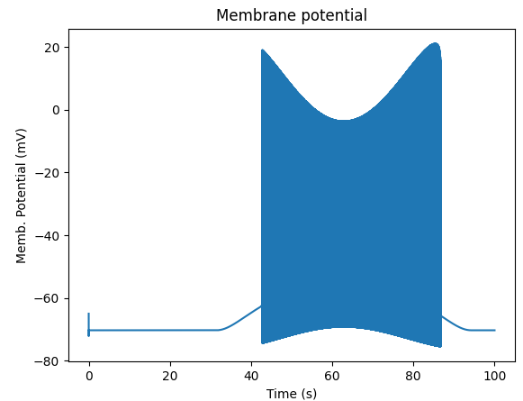

   Spiking response to sine-wave shaped stimulus.

As a reference point, on a fast 2018 laptop this benchmark runs in 5.4 seconds.
Some more things to try for benchmarking:

    - How slow does it get if you turn on the 3-D moogli display?
    - Is it costlier to run 2 compartments for 1000 seconds, or
      200 compartments for 10 seconds?

Synaptic stimulus: random (Possion)
~~~~~~~~~~~~~~~~~~~~~~~~~~~~~~~~~~~

*ex5.0_random_syn_input.py*

In this example we introduce synaptic inputs: both the receptor channels
and a means for stimulating the channels. We do this in a passive model.

::

    import moose
    import rdesigneur as rd
    rdes = rd.rdesigneur(
        cellProto = [['somaProto', 'soma', 20e-6, 200e-6]],
        chanProto = [['make_glu()', 'glu']],
        chanDistrib = [['glu', 'soma', 'Gbar', '1' ]],
        stimList = [['soma', '0.5', 'glu', 'randsyn', '50' ]],
        # Deliver stimulus to glu synapse on soma, at mean 50 Hz Poisson.
        plotList = [['soma', '1', '.', 'Vm', 'Soma membrane potential']]
    )
    rdes.buildModel()
    moose.reinit()
    moose.start( 0.3 )
    rdes.display()

Most of the rdesigneur setup uses familiar syntax.

Novelty 1: we use the default built-in glutamate receptor model, in chanProto.
We just put it in the soma at a max conductance of 1 Siemen/sq metre.

Novelty 2: We specify a new kind of stimulus in the stimList:

        ``['soma', '0.5', 'glu', 'randsyn', '50' ]``

Most of this is similar to previous stimLists.

        - arg0: 'soma': the named compartments in the cell to populate with 
          the *glu* receptor
        - arg1: '0.5': Tell the system to use a uniform synaptic weight of 0.5.
          This argument could be a more complicated expression incorporating
          spatial arguments. Here it is just uniform.
        - arg2: 'glu': Which receptor to stimulate
        - arg3: 'randsyn': Apply random (Poisson) synaptic input.
        - arg4: '50': Mean firing rate of the Poisson input. Note that this last
          argument could be a function of time and hence is quite versatile.

As the model has no voltage-gated channels, we do not see spiking.

.. figure:: ../../../../images/ex5.0_random_syn_input.png
   :alt: Random synaptic input with a Poisson distribution.
   
   Random synaptic input with a Poisson distribution.

Things to try: Vary the rate and the weight of the synaptic input.

Synaptic stimulus: periodic
~~~~~~~~~~~~~~~~~~~~~~~~~~~

*ex5.1_periodic_syn_input.py*

This is almost identical to 5.0, except that the input is now perfectly
periodic. The one change is of an argument in the stimList to say
``periodicsyn`` rather than ``randsyn``.

::

    import moose
    import rdesigneur as rd
    rdes = rd.rdesigneur(
        cellProto = [['somaProto', 'soma', 20e-6, 200e-6]],
        chanProto = [['make_glu()', 'glu']],
        chanDistrib = [['glu', 'soma', 'Gbar', '1' ]],
    
        # Deliver stimulus to glu synapse on soma, periodically at 50 Hz.
        stimList = [['soma', '0.5', 'glu', 'periodicsyn', '50' ]],
        plotList = [['soma', '1', '.', 'Vm', 'Soma membrane potential']]
    )
    rdes.buildModel()
    moose.reinit()
    moose.start( 0.3 )
    rdes.display()

As designed, we get periodically firing synaptic input.

.. figure:: ../../../../images/ex5.1_periodic_syn_input.png
   :alt: Periodic synaptic input
   
   Periodic synaptic input

Reaction system in a single compartment
~~~~~~~~~~~~~~~~~~~~~~~~~~~~~~~~~~~~~~~

*ex6_chem_osc.py*

Here we use the compartment as a place in which to embed a chemical
model. The chemical oscillator model is predefined in the rdesigneur
prototypes. Its general form is:

::

    s ---a---> a  // s goes to a, catalyzed by a.
    s ---a---> b  // s goes to b, catalyzed by a.
    a ---b---> s  // a goes to s, catalyzed by b.
    b -------> s  // b is degraded irreversibly to s

Here is the script:

::

    import moose
    import pylab
    import rdesigneur as rd
    rdes = rd.rdesigneur(
            turnOffElec = True,
            diffusionLength = 1e-3, # Default diffusion length is 2 microns
            chemProto = [['makeChemOscillator()', 'osc']],
            chemDistrib = [['osc', 'soma', 'install', '1' ]],
            plotList = [['soma', '1', 'dend/a', 'conc', 'a Conc'],
                ['soma', '1', 'dend/b', 'conc', 'b Conc']]
    )
    rdes.buildModel()
    b = moose.element( '/model/chem/dend/b' )
    b.concInit *= 5
    moose.reinit()
    moose.start( 200 )

    rdes.display()

In this special case we set the turnOffElec flag to True, so that
Rdesigneur only sets up chemical and not electrical calculations. This
makes the calculations much faster, since we disable electrical
calculations and delink chemical calculations from them.

We also have a line which sets the ``diffusionLength`` to 1 mm, so that
it is bigger than the 0.5 mm squid axon segment in the default
compartment. If you don't do this the system will subdivide the
compartment into the default 2 micron voxels for the purposes of putting
in a reaction-diffusion system. We discuss this case below.

Note how the *plotList* is done here. To remind you, each entry has five
arguments

::

    [region_in_cell, region_expression, moose_object, parameter, title_of_plot]

The change from the earlier usage is that the ``moose_object`` now
refers to a chemical entity, in this example the molecule *dend/a*. The
simulator builds a default chemical compartment named *dend* to hold the
reactions defined in the *chemProto*. What we do in this plot is to
select molecule *a* sitting in *dend*, and plot its concentration. Then
we do this again for molecule *b*.

After the model is built, we add a couple of lines to change the initial
concentration of the molecular pool *b*. Note its full path within
MOOSE: */model/chem/dend/b*. It is scaled up 5x to give rise to slowly
decaying oscillations.

.. figure:: ../../../../images/rdes4_osc.png
   :alt: Plot for single-compartment reaction simulation

   Plot for single-compartment reaction simulation

Reaction-diffusion system
~~~~~~~~~~~~~~~~~~~~~~~~~

*ex7.0_spatial_chem_osc.py*

In order to see what a reaction-diffusion system looks like, we assign the
``diffusionLength`` expression in the previous example to a much shorter
length, and add a couple of lines to set up 3-D graphics for the 
reaction-diffusion product:

::

    import moose
    import pylab
    import rdesigneur as rd
    rdes = rd.rdesigneur(
            turnOffElec = True,
            #This subdivides the length of the soma into 2 micron voxels
            diffusionLength = 2e-6,
            chemProto = [['makeChemOscillator()', 'osc']],
            chemDistrib = [['osc', 'soma', 'install', '1' ]],
            plotList = [['soma', '1', 'dend/a', 'conc', 'Concentration of a'],
                ['soma', '1', 'dend/b', 'conc', 'Concentration of b']],
            moogList = [['soma', '1', 'dend/a', 'conc', 'a Conc', 0, 360 ]]
    )

    rdes.buildModel()
    bv = moose.vec( '/model/chem/dend/b' )
    bv[0].concInit *= 2
    bv[-1].concInit *= 2
    moose.reinit()

    rdes.displayMoogli( 1, 400, rotation = 0, azim = np.pi/2, elev = 0.0 )

This is the new value for diffusion length.

::

        diffusionLength = 2e-3,

With this change we tell *rdesigneur* to use the diffusion length of 2 microns.
This happens to be the default too. The 500-micron axon segment is now 
subdivided into 250 voxels, each of which has a reaction system and 
diffusing molecules.
To make it more picturesque, we have added a line after the plotList, to
display the outcome in 3-D:

::

    moogList = [['soma', '1', 'dend/a', 'conc', 'a Conc', 0, 360 ]]

This line says: take the model compartments defined by ``soma`` as the
region to display, do so throughout the the geometry (the ``1``
signifies this), and over this range find the chemical entity defined by
``dend/a``. For each ``a`` molecule, find the ``conc`` and dsiplay it.
There are two optional arguments, ``0`` and ``360``, which specify the
low and high value of the displayed variable.

In order to initially break the symmetry of the system, we change the
initial concentration of molecule b at each end of the cylinder:

::

    bv[0].concInit *= 2
    bv[-1].concInit *= 2

If we didn't do this the entire system would go through a few cycles of
decaying oscillation and then reach a boring, spatially uniform, steady
state. Try putting an initial symmetry break elsewhere to see what
happens.

To display the concenctration changes in the 3-D soma as the simulation
runs, we use the line

::

    rdes.displayMoogli( 1, 400, rotation = 0, azim = np.pi/2, elev = 0.0 )

The arguments mean: *displayMoogli( frametime, runtime, rotation, azimuth, elevation )*
Here,

::

    frametime = time by which simulation advances between display updates
    runtime = Total simulated time
    rotation = angle by which display rotates in each frame, in radians.
    azimuth = Azimuth angle of view point, in radians
    elevation = elevation angle of view point, in radians

When we run this, we first get a 3-D display with the oscillating
reaction-diffusion system making its way inward from the two ends. After
the simulation ends the plots for all compartments for the whole run
come up.

.. figure:: ../../../../images/rdes5_reacdiff.png
   :alt: Display for oscillatory reaction-diffusion simulation

   Display for oscillatory reaction-diffusion simulation

For those who would rather use the much simpler matplotlib 3-D display option,
this is what the same simulation looks like:

   Display for oscillatory reac-diff simulation using matplotlib

.. _`moogli primer`:

Primer on using the 3-D MOOGLI display
~~~~~~~~~~~~~~~~~~~~~~~~~~~~~~~~~~~~~~

There are two variants of the MOOGLI display. The first, named Moogli,
uses OpenGL and OpenSceneGraph. It is fast to display, slow to load, and
difficult to compile. It produces much better looking 3-D graphics.
The second is a fallback interface using mplot3d, which is a library of 
Matplotlib and so should be generally available. It is slower to display,
faster to load, but needs no special compilation. It uses stick graphics
and though it conveys much the same information, isn't as nice to look at
as the original Moogli. Its controls are more or less the same but less 
smooth than the original Moogli.

Here is a short primer on the 3-D display controls.

-  *Roll, pitch, and yaw*: Use the letters *r*, *p*, and *y*. To rotate
   backwards, use capitals.
-  *Zoom out and in*: Use the *,* and *.* keys, or their upper-case
   equivalents, *<* and *>*. Easier to remember if you think in terms of
   the upper-case.
-  *Left/right/up/down*: Arrow keys.
-  *Quit*: control-q or control-w.
-  You can also use the mouse or trackpad to control most of the above.
-  By default rdesigneur gives Moogli a small rotation each frame. It is
   the *rotation* argument in the line:

   ``displayMoogli( frametime, runtime, rotation )``

These controls operate over and above this rotation, but the rotation
continues. If you set the rotation to zero you can, with a suitable
flick of the mouse, get the image to rotate in any direction you choose
as long as the window is updating.

Diffusion of a single molecule
~~~~~~~~~~~~~~~~~~~~~~~~~~~~~~

*ex7.1_diffusive_gradient.py*

This is simply a test model to confirm that simple diffusion happens as
expected. While the model is just that of a single pool, we spend a few lines
taking snapshots of the spatial profile of this pool.

::

    import moose
    import pylab
    import re
    import rdesigneur as rd
    import matplotlib.pyplot as plt
    import numpy as np
    
    moose.Neutral( '/library' )
    moose.Neutral( '/library/diffn' )
    moose.CubeMesh( '/library/diffn/dend' )
    A = moose.Pool( '/library/diffn/dend/A' )
    A.diffConst = 1e-10
    
    rdes = rd.rdesigneur(
        turnOffElec = True,
        diffusionLength = 1e-6,
        chemProto = [['diffn', 'diffn']],
        chemDistrib = [['diffn', 'soma', 'install', '1' ]],
        moogList = [
                ['soma', '1', 'dend/A', 'conc', 'A Conc', 0, 360 ]
        ]
    )
    rdes.buildModel()
    
    rdes.displayMoogli( 1, 2, rotation = 0, azim = -np.pi/2, elev = 0.0, block = False )
    av = moose.vec( '/model/chem/dend/A' )
    for i in range(10):
        av[i].concInit = 1
    moose.reinit()
    plist = []
    for i in range( 20 ):
        plist.append( av.conc[:200] )
        moose.start( 2 )
    fig = plt.figure( figsize = ( 10, 12 ) )
    plist = np.array( plist ).T
    plt.plot( range( 0, 200 ), plist )
    plt.xlabel( "position ( microns )" )
    plt.ylabel( "concentration ( mM )" )
    plt.show( block = True )
    
    
Here are the snapshots, overlaid in a single plot:

.. figure:: ../../../../images/ex7.1_diffusive_gradient.png
   :alt: Display of how a molecule A spreads through the inter

   Display for simple time-series of spread of a diffusing molecule 
   using matplotlib

Calcium-induced calcium release
~~~~~~~~~~~~~~~~~~~~~~~~~~~~~~~

.. _`models of calcium-induced calcium release`:

*ex7.2_CICR.py*

This is a somewhat more complex reaction-diffusion system, involving calcium
release from intracellular stores that propagates in a wave of activity along
a dendrite. This example demonstrates the use of endo compartments.

Endo-compartments, as the name suggests, represent compartments that sit 
within other cellular compartments. If the surround compartment is subdivided 
into N voxels, so is the endo- compartment. The rdesigneur system looks at the
provided model, and if there are 2 compartments and the *addEndoChemCompt* flag
is True, then the chemistry contained in the smaller of the two compartments is 
positioned in an endo compartment surrounded by the first compartment.
Here we use the endo-compartment to represent the endoplasmic reticulum sitting
inside the dendrite. 

In the chemical model, we also introduce a new MOOSE class,
ConcChan. These act as membrane pores whose permeability scales with 
number of channels in the open state. The IP3 receptor in this model is 
implemented as a ConcChan which opens due to binding to IP3 and Calcium.
This leads to the release of more calcium from the ER, and this feedback
loop develops into a propagating-wave oscillation.

::

    import moose
    import pylab
    import rdesigneur as rd
    rdes = rd.rdesigneur(
        turnOffElec = True,
        chemDt = 0.005,
        chemPlotDt = 0.02,
        diffusionLength = 1e-6,
        useGssa = False,
        addSomaChemCompt = False,
        addEndoChemCompt = True,
        # cellProto syntax: ['somaProto', 'name', dia, length]
        cellProto = [['somaProto', 'soma', 2e-6, 10e-6]],
        chemProto = [['./chem/CICRwithConcChan.g', 'chem']],
        chemDistrib = [['chem', 'soma', 'install', '1' ]],
        plotList = [
            ['soma', '1', 'dend/CaCyt', 'conc', 'Dendritic Ca'],
            ['soma', '1', 'dend/CaCyt', 'conc', 'Dendritic Ca', 'wave'],
            ['soma', '1', 'dend_endo/CaER', 'conc', 'ER Ca'],
            ['soma', '1', 'dend/ActIP3R', 'conc', 'active IP3R'],
        ],
    )
    rdes.buildModel()
    IP3 = moose.element( '/model/chem/dend/IP3' )
    IP3.vec.concInit = 0.004
    IP3.vec[0].concInit = 0.02
    moose.reinit()
    moose.start( 40 )
    rdes.display()

Note how the dendritic calcium is displayed both as a time-series plot and
as a wave plot, which presents the time-evolution of the calcium as a function
of position in successive image frames.

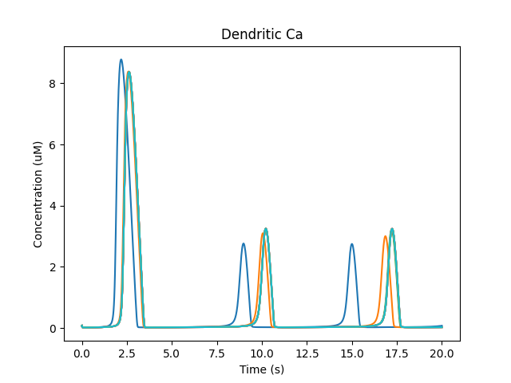
        different voxels in the dendrite.

    Time-series plot of dendritic calcium. Different colors represent
    different voxels in the dendrite.

.. figure:: ../../../../images/ex7.2_CICR_wave_lastFrame.png

    Place holder for time-evolving movie of dendritic calcium as a function of
    position along the dendrite.

Intracellular transport
~~~~~~~~~~~~~~~~~~~~~~~

*ex7.3_simple_transport.py*

This illustrates how intracellular transport works in MOOSE. We have a 
an elongated soma in which molecules start out at the left and are transported
to the right. Note that they spread out as they go along,
This is because the transport is implemented as drift-diffusion, in which a 
fraction of the molecules move to the next location each timestep. The 
equation is

        ``flux = motorConst * conc / spacing``

for a uniform cylinder. MOOSE applies suitable scaling terms if the neuronal
geometry is non-uniform.

::

    import moose
    import numpy as np
    import pylab
    import rdesigneur as rd
    
    moose.Neutral( '/library' )
    moose.Neutral( '/library/transp' )
    moose.CubeMesh( '/library/transp/dend' )
    A = moose.Pool( '/library/transp/dend/A' )
    A.diffConst = 0 
    A.motorConst = 1e-6     # Metres/sec
    
    rdes = rd.rdesigneur(
        turnOffElec = True,
        #This subdivides the length of the soma into 0.5 micron voxels
        diffusionLength = 0.5e-6, 
        cellProto = [['somaProto', 'soma', 2e-6, 50e-6]],
        chemProto = [['transp', 'transp']],
        chemDistrib = [['transp', 'soma', 'install', '1' ]], 
        plotList = [ 
            ['soma', '1', 'dend/A', 'conc', 'Concentration of A'],
            ['soma', '1', 'dend/A', 'conc', 'Concentration of A', 'wave'],
        ],  
        moogList = [['soma', '1', 'dend/A', 'conc', 'A Conc', 0, 20 ]]
    )
    rdes.buildModel()
    moose.element( '/model/chem/dend/A[0]' ).concInit = 0.1 
    moose.reinit()
    rdes.displayMoogli( 1, 80, rotation = 0, azim = -np.pi/2, elev = 0.0 )

In this example we explicitly create the single-molecule reaction system,
and assign a motorConst of 1 micron/sec to the molecule A. We start off with 
all the molecules in a single voxel on the left of the cylinder, and then
watch the molecules move.
Once the molecules reach the end of the cylindrical soma, they have nowhere
further to go so they pile up.

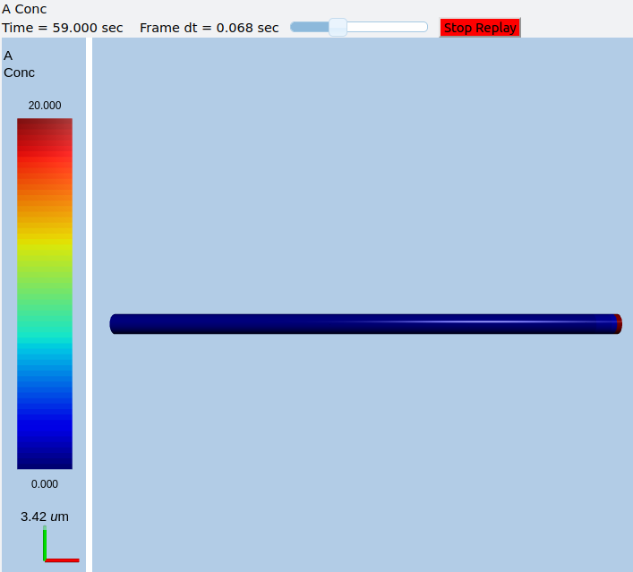
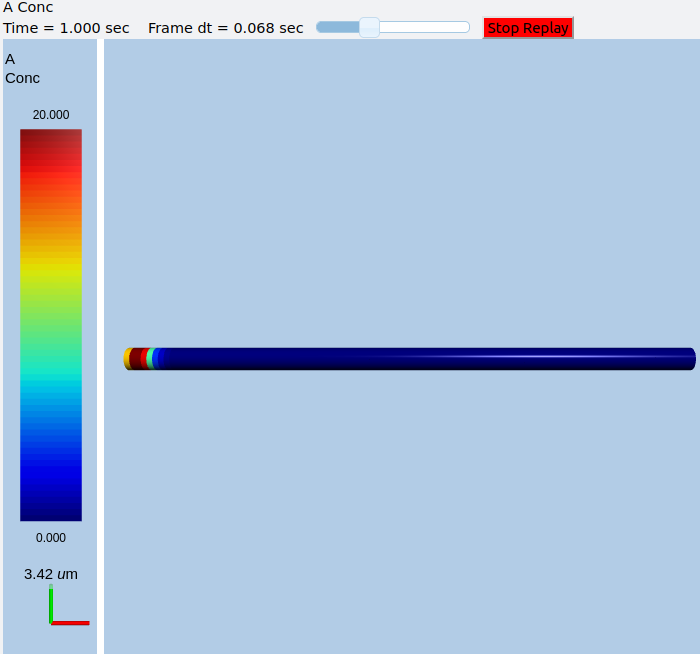
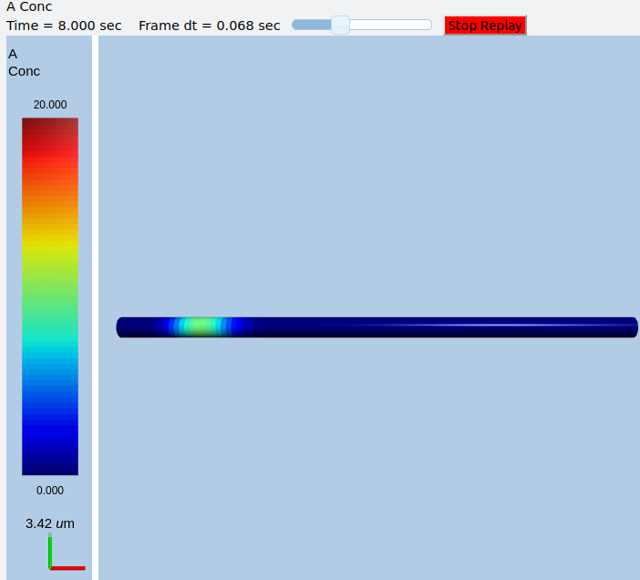
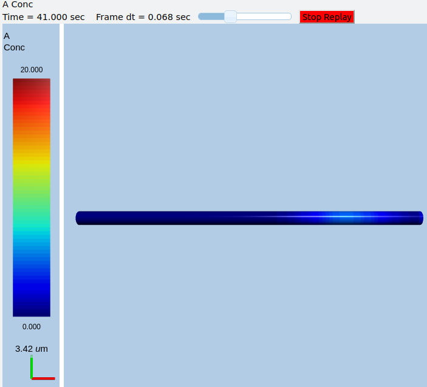
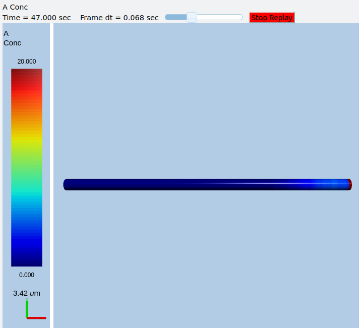
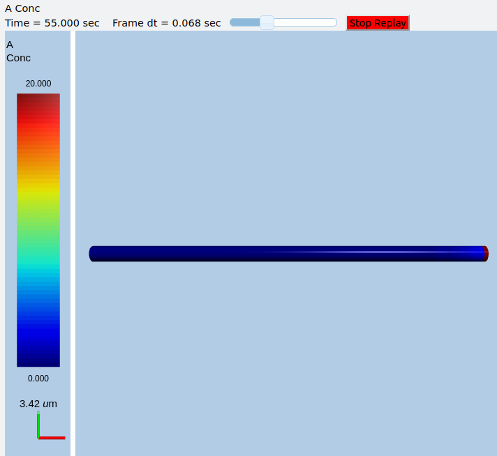

    Frames at increasing intervals from the transport simulation showing 
    spreading and piling up of the molecule at the right end of the cylinder.

Suggestions:

    - Play with different motor rates.
    - The motor constant sign detemines the direction of transport. See
      what happens if you get it going in the opposite direction.
    - Consider how you could avoid the buildup in the last voxel.
    - Consider how to achieve a nice exponential falloff over a
      much longer range than possible with diffusion.

Travelling oscillator
~~~~~~~~~~~~~~~~~~~~~

*ex7.4_travelling_osc.py*

Here we put a chemical oscillator into a cylinder, and activate motor transport
in one of the molecules. The oscillatory zone slowly moves to the right, with 
an amplification in the last compartment due to end-effects.

::

    import moose
    import numpy as np
    import pylab
    import rdesigneur as rd
    rdes = rd.rdesigneur(
        turnOffElec = True,
        diffusionLength = 2e-6,
        chemProto = [['makeChemOscillator()', 'osc']],
        chemDistrib = [['osc', 'soma', 'install', '1' ]],
        plotList = [
            ['soma', '1', 'dend/a', 'conc', 'Concentration of a'],
            ['soma', '1', 'dend/b', 'conc', 'Concentration of b'],
            ['soma', '1', 'dend/a', 'conc', 'Concentration of a', 'wave'],
        ],
        moogList = [['soma', '1', 'dend/a', 'conc', 'a Conc', 0, 360 ]]
    )
    a = moose.element( '/library/osc/kinetics/a' )
    b = moose.element( '/library/osc/kinetics/b' )
    s = moose.element( '/library/osc/kinetics/s' )
    a.diffConst = 0
    b.diffConst = 0
    a.motorConst = 1e-6
    
    rdes.buildModel()
    moose.reinit()
    
    rdes.displayMoogli( 1, 400, rotation = 0, azim = -np.pi/2, elev = 0.0 )

.. figure:: ../../../../images/ex7.4_travelling_osc.png
    :alt: Travelling Oscillator

    Snapshot of travelling oscillator waveform at t = 198.

Suggestions:

    - What happens if all molecules undergo transport?
    - What happens if b is transported opposite to a?
    - What happens if there is also diffusion?

Bidirectional transport
~~~~~~~~~~~~~~~~~~~~~~~

*ex7.5_bidirectional_transport.py*

This is almost identical to ex7.4, except that we implement bidirectional
transport. Molecule a goes from left to right, and b and s go from 
right to left. Here we see that the system builds up with large oscillations
in the middle as the molecules converge, then the peaks collapse when 
the molecules go away.

::

    import moose
    import numpy as np
    import pylab
    import rdesigneur as rd
    rdes = rd.rdesigneur(
        turnOffElec = True,
        diffusionLength = 2e-6, 
        numWaveFrames = 50, 
        chemProto = [['makeChemOscillator()', 'osc']],
        chemDistrib = [['osc', 'soma', 'install', '1' ]], 
        plotList = [ 
            ['soma', '1', 'dend/a', 'conc', 'Concentration of a', 'wave', 0, 1800],
            ['soma', '1', 'dend/b', 'conc', 'Concentration of b', 'wave', 0, 500],
            ['soma', '1', 'dend/s', 'conc', 'Concentration of s', 'wave', 0, 1200],
        ],
        moogList = [['soma', '1', 'dend/a', 'conc', 'a Conc', 0, 600 ]]
    )
    a = moose.element( '/library/osc/kinetics/a' )
    b = moose.element( '/library/osc/kinetics/b' )
    s = moose.element( '/library/osc/kinetics/s' )
    a.diffConst = 0
    b.diffConst = 0
    a.motorConst = 2e-6
    b.motorConst = -2e-6
    s.motorConst = -2e-6
    
    rdes.buildModel()
    moose.reinit()
    
    rdes.displayMoogli( 1, 250, rotation = 0, azim = -np.pi/2, elev = 0.0 )
    
.. figure:: ../../../../images/ex7.5_a.png
    :alt: Travelling Oscillator molecule a

.. figure:: ../../../../images/ex7.5_b.png
    :alt: Travelling Oscillator molecule b

.. figure:: ../../../../images/ex7.5_s.png
    :alt: Travelling Oscillator molecule 

Above we see *a*, *b*, *s* at a point where the transport has collected the 
molecules toward the middle of the cylinder, so the oscillations are large. 
Below we see molecule *a* later, when it has gone past the *b* and *s* pools
and so the reaction system is depleted and does not oscillate.

.. figure:: ../../../../images/ex7.5_a_later.png
    :alt: Travelling Oscillator molecule a later.

Controlling a reaction by a function
~~~~~~~~~~~~~~~~~~~~~~~~~~~~~~~~~~~~

*ex7.6_func_controls_reac_rate.py*

This example illustrates how a function can be used to control a reaction
rate. This kind of calculation is appropriate when we need to link
different kinds of physical processses with chemical reactions, for 
example, membrane curvature with molecule accumulation. The use of
functions to modify reaction rates should be avoided in purely chemical 
systems since they obscure the underlying chemistry, and do not map
cleanly to stochastic calculations.

In this example we simply have a molecule C that controls the forward
rate of a reaction that converts A to B. C is a function of location
on the cylinder, and is fixed. In more elaborate computations we could
have a function of multiple molecules, some of which could be changing and
others could be buffered.

::

    import numpy as np
    import moose
    import pylab
    import rdesigneur as rd
    
    
    def makeFuncRate():
        model = moose.Neutral( '/library' )
        model = moose.Neutral( '/library/chem' )
        compt = moose.CubeMesh( '/library/chem/compt' )
        compt.volume = 1e-15
        A = moose.Pool( '/library/chem/compt/A' )
        B = moose.Pool( '/library/chem/compt/B' )
        C = moose.Pool( '/library/chem/compt/C' )
        reac = moose.Reac( '/library/chem/compt/reac' )
        func = moose.Function( '/library/chem/compt/reac/func' )
        func.x.num = 1
        func.expr = "(x0/1e8)^2"
        moose.connect( C, 'nOut', func.x[0], 'input' )
        moose.connect( func, 'valueOut', reac, 'setNumKf' )
        moose.connect( reac, 'sub', A, 'reac' )
        moose.connect( reac, 'prd', B, 'reac' )
    
        A.concInit = 1
        B.concInit = 0
        C.concInit = 0
        reac.Kb = 1
    
    makeFuncRate()
    rdes = rd.rdesigneur(
            turnOffElec = True,
            #This subdivides the 50-micron cylinder into 2 micron voxels
            diffusionLength = 2e-6,
            cellProto = [['somaProto', 'soma', 5e-6, 50e-6]],
            chemProto = [['chem', 'chem']],
            chemDistrib = [['chem', 'soma', 'install', '1' ]],
            plotList = [['soma', '1', 'dend/A', 'conc', 'A conc', 'wave'],
                ['soma', '1', 'dend/C', 'conc', 'C conc', 'wave']],
    )
    rdes.buildModel()
    C = moose.element( '/model/chem/dend/C' )
    C.vec.concInit = [ 1+np.sin(x/5.0) for x in range( len(C.vec) ) ]
    moose.reinit()
    moose.start(10)
    rdes.display()
    
We plot the controlling molecule C and the substrate molecule A as
functions of position, using a waveplot. C remains fixed, and A 
decreases with time and space. A is smallest at about voxel 8, where the 
reaction rate, as controlled by C, is highest.

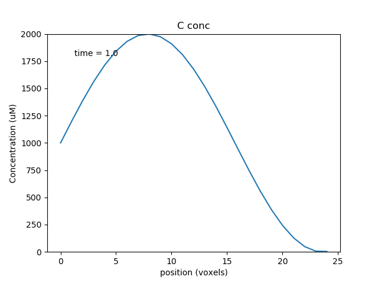
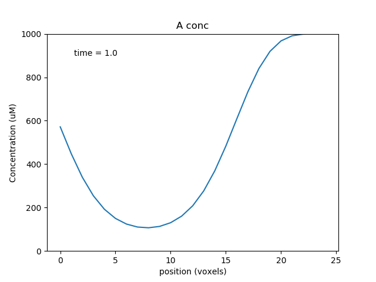

Multiscale models: single compartment
~~~~~~~~~~~~~~~~~~~~~~~~~~~~~~~~~~~~~

*ex8.0_multiscale_KA_phosph.py*

The next few examples are for the multiscale modeling that is the main purpose
of rdesigneur and MOOSE as a whole. These are 'toy' examples in that the
chemical and electrical signaling is simplified, but they exhibit dynamics
that are of real interest.

The first example is of a bistable system where the feedback loop comprises of

`calcium influx -> chemical activity -> channel modulation -> electrical activity -> calcium influx.`

Calcium enters through voltage gated calcium channels, leads to enzyme 
activation and phosphorylation of a KA channel, which depolarizes the cell,
so it spikes more, so more calcium enters.

::
    
    import moose
    import pylab
    import rdesigneur as rd
    rdes = rd.rdesigneur(
        elecDt = 50e-6,
        chemDt = 0.002,
        chemPlotDt = 0.002,
        # cellProto syntax: ['somaProto', 'name', dia, length]
        cellProto = [['somaProto', 'soma', 12e-6, 12e-6]],
        chemProto = [['./chem/chanPhosphByCaMKII.g', 'chem']],
        chanProto = [
            ['make_Na()', 'Na'], 
            ['make_K_DR()', 'K_DR'], 
            ['make_K_A()', 'K_A' ],
            ['make_Ca()', 'Ca' ],
            ['make_Ca_conc()', 'Ca_conc' ]
        ],
        # Some changes to the default passive properties of the cell.
        passiveDistrib = [['soma', 'CM', '0.03', 'Em', '-0.06']],
        chemDistrib = [['chem', 'soma', 'install', '1' ]],
        chanDistrib = [
            ['Na', 'soma', 'Gbar', '300' ],
            ['K_DR', 'soma', 'Gbar', '250' ],
            ['K_A', 'soma', 'Gbar', '200' ],
            ['Ca_conc', 'soma', 'tau', '0.0333' ],
            ['Ca', 'soma', 'Gbar', '40' ]
        ],
        adaptorList = [
            [ 'dend/chan', 'conc', 'K_A', 'modulation', 0.0, 70 ],
            [ 'Ca_conc', 'Ca', 'dend/Ca', 'conc', 0.00008, 2 ]
        ],
        # Give a + pulse from 5 to 7s, and a - pulse from 20 to 21.
        stimList = [['soma', '1', '.', 'inject', '((t>5 && t<7) - (t>20 && t<21)) * 1.0e-12' ]],
        plotList = [
            ['soma', '1', '.', 'Vm', 'Membrane potential'],
            ['soma', '1', '.', 'inject', 'current inj'],
            ['soma', '1', 'K_A', 'Ik', 'K_A current'],
            ['soma', '1', 'dend/chan', 'conc', 'Unphosph K_A conc'],
            ['soma', '1', 'dend/Ca', 'conc', 'Chem Ca'],
        ],
    )
    
    rdes.buildModel()
    moose.reinit()
    moose.start( 30 )
    
    rdes.display()
    
There is only one fundamentally new element in this script:

**adaptor List:** `[source, sourceField, dest, destField, offset, scale]`
The adaptor list maps between molecular, electrical or even structural 
quantities in the simulation. At present it is linear mapping, in due course
it may evolve to an arbitrary function. 

The two adaptorLists in the above script do the following:

      ``[ 'dend/chan', 'conc', 'K_A', 'modulation', 0.0, 70 ]``:

Use the concentration of the 'chan' molecule in the 'dend' compartment, 
to modulate the conductance of the 'K_A' channel such that the basal
conductance is zero and 1 millimolar of 'chan' results in a conductance that is
70 times greater than the baseline conductance of the channel, *Gbar*.

It is advisable to use the field *'modulation'* on channels undergoing scaling,
rather than to directly assign the conductance *'Gbar'*. This is because 
*Gbar* is an absolute conductance, and therefore it is scaled to the area of
the electrical segment. This makes it difficult to keep track of. *Modulation*
is a simple multiplier term onto *Gbar*, and is therefore easier to work with.

       ``[ 'Ca_conc', 'Ca', 'dend/Ca', 'conc', 0.00008, 2 ]``:

Use the concentration of *Ca* as computed in the electrical model, to assign
the concentration of molecule *Ca* on the dendrite compartment. There is a
basal level of 80 nanomolar, and every unit of electrical *Ca* maps to 2 
millimolar of chemical *Ca*.

The arguments in the adaptorList are:

        * **Source and Dest**: Strings. These can be either a molecular or an 
          electrical object. To identify a molecular object, it should be 
          prefixed with the name of the chemical compartment, which is one 
          of *dend, spine, psd*. Thus *dend/chan* specifies a molecule 
          named *'chan'* sitting in the *'dend'* compartment.

          To identify an electrical object, just pass in its path, 
          such as '.' or *'Ca_conc'*.

          Note that the adaptors do **not** need to know anything about the 
          location.  It is assumed that the adaptors do their job wherever 
          the specified source and dest coexist. There is a subtlety here 
          due to the different length and time scales. The rule of thumb 
          is that the adaptor averages whichever one is subdivided more finely. 

            - Example 1: Molecules are typically spatially partitioned into 
              short voxels (micron-scale) compared to typical 100-micron 
              electrical 
              segments. So an adaptor going from molecules to, say, channel 
              conductance, would average all the molecular voxels that fit 
              in the electrical segment.
            - Example 2: Electrical activity is typically much faster than 
              chemical.
              So an adaptor going from an electrical entity (Ca computed from 
              channel opening) to molecules (Chemical Ca concentration) would
              average all the time-steps between updates to the molecule.

        * **Fields**: Strings. These are simply the field names on the 
          objects coupled by the adaptors.

        * **offset and scale**: Doubles. At present the adaptor is just a 
          straight-line conversion, obeying ``y = mx + c``. The computed 
          output is *y*, averaged input is *x*, offset is *c* and scale is *m*.

There is a handy new line to specify cellular passive properties:

**passiveDistrib:** `[path, field, value, field, value, ... ]`,

        * path: String. Specifies the object whose parameters are to be changed.
        * field: String. Name of the field on the object.
        * value: String, that is the value has to be enclosed in quotes. The
          value to be assigned to the object.

With these in place, the model behavior is rather neat. It starts out silent,
then we apply 2 seconds of +ve current injection. 

.. figure:: ../../../../images/ex8.0_multiscale_currInj.png
   :alt: Current injection stimuli for multiscale model.

   Current injection stimuli for multiscale model.

The cell fires briskly, and keeps firing even when the current injection
drops to zero. 

   Firing responses of cell with multiscale signaling.

The firing of the neuron leads to Ca influx.

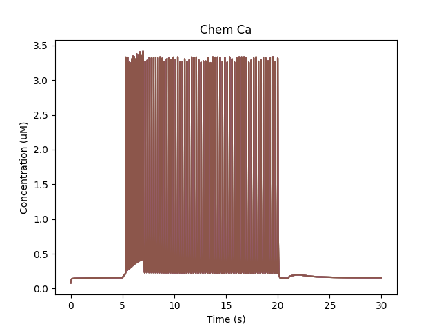

   Calcium buildup in cell due to firing.

The chemical reactions downstream of Ca lead to phosphorylation of the K_A
channel. Only the unphosphorylated K_A channel is active, so the net effect
is to reduce K_A conductance while the Ca influx persists.

.. figure:: ../../../../images/ex8.0_multiscale_KA_conc.png
   :alt: Removal of KA channel due to phosphorylation.

   Removal of KA channel due to phosphorylation.

Since the phosphorylated form has low conductance, the cell becomes more 
excitable and keeps firing even when the current injection is stopped. It takes
a later, -ve current injection to turn the firing off again.

Suggestions for things to do with the model:

        - Vary the adaptor settings, which couple electrical to chemical
          signaling and vice versa.
        - Play with the channel densities
        - Open the chem model in moosegui and vary its parameters too.

Multiscale model of CICR in dendrite triggered by synaptic input
~~~~~~~~~~~~~~~~~~~~~~~~~~~~~~~~~~~~~~~~~~~~~~~~~~~~~~~~~~~~~~~~

*ex8.1_synTrigCICR.py*

In this model synaptic input arrives at a dendritic spine, leading to calcium
influx through the NMDA receptor. An adaptor converts this influx to the 
concentration of a chemical species, and this then diffuses into the dendrite
and sets off the CICR.

This example models Calcium events in three compartments: dendrite, ER 
inside dendrite, and spine. The signaling is a slight change from the 
toy model used
in *ex7.2_CICR.py*. Note how the range of CICR wave propagation
is limited by a domain of the dendrite in which the level of IP3 is elevated.

::

    import moose
    import pylab
    import rdesigneur as rd
    rdes = rd.rdesigneur(
        turnOffElec = False,
        chemDt = 0.002,
        chemPlotDt = 0.02,
        diffusionLength = 1e-6,
        numWaveFrames = 50,
        useGssa = False,
        addSomaChemCompt = False,
        addEndoChemCompt = True,
        # cellProto syntax: ['ballAndStick', 'name', somaDia, somaLength, dendDia, dendLength, numDendSeg]
        cellProto = [['ballAndStick', 'soma', 10e-6, 10e-6, 2e-6, 40e-6, 4]],
        spineProto = [['makeActiveSpine()', 'spine']],
        chemProto = [['./chem/CICRspineDend.g', 'chem']],
        spineDistrib = [['spine', '#dend#', '10e-6', '0.1e-6']],
        chemDistrib = [['chem', 'dend#,spine#,head#', 'install', '1' ]],
        adaptorList = [
            [ 'Ca_conc', 'Ca', 'spine/Ca', 'conc', 0.00008, 8 ]
        ],
        stimList = [
            ['head0', '0.5', 'glu', 'periodicsyn', '1 + 40*(t>5 && t<6)'],
            ['head0', '0.5', 'NMDA', 'periodicsyn', '1 + 40*(t>5 && t<6)'],
            ['dend#',  'g>10e-6 && g<=31e-6', 'dend/IP3', 'conc', '0.0006' ],
            ],
        plotList = [
            ['head#', '1', 'spine/Ca', 'conc', 'Spine Ca conc'],
            ['dend#', '1', 'dend/Ca', 'conc', 'Dend Ca conc'],
            ['dend#', '1', 'dend/Ca', 'conc', 'Dend Ca conc', 'wave'],
            ['dend#', '1', 'dend_endo/CaER', 'conc', 'ER Ca conc', 'wave'],
            ['soma', '1', '.', 'Vm', 'Memb potl'],
        ],
    )
    moose.seed( 1234 )
    rdes.buildModel()
    moose.reinit()
    moose.start( 16 )
    rdes.display()

The demo illustrates how to specify the range of elevated IP3 in the *stimList*
using the second argument, which selects a geometric range of electrical
compartments.

::

    ['dend#',  'g>10e-6 && g<=31e-6', 'dend/IP3', 'conc', '0.0006' ]

This means to look at all dendrite compartments (first argument), and select 
those which are between a geometrical distance *g* of 10 to 31 microns 
from the soma (second argument). The system then
sets the IP3 concentration (third and fourth arguments) to 0.6 uM 
(last argument) for all the chemical voxels embedded in these dendrite 
compartments.

A note on defining the endo compartments: In cases like this, where the
compartment identity isn't built into the chemical model definition, we need
a heuristic to decide which compartment is which. The heuristic used in 
rdesigneur goes like this:

        - Sort chemical compartments in decreasing order by volume
        - If the addSomaChemCompt flag is **true**, they are assigned to
          *soma, dendrite, spine-head, spine-psd*, depending on how many
          compartments are specified. If the flag is **false**, the soma is 
          omitted.
        - If the addEndoChemCompt is **true**, then alternate compartments are
          assigned to the endo_compartment. Here it is
          *dend, dend_endo, spine-head*.
          If we had six compartments defined (no soma) it would have been:
          *dend, dend_endo, spine-head, spine-endo, psd, psd-endo*.
          The psd-endo doesn't make a lot of biological sense, though.

When we run this model, we trigger a propagating Ca wave from about voxel 
number 16 of 40. It spreads in both directions, and comes to a halt at voxels
10 and 30, which mark the limits of the IP3 elevation zone.

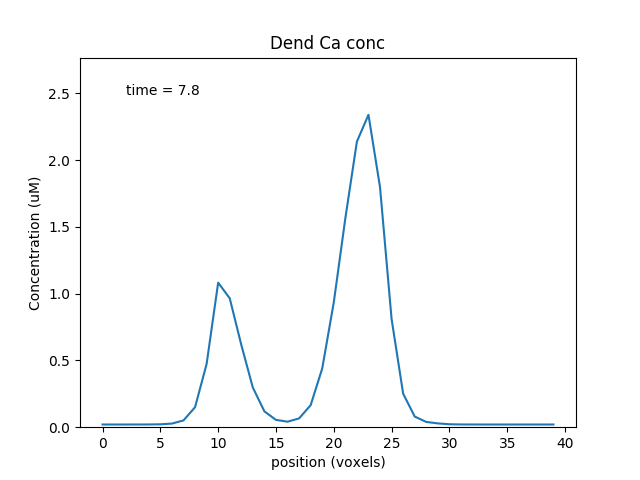

   Calcium wave propagation along the dendrite

Note two subtle effects on the ER Ca concentration: first, there is a 
periodic small influx of calcium at voxel 16 due to synaptic input. Second, 
there is a slow restoration of the ER Ca level toward baseline due to 
diffusion in the dendrite and the action of pumps to within the ER, and 
out of the cell. Note also that the gradient within the ER is actually quite
small, being about a 12% deviation from the resting calcium.

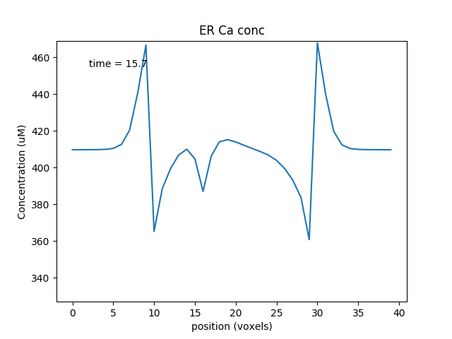

   Calcium depletion and buildup in the ER due to CICR wave.

Multiscale model spanning PSD, spine head and dendrite
~~~~~~~~~~~~~~~~~~~~~~~~~~~~~~~~~~~~~~~~~~~~~~~~~~~~~~

*ex8.2_multiscale_glurR_phosph_3compt.py*

This is another multiscale model on similar lines to 8.0. It is structurally
and computationally more complicated, because the action is distributed between
spines and dendrites, but formally it does the same thing: it turns on and 
stays on after a strong stimulus, due to phosphorylation of a (receptor) 
channel leading to greater excitability.

`calcium influx -> chemical activity -> channel modulation -> electrical activity -> calcium influx.`

The model is bistable as long as synaptic input keeps coming along at a basal 
rate, in this case 1 Hz. 

Here we have two new lines, to do with addition of spines. These are discussed
in detail in a later example. For now it is enough to know that the
**spineProto** line defines one of the prototype spines to be used to put into
the model, and the **spineDistrib** line tells the system where to put them,
and how widely to space them.

::

    import moose
    import rdesigneur as rd
    rdes = rd.rdesigneur(
        elecDt = 50e-6,
        chemDt = 0.002,
        diffDt = 0.002,
        chemPlotDt = 0.02,
        useGssa = False,
        # cellProto syntax: ['ballAndStick', 'name', somaDia, somaLength, dendDia, d
    endLength, numDendSegments ]
        cellProto = [['ballAndStick', 'soma', 12e-6, 12e-6, 4e-6, 100e-6, 2 ]],
        chemProto = [['./chem/chanPhosph3compt.g', 'chem']],
        spineProto = [['makeActiveSpine()', 'spine']],
        chanProto = [
            ['make_Na()', 'Na'], 
            ['make_K_DR()', 'K_DR'], 
            ['make_K_A()', 'K_A' ],
            ['make_Ca()', 'Ca' ],
            ['make_Ca_conc()', 'Ca_conc' ]
        ],
        passiveDistrib = [['soma', 'CM', '0.01', 'Em', '-0.06']],
        spineDistrib = [['spine', '#dend#', '50e-6', '1e-6']],
        chemDistrib = [['chem', '#', 'install', '1' ]],
        chanDistrib = [
            ['Na', 'soma', 'Gbar', '300' ],
            ['K_DR', 'soma', 'Gbar', '250' ],
            ['K_A', 'soma', 'Gbar', '200' ],
            ['Ca_conc', 'soma', 'tau', '0.0333' ],
            ['Ca', 'soma', 'Gbar', '40' ]
        ],
        adaptorList = [
            [ 'psd/chan_p', 'n', 'glu', 'modulation', 0.1, 1.0 ],
            [ 'Ca_conc', 'Ca', 'spine/Ca', 'conc', 0.00008, 8 ]
        ],
        # Syn input basline 1 Hz, and 40Hz burst for 1 sec at t=20. Syn weight
        # is 0.5, specified in 2nd argument as a special case stimLists. 
        stimList = [['head#', '0.5','glu', 'periodicsyn', '1 + 40*(t>10 && t<11)']],
        plotList = [
            ['soma', '1', '.', 'Vm', 'Membrane potential'],
            ['#', '1', 'spine/Ca', 'conc', 'Ca in Spine'],
            ['#', '1', 'dend/DEND/Ca', 'conc', 'Ca in Dend'],
            ['#', '1', 'spine/Ca_CaM', 'conc', 'Ca_CaM'],
            ['head#', '1', 'psd/chan_p', 'conc', 'Phosph gluR'],
            ['head#', '1', 'psd/Ca_CaM_CaMKII', 'conc', 'Active CaMKII'],
        ]
    )
    moose.seed(123)
    rdes.buildModel()
    moose.reinit()
    moose.start( 25 )
    rdes.display()
    

This is how it works:

This is a ball-and-stick model with a couple of spines sitting on the dendrite.
The spines get synaptic input onto NMDARs and gluRs. There is a baseline
input rate of 1 Hz thoughout, and there is a burst at 40 Hz for 1 second at 
t = 10s.

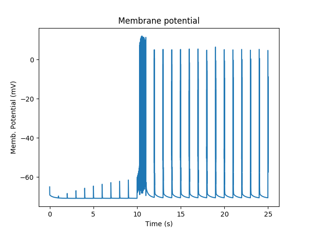

   Membrane potential responses of cell with synaptic input and multiscale signaling

At baseline, we just have small EPSPs and little Ca influx. A burst of
strong synaptic input causes Ca entry into the spine via NMDAR. 

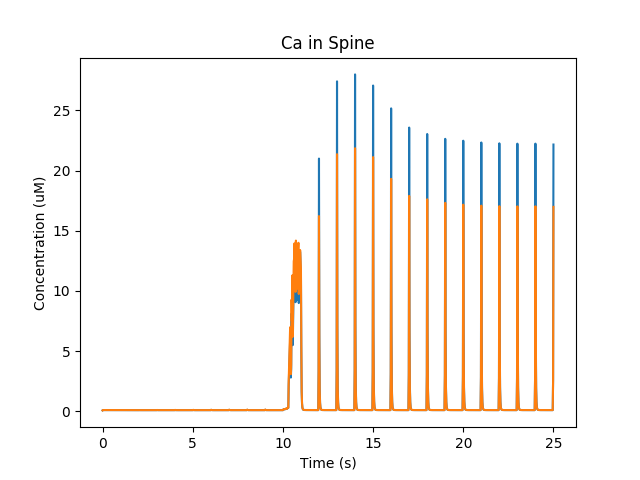

   Calcium influx into spine.

Ca diffuses from the spine into the dendrite and spreads. In the graph below
we see how Calcium goes into the 50-odd voxels of the dendrite.

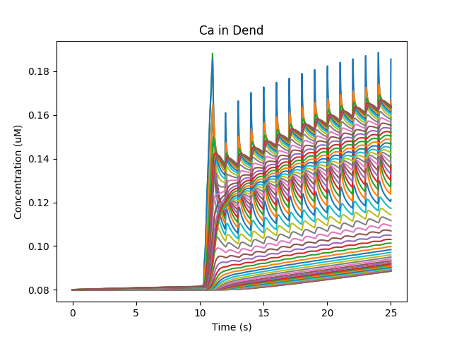

   Calcium influx and diffusion in dendrite.

The Ca influx into the spine 
triggers activation of CaMKII and its translocation to the PSD, where
it phosphorylates and increases the conductance of gluR. We have two spines
with slightly different geometry, so the CaMKII activity differs slightly.

   Activation of CaMKII and translocation to PSD

Now that gluR has a greater weight, the baseline synaptic input keeps 
Ca trickling in enough to keep the CaMKII active. 

Here are the reactions:

::
        
        Ca+CaM <===> Ca_CaM;    Ca_CaM + CaMKII <===> Ca_CaM_CaMKII (all in
        spine head, except that the Ca_CaM_CaMKII translocates to the PSD)

        chan ------Ca_CaM_CaMKII-----> chan_p; chan_p ------> chan  (all in PSD)

Suggestions:

        - Add GABAR using make_GABA(), put it on soma or dendrite. Stimulate it
          after 20 s to see if you can turn off the sustained activation
        - Replace the 'periodicsyn' in stimList with 'randsyn'. This gives
          Poisson activity at the specified mean frequency. Does the switch
          remain reliable?
        - What are the limits of various parameters for this switching? You
          could try basal synaptic rate, burst rate, the various scaling factors
          for the adaptors, the densities of various channels, synaptic weight,
          and so on.
        - In real life an individual synaptic EPSP is tiny, under a millivolt.
          How many synapses would you need to achieve this kind of switching?
          You can play with # of synapses by altering the spacing between
          spines as the third argument of spineDistrib.

Multiscale model in which spine geometry changes due to signaling
~~~~~~~~~~~~~~~~~~~~~~~~~~~~~~~~~~~~~~~~~~~~~~~~~~~~~~~~~~~~~~~~~

*ex8.3_spine_vol_change.py*

This model is very similar to 8.2. The main design difference is that 
*adaptor*, instead of just modulating the gluR conductance, scales the 
entire spine cross-section area, with all sorts of electrical and chemical
ramifications. There are a lot of plots, to illustrate some of these outcomes.

::

    import moose
    import rdesigneur as rd
    rdes = rd.rdesigneur(
        elecDt = 50e-6,
        chemDt = 0.002,
        diffDt = 0.002,
        chemPlotDt = 0.02,
        useGssa = False,
        stealCellFromLibrary = True, # Simply move library model to use for sim
        cellProto = [['ballAndStick', 'soma', 12e-6, 12e-6, 4e-6, 100e-6, 2 ]],
        chemProto = [['./chem/chanPhosph3compt.g', 'chem']],
        spineProto = [['makeActiveSpine()', 'spine']],
        chanProto = [
            ['make_Na()', 'Na'], 
            ['make_K_DR()', 'K_DR'], 
            ['make_K_A()', 'K_A' ],
            ['make_Ca()', 'Ca' ],
            ['make_Ca_conc()', 'Ca_conc' ]
        ],
        passiveDistrib = [['soma', 'CM', '0.01', 'Em', '-0.06']],
        spineDistrib = [['spine', '#dend#', '50e-6', '1e-6']],
        chemDistrib = [['chem', '#', 'install', '1' ]],
        chanDistrib = [
            ['Na', 'soma', 'Gbar', '300' ],
            ['K_DR', 'soma', 'Gbar', '250' ],
            ['K_A', 'soma', 'Gbar', '200' ],
            ['Ca_conc', 'soma', 'tau', '0.0333' ],
            ['Ca', 'soma', 'Gbar', '40' ]
        ],
        adaptorList = [
            # This scales the psdArea of the spine by # of chan_p. Note that 
            # the cross-section area of the spine head is identical to psdArea.
            [ 'psd/chan_p', 'n', 'spine', 'psdArea', 0.1e-12, 0.01e-12 ],
            [ 'Ca_conc', 'Ca', 'spine/Ca', 'conc', 0.00008, 8 ]
        ],
        # Syn input basline 1 Hz, and 40Hz burst for 1 sec at t=20. Syn wt=10
        stimList = [['head#', '10','glu', 'periodicsyn', '1 + 40*(t>10 && t<11)']],
        plotList = [
            ['soma', '1', '.', 'Vm', 'Membrane potential'],
            ['#', '1', 'spine/Ca', 'conc', 'Ca in Spine'],
            ['#', '1', 'dend/DEND/Ca', 'conc', 'Ca in Dend'],
            ['head#', '1', 'psd/chan_p', 'n', 'Amount of Phospho-chan'],
            ['head#', '1', 'spine/CaMKII', 'conc', 'Conc of CaMKII in spine'],
            ['head#', '1', '.', 'Cm', 'Capacitance of spine head'],
            ['head#', '1', '.', 'Rm', 'Membrane res of spine head'],
            ['head#', '1', '.', 'Ra', 'Axial res of spine head'],
            ['head#', '1', 'glu', 'Gbar', 'Conductance of gluR'],
            ['head#', '1', 'NMDA', 'Gbar', 'Conductance of NMDAR'],
        ]
    )
    moose.seed(123)
    rdes.buildModel()
    moose.reinit()
    moose.start( 25 )
    rdes.display()
    

The key *adaptor* line is as follows:

``[ 'psd/chan_p', 'n', 'spine', 'psdArea', 0.1e-12, 0.01e-12 ]``

Here, we use the phosphorylated *chan_p* molecule in the PSD as a proxy for 
processes that control spine size. We operate on a special object called
*spine* which manages many aspects of spines in the model (see below). Here
we control the *psdArea*, which defines the cross-section area of the spine
head and by extension of the PSD too. We keep a minimum spine area of 0.1 um^2,
and a scaling factor of 0.01um^2 per phosphorylated molecule.

The reaction system is identical to the one in *ex8.2*: 

::
        
        Ca+CaM <===> Ca_CaM;    Ca_CaM + CaMKII <===> Ca_CaM_CaMKII (all in
        spine head, except that the Ca_CaM_CaMKII translocates to the PSD)

        chan ------Ca_CaM_CaMKII-----> chan_p; chan_p ------> chan  (all in PSD)

Rather than list all the 10 plots, here are a few to show what is going on.

First, just the spiking activity of the cell. Here the burst of activity is
followed by a few seconds of enhanced synaptic weight, followed by subthreshold
EPSPs:

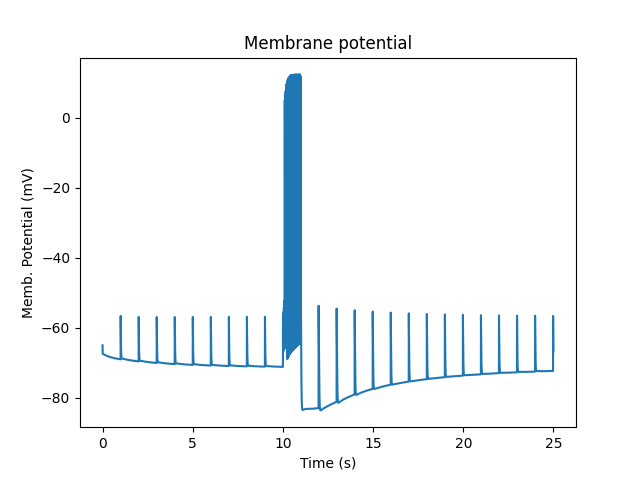

   Membrane potential and spiking.

Then, we fast-forward to the amount of *chan_p* which is the molecule that
controls spine size scaling: 

   Molecule that controles spine size

This causes some obvious outcomes. One of them is to increase the synaptic
conductance of the glutamate receptor. The system assumes that the conductance
of all channels in the PSD scales linearly with the psdArea.

.. figure:: ../../../../images/ex8.3_gluR.png
   :alt: Conductance of glutamate receptor

   Conductance of glutamate receptor

Here is one of several non-intuitive outcomes. Because the spine volume has
increased, the concentration of molecules in the spine is diluted out. So
the concentration of active CaMKII actually falls when the spine gets bigger.
In a more detailed model, this would be a race between the increase in spine
size and the time taken for diffusion and further reactions to replenish 
CaMKII. In the current model we don't have a diffusive coupling of CaMKII to
the dendrite, so this replenishment doesn't happen.

.. figure:: ../../../../images/ex8.3_CaMKII_spine.png
   :alt: Concentration of CaMKII in the spine

   Concentration of CaMKII in the spine

In the simulation we display several other electrical and chemical properties
that change with spine size. The diffusion properties also change since the 
cross-section areas are altered. This is harder to visualize but has large 
effects on coupling to the dendrite,
especially if the *shaftDiameter* is the parameter scaled by the signaling.

Suggestions:

        - The Spine class (instance: spine) manages several possible scaling
          targets on the spine geometry: shaftLength, shaftDiameter,
          headLength, headDiameter, psdArea, headVolume, totalLength. Try them
          out. Think about mechanisms by which molecular concentrations might
          affect each.
        - When volume changes, we assume that the molecular numbers stay
          fixed, so concentration changes. Except for buffered molecules, where
          we assume concentration remains fixed. Use this to design a bistable
          simply relying on molecules and spine geometry terms.
        - Even more interesting, use it to design an oscillator. You could look
          at Bhalla, BiophysJ 2011 for some ideas.

Morphology: Load .swc morphology file and view it
~~~~~~~~~~~~~~~~~~~~~~~~~~~~~~~~~~~~~~~~~~~~~~~~~

*ex9.0_load_neuronal_morphology_file.py*

Here we build a passive model using a morphology file in the .swc file
format (as used by NeuroMorpho.org). The morphology file is predefined
for Rdesigneur and resides in the directory ``./cells``. We apply a
somatic current pulse, and view the somatic membrane potential in a
plot, as before. To make things interesting we display the morphology in
3-D upon which we represent the membrane potential as colors.

::

    import sys
    import moose
    import rdesigneur as rd
    
    if len( sys.argv ) > 1:
        fname = sys.argv[1]
    else:
        fname = './cells/h10.CNG.swc'
    rdes = rd.rdesigneur(
        cellProto = [[fname, 'elec']],
        stimList = [['soma', '1', '.', 'inject', 't * 25e-9' ]],
        plotList = [['#', '1', '.', 'Vm', 'Membrane potential'],
                ['#', '1', 'Ca_conc', 'Ca', 'Ca conc (uM)']],
        moogList = [['#', '1', '.', 'Vm', 'Soma potential']]
    )
    rdes.buildModel()
    moose.reinit()
    rdes.displayMoogli( 0.001, 0.1, rotation = 0.02 )

Here the new concept is the cellProto line, which loads in the specified
cell model:

::

    `[ filename, cellname ]`

The system recognizes the filename extension and builds a model from the
swc file. It uses the cellname **elec** in this example.

We use a similar line as in the reaction-diffusion example, to build up
a Moogli display of the cell model:

::

    `moogList = [['#', '1', '.', 'Vm', 'Soma potential']]`

Here we have:

::

    # : the path to use for selecting the compartments to display. 
    This wildcard means use all compartments.
    1 : The expression to use for the compartments. Again, `1` means use
    all of them.
    . : Which object in the compartment to display. Here we are using the
    compartment itself, so it is just a dot.
    Vm : Field to display
    Soma potential : Title for display.

   3-D display for passive neuron

Suggestions:

        - The tutorial directory already has a number of pre-loaded files from
          NeuroMorpho. Pass them in to ex9.0 on the command line:

          `python ex9.0_load_neuronal_morphology_file.py <morpho.swc>`
        - Grab other morphology files from NeuroMorpho.org,  try them out.

Build an active neuron model by putting channels into a morphology file
~~~~~~~~~~~~~~~~~~~~~~~~~~~~~~~~~~~~~~~~~~~~~~~~~~~~~~~~~~~~~~~~~~~~~~~

*ex9.1_chans_in_neuronal_morph.py*

Here we load in a morphology file and distribute voltage-gated ion channels
over the neuron. The voltage-gated channels are obtained from a
number of channelML files, located in the ``./channels`` subdirectory.
Since we have a spatially extended neuron, we need to specify the
spatial distribution of channel densities too.

::

    import moose
    import rdesigneur as rd
    rdes = rd.rdesigneur(
        chanProto = [
            ['./chans/hd.xml'],
            ['./chans/kap.xml'],
            ['./chans/kad.xml'],
            ['./chans/kdr.xml'],
            ['./chans/na3.xml'],
            ['./chans/nax.xml'],
            ['./chans/CaConc.xml'],
            ['./chans/Ca.xml']
        ],
        cellProto = [['./cells/h10.CNG.swc', 'elec']],
        chanDistrib = [ \
            ["hd", "#dend#,#apical#", "Gbar", "50e-2*(1+(p*3e4))" ],
            ["kdr", "#", "Gbar", "p < 50e-6 ? 500 : 100" ],
            ["na3", "#soma#,#dend#,#apical#", "Gbar", "850" ],
            ["nax", "#soma#,#axon#", "Gbar", "1250" ],
            ["kap", "#axon#,#soma#", "Gbar", "300" ],
            ["kap", "#dend#,#apical#", "Gbar",
                "300*(H(100-p*1e6)) * (1+(p*1e4))" ],
            ["Ca_conc", "#", "tau", "0.0133" ],
            ["kad", "#soma#,#dend#,#apical#", "Gbar", "50" ],
            ["Ca", "#", "Gbar", "50" ]
        ],
        stimList = [['soma', '1', '.', 'inject', '(t>0.02) * 1e-9' ]],
        plotList = [['#', '1', '.', 'Vm', 'Membrane potential'],
                ['#', '1', 'Ca_conc', 'Ca', 'Ca conc (uM)']],
        moogList = [['#', '1', 'Ca_conc', 'Ca', 'Calcium conc (uM)', 0, 120],
            ['#', '1', '.', 'Vm', 'Soma potential']]
    )

    rdes.buildModel()

    moose.reinit()
    rdes.displayMoogli( 0.0002, 0.052 )

Here we make more extensive use of two concepts which we've already seen
from the single compartment squid model:

1. *chanProto*: This defines numerous channels, each of which is of the
   form:

   ``[ filename ]``

   or

   ``[ filename, channelname ]``

   or

   ``[ channelFunction(), channelname ]``

If the *channelname* is not specified the system uses the last part of
the channel name, before the filetype suffix.

2. *chanDistrib*: This defines the spatial distribution of each channel
   type. Each line is of a form that should be familiar now:

   ``[channelname, region_in_cell, parameter, expression_string]``

-  The *channelname* is the name of the prototype from *chanproto*. This
   is usually an ion channel, but in the example above you can also see
   a calcium concentration pool defined.
-  The *region\_in\_cell* is typically defined using wildcards, so that
   it generalizes to any cell morphology. For example, the plain
   wildcard ``#`` means to consider all cell compartments. The wildcard
   ``#dend#`` means to consider all compartments with the string
   ``dend`` somewhere in the name. Wildcards can be comma-separated, so
   ``#soma#,#dend#`` means consider all compartments with either soma or
   dend in their name. The naming in MOOSE is defined by the model file.
   Importantly, in **.swc** files MOOSE generates names that respect the
   classification of compartments into axon, soma, dendrite, and apical
   dendrite compartments respectively. SWC files generate compartment
   names such as:

   ::

       soma_<number>
       dend_<number>
       apical_<number>
       axon_<number>

where the number is automatically assigned by the reader. In order to
select all dendritic compartments, for example, one would use *"#dend#"*
where the *"#"* acts as a wildcard to accept any string. - The
*parameter* is usually Gbar, the channel conductance density in *S/m^2*.
If *Gbar* is zero or less, then the system economizes by not
incorporating this channel mechanism in this part of the cell.
Similarly, for calcium pools, if the *tau* is below zero then the
calcium pool object is simply not inserted into this part of the cell. -
The *expression\_string* defines the value of the parameter, such as
Gbar. This is typically a function of position in the cell. The
expression evaluator knows about several parameters of cell geometry.
All units are in metres:

-  *x*, *y* and *z* coordinates.
-  *g*, the geometrical distance from the soma
-  *p*, the path length from the soma, measured along the dendrites.
-  *dia*, the diameter of the dendrite.
-  *L*, The electrotonic length from the soma (no units).

Along with these geometrical arguments, we make liberal use of the
ternary expressions like *p < 50e-6 ? 500 : 100* or multiplying a channel
density with a logical function or Heaviside function H(x) to set up the 
channel distributions. The
expression evaluator also knows about pretty much all common algebraic,
trignometric, and logarithmic functions, should you wish to use these.

Also note the two Moogli displays. The first is the calcium
concentration. The second is the membrane potential in each compartment.
Easy!

.. figure:: ../../../../images/rdes8_active.png
   :alt: 3-D display for active neuron

   3-D display for active neuron

Suggestions:

        - Try another morphology file.
        - Try different channel distributions by editing the chanDistrib lines.
        - There are numerous predefined channels available within Rdesigneur.
          These can be defined using the following chanProto options:

          ::

                ['make_HH_Na()', 'HH_Na']
                ['make_HH_K_DR()', 'HH_K']
                ['make_Na()', 'Na']
                ['make_K_DR()', 'K_DR']
                ['make_K_A()', 'K_A']
                ['make_K_AHP()', 'K_AHP']
                ['make_K_C()', 'K_C']
                ['make_Ca()', 'Ca']
                ['make_Ca_conc()', 'Ca_conc']
                ['make_glu()', 'glu']
                ['make_GABA()', 'GABA']

          Then the chanDistrib can refer to these channels instead.
        - Deliver stimuli on the dendrites rather than the soma.

Build a spiny neuron from a morphology file and put active channels in it.
~~~~~~~~~~~~~~~~~~~~~~~~~~~~~~~~~~~~~~~~~~~~~~~~~~~~~~~~~~~~~~~~~~~~~~~~~~

*ex9.2_spines_in_neuronal_morpho.py*

This model is one step elaborated from the previous one, in that we now
also have dendritic spines. MOOSE lets one decorate a bare neuronal
morphology file with dendritic spines, specifying various geometric
parameters of their location. As before, we use an swc file for the
morphology, and the same ion channels and distribution.

::

    import moose
    import pylab
    import rdesigneur as rd
    rdes = rd.rdesigneur(
        chanProto = [
            ['./chans/hd.xml'],
            ['./chans/kap.xml'],
            ['./chans/kad.xml'],
            ['./chans/kdr.xml'],
            ['./chans/na3.xml'],
            ['./chans/nax.xml'],
            ['./chans/CaConc.xml'],
            ['./chans/Ca.xml']
        ],
        cellProto = [['./cells/h10.CNG.swc', 'elec']],
        spineProto = [['makeActiveSpine()', 'spine']],
        chanDistrib = [
            ["hd", "#dend#,#apical#", "Gbar", "50e-2*(1+(p*3e4))" ],
            ["kdr", "#", "Gbar", "p < 50e-6 ? 500 : 100" ],
            ["na3", "#soma#,#dend#,#apical#", "Gbar", "850" ],
            ["nax", "#soma#,#axon#", "Gbar", "1250" ],
            ["kap", "#axon#,#soma#", "Gbar", "300" ],
            ["kap", "#dend#,#apical#", "Gbar",
                "300*(H(100-p*1e6)) * (1+(p*1e4))" ],
            ["Ca_conc", "#", "tau", "0.0133" ],
            ["kad", "#soma#,#dend#,#apical#", "Gbar", "50" ],
            ["Ca", "#", "Gbar", "50" ]
        ],
        spineDistrib = [['spine', '#dend#,#apical#', '20e-6', '1e-6']],
        stimList = [['soma', '1', '.', 'inject', '(t>0.02) * 1e-9' ]],
        plotList = [['#', '1', '.', 'Vm', 'Membrane potential'],
                ['#', '1', 'Ca_conc', 'Ca', 'Ca conc (uM)']],
        moogList = [['#', '1', 'Ca_conc', 'Ca', 'Calcium conc (uM)', 0, 120],
            ['#', '1', '.', 'Vm', 'Soma potential']]
    )

    rdes.buildModel()

    moose.reinit()
    rdes.displayMoogli( 0.0002, 0.023 )

Spines are set up in a familiar way: we first define one (or more)
prototype spines, and then distribute these around the cell. Here is the
prototype string:

::

        [spine_proto, spinename]

*spineProto*: This is typically a function. One can define one's own,
but there are several predefined ones in rdesigneur. All these define a
spine with the following parameters:

-  head diameter 0.5 microns
-  head length 0.5 microns
-  shaft length 1 micron
-  shaft diameter of 0.2 microns
-  RM = 1.0 ohm-metre square
-  RA = 1.0 ohm-meter
-  CM = 0.01 Farads per square metre.

Here are the predefined spine prototypes:

-  *makePassiveSpine()*: This just makes a passive spine with the
   default parameters
-  *makeExcSpine()*: This makes a spine with NMDA and glu receptors, and
   also a calcium pool. The NMDA channel feeds the Ca pool.
-  *makeActiveSpine()*: This adds a Ca channel to the exc\_spine. and
   also a calcium pool.

The spine distributions are specified in a familiar way for the first
few arguments, and then there are multiple (optional) spine-specific
parameters:

*[spinename, region\_in\_cell, spacing, spacing\_distrib, size,
size\_distrib, angle, angle\_distrib ]*

Only the first two arguments are mandatory.

-  *spinename*: The prototype name
-  *region\_in\_cell*: Usual wildcard specification of names of
   compartments in which to put the spines.
-  *spacing*: Math expression to define spacing between spines. In the
   current implementation this evaluates to
   ``1/probability_of_spine_per_unit_length``. Defaults to 10 microns.
   Thus, there is a 10% probability of a spine insertion in every
   micron. This evaluation method has the drawback that it is possible
   to space spines rather too close to each other. If spacing is zero or
   less, no spines are inserted.
-  *spacing\_distrib*: Math expression for distribution of spacing. In
   the current implementation, this specifies the interval at which the
   system samples from the spacing probability above. Defaults to 1
   micron.
-  *size*: Linear scale factor for size of spine. All dimensions are
   scaled by this factor. The default spine head here is 0.5 microns in
   diameter and length. If the scale factor were to be 2, the volume
   would be 8 times as large. Defaults to 1.0.
-  *size\_distrib*: Range for size of spine. A random number R is
   computed in the range 0 to 1, and the final size used is
   ``size + (R - 0.5) * size_distrib``. Defaults to 0.5
-  *angle*: This specifies the initial angle at which the spine sticks
   out of the dendrite. If all angles were zero, they would all point
   away from the soma. Defaults to 0 radians.
-  *angle\_distrib*: Specifies a random number to add to the initial
   angle. Defaults to 2 PI radians, so the spines come out in any
   direction.

.. figure:: ../../../../images/rdes9_spiny_active.png
   :alt: 3-D display for spiny active neuron

   3-D display for spiny active neuron

Suggestions:

        - Try different spine settings. Warning: if you put in too many spines
          it will take much longer to load and run!
        - Try different spine geometry layouts.
        - See if you can deliver the current injection to the spine. Hint: the
          name of the spine compartments is 'head#' where # is the index of the
          spine.

Place spines in a spiral along a dendrite
~~~~~~~~~~~~~~~~~~~~~~~~~~~~~~~~~~~~~~~~~~~~~~~~~~~~~~~~~~~~~~~~~~~~~~~~~~

*ex9.3_spiral_spines.py*

Just for fun. Illustrates how to place spines in a spiral around the dendrite. 
For good measure the spines get bigger the further they are from the soma. 

Note that the uniform spacing of spines is signified
by the negative minSpacing term, the fourth argument to spineDistrib.

::

    import moose
    import pylab
    import rdesigneur as rd
    rdes = rd.rdesigneur(
        cellProto = [['ballAndStick', 'elec', 10e-6, 10e-6, 2e-6, 300e-6, 50]],
        spineProto = [['makePassiveSpine()', 'spine']],
        spineDistrib = [['spine', '#dend#', '3e-6', '-1e-6', '1+p*2e4', '0', 'p*6.28e7', '0']],
        stimList = [['soma', '1', '.', 'inject', '(t>0.02) * 1e-9' ]],
        moogList = [['#', '1', '.', 'Vm', 'Soma potential']]
    )
    rdes.buildModel()
    moose.reinit()
    rdes.displayMoogli( 0.0002, 0.025, 0.02 )

Note that the uniform spacing of spines is signified
by the negative minSpacing term, the fourth argument to spineDistrib.

spineDistrib = [['spine', '#dend#', '3e-6', **'-1e-6'**, '1+p*2e4', '0', 'p*6.28e7', '0']]

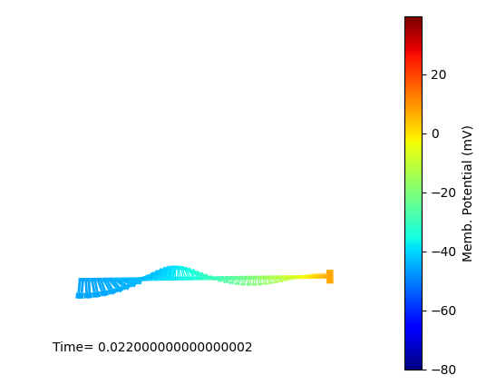

   3-D display of spines in a spiral

Suggestions:

        - Play with expressions for spine size and angular placement.
        - See what happens if the segment size gets smaller than the
          spine spacing.

Rdesigneur command reference
----------------------------

Rdesigneur is a Python class used to build multiscale neuronal models 
involving Reaction-Diffusion and Electrical SIGnaling in NEURons. 
The stages in its use are illustrated in the following dummy code snippet:

::

    # 1. Load in the libraries
    import moose
    import rdesigneur as rd

    # 2. Define the arguments. This does most of the model setup
    rdes = rd.rdesigneur( args )

    # 3. Tweak parameters of model building-blocks, for example:
    a = moose.element( '/library/chem/kinetics/a' )
    a.diffConst = 0
    
    # 4. Build the model
    rdes.buildModel()

    # 5. Tweak values in the constructed model, for example
    bv = moose.vec( '/model/chem/dend/b' )
    bv[0].concInit *= 2

    # 6. Run the model
    moose.reinit()
    moose.start( runtime )

    # 7. Display and/or save model output
    rdes.dispay()

The rdesigneur arguments are provided in the standard Python keyword-argument
format. For example:

::

    rdes = rd.rdesigneur(
        turnOffElec = True,
        chemDt = 0.05,
        ...
        chemProto = [ ['makeChemOscillator()', 'osc'] ],
        ...
        plotList = [ rd.rplot( relpath = 'dend/a', field = 'conc', title = '[a] (uM)' ) ],
        ...
    )

Each argument has a default, hence even 
`building rdesigneur without arguments`_ will produce a correct, if not very 
interesting model. 

**Rdesigneur and Prototypes:** Rdesigneur assembles models by taking prototype
objects and replicating them into the model. These prototypes can be chemical
reaction systems, ion channels, spines, or entire neurons. All the prototypes
are placed under the MOOSE object */library*. When building the model, it looks
up prototypes by name and places them into the resulting model. The rdesigneur
constructor (step 2 above) builds all these prototypes. Once they are in place,
the *BuildModel()* method (step 4 above) performs the assembly.

Below we provide the usage of the argument list to rdesigneur, which 
does most of the model specification.

turnOffElec
~~~~~~~~~~~
.. _`turnOffElec`:

Type: bool

Default: False

Use: Turns off electrical calculations. It is a good idea to set this flag 
**True** if the model doesn't use electrical calculations, it can make the 
calculations many times faster.

useGssa
~~~~~~~
Type: bool

Default: True

Use: Turns on the use of the Gillespie Stochastic Simulation Algorithm (GSSA)
in dendritic spines. Advisable in models where you worry about stochasticity.
Also it typically makes the simulations run faster.

combineSegments
~~~~~~~~~~~~~~~

Type: bool

Default: True

Use: Flag to pass on to the NeuroML loader to tell it to combine segments.

stealCellFromLibrary
~~~~~~~~~~~~~~~~~~~~

Type: bool

Default: False

Use: Use the prototype loaded-in neuron itself for the main simulation run,
removing it from the available prototypes.
It is advisable to set this to *True* if the model is large and complicated. It
saves memory and in some cases runs more reliably.

verbose
~~~~~~~

Type: bool

Default: True

Use: Tell rdesigneur to be garrulous when loading and reporting status and 
errors.

.. _`addSomaChemCompt`:

addSomaChemCompt
~~~~~~~~~~~~~~~~

Type: bool

Default: False

Use: Specify that the largest chemical compartment (by volume) should be 
assigned to the cell soma. Most multiscale models don't bother with a soma 
chemical compartment, and are happy with dendrite and possibly spines, so this
defaults to False.

.. _`addEndoChemCompt`:

addEndoChemCompt
~~~~~~~~~~~~~~~~

Type: bool

Default: False

Use: Specify that each of the chemical compartments should contain an internal
*endo*-compartment. This is typically used for the endoplasmic reticulum in
`models of calcium-induced calcium release`_ (CICR), however, the 
EndoCompartments are quite general and can be used for defining chemistry and
transport involving any membrane-bound organelle. In MOOSE, when you create 
an EndoCompartment it must be surrounded by a regular compartment, and a 
voxel of the EndoCompartment appears within every voxel of the surrounding 
compartment.

diffusionLength
~~~~~~~~~~~~~~~
Type: double

Default: 2e-6 (2 microns)

Use: This sets the spatial discretization length of reaction-diffusion models.
If the diffusion constant is D (in micron^2/sec), then the *diffusionLength*
should be less than D microns for signaling events that take 1 second. If the
signaling is faster, *diffusionLength* should be smaller.

temperature
~~~~~~~~~~~

Type: double

Default: 32 degrees Celsius

Use: ChannelML definitions of ion channels use this value to modulate 
their kinetics.

chemDt
~~~~~~

Type: double

Default: 0.1 s

Use: Specify timestep for chemical computations. Note that internally the MOOSE
solver will probably use finer or adaptive timesteps. The *chemDt* just ensures
that all the chemical values in different solvers will be synchronized at 
this interval. You will want to make this somewhat smaller (0.01 to 0.001 s)
in the case of multiscale simulations with tight coupling between electrical
and signaling events.

diffDt
~~~~~~

Type: double

Default: 0.01 s

Use: Specify timestep for diffusion computations, as well as cross-compartment
reactions and molecular transport across membrane pores. This timestep
does not apply to voltage-gated and synaptic channels handled by the electrical
solver, for that use *elecDt*. 
You will want to make this somewhat smaller (0.01 to 0.001 s)
in the case of multiscale simulations with tight coupling between electrical
and signaling events.

elecDt
~~~~~~

Type: double

Default: 50e-6 s

Use: Specify timestep for electrical calculations, used by the HSolver in
MOOSE to carry out calculations using Gaussian Elimination and the Crank-
Nicolson method for ion channels. This works well for slower
channels, but if you have particularly fast channel kinetics you may wish to
use *elecDt* of 10 to 20 us.

chemPlotDt
~~~~~~~~~~

Type: double

Default: 1 s

Use: Timestep for storing and plotting chemical values.

elecPlotDt
~~~~~~~~~~

Type: double

Default: 100e-6 s

Use: Timestep for storing and plotting electrical values.

funcDt
~~~~~~

Type: double

Default: 100e-6 s

Use: Timestep for performing Function calculations for inputs and stimuli,
for electrical models. Only used for electrical models, i.e., 
when `turnOffElec`_ is False. Otherwise the system uses a *funcDt* equal to
the *chemDt*.

cellProto
~~~~~~~~~

Type: List of lists

Default: [] (empty list). This generates the Hodgkin-Huxley configuration where
length and diameter are 500 microns, RM = 0.333, RA = 3000, and
CM = 0.01 F/m^2, but no active channels.

Use: This defines which neuronal model specification to use. There are many
options here:

    1. zero args: make standard soma corresponding to the Hodgkin-Huxley 
       model. length and diameter are both 500 um.
    2. [name, library_proto_name]: uses library prototype object.
    3. [fname.suffix, cellname ]: Loads cell from file. The file type
       is identified by the suffix, and can be :

        - *.nml*: NeuroML
        - *.xml*: NeuroML
        - *.swc*: NeuroMorpho.org format for cellular morphology
        - *.p*: Genesis format

    4. [moose<Classname>, cellname]: Makes prototype from MOOSE class.
    5. [funcname, cellname]: Calls named function with specified 
       name of cell to be made.
    6. [path, cellname]: Copies path to library as proto
    7. [libraryName, cellname]: Renames library entry as prototype.
    8. [somaProto, name, somaDia=5e-4, somaLen=5e-4]
       Creates a soma with optional specified diameter and length. Defaults
       as shown.
    9. [ballAndStick,name, somaDia=10e-6, somaLen=10e-6,
       dendDia=4e-6, dendLen=200e-6, numDendSeg=1]
       Creates a ball-and-stick with required type and name arguments. 
       The remaining arguments are optional. Defaults as shown.

spineProto
~~~~~~~~~~

.. _`spine prototype`:

Type: List of lists

Default: [] (empty list). This does not define any spines.

Use: Each list entry should be a list containing two strings: *source* and
*destination*. The *source* defines how to build the prototype. The 
*destination* specifies its name.
If the requested *destination* is an object that already exists in the library,
the system doesn't do anything.

The *source* can be any of:

    - functionName(): Call specified Python function, with the *destination*
      as the argument. The function is expected to build a prototype of the
      requested name on '/library'. The following utility functions are 
      built-in:

        - makePassiveSpine(): Makes a 2-compartment spine with the following 
          parameters:

            - shaft name: shaft
            - shaft length = 1 micron
            - shaft diameter = 0.2 micron
            - head name: head
            - head length = 0.5 micron
            - head diameter = 0.5 micron
            - RM = 1.0
            - RA = 1.0
            - CM = 0.01

        - makeExcSpine(): Same as above but adds in glutamate and NMDA 
          receptors and a calcium pool. The calcium pool has a pumping tau of 
          13.333 ms, and is present in the volume of the spine head. 
          Both receptors have conductances in the form of dual-exponential
          alpha functions, with a separate opening and closing tau.
          The glutamate receptor has the following parameters:

            - name: glu
            - opening tau: 2 ms
            - closing tau: 9 ms
            - Gbar, ie, conductance per unit area: 200 Siemens/m^2

          The NMDA receptor has the following parameters:

            - name: NMDA
            - opening tau: 20 ms
            - closing tau: 20 ms
            - Gbar, ie, conductance per unit area: 80 Siemens/m^2

        - makeActiveSpine(): Same as above, but also adds in a voltage-gated
          calcium channel with *Gbar = 10 Siemens/m^2* into the spine head.

    - Path of existing object in memory, such as */library/source*. In this 
      case rdesigneur renames the object to */library/destination*.
    - A filename, with any of the suffices:

        - *.nml*: NeuroML
        - *.xml*: NeuroML
        - *.swc*: NeuroMorpho.org format for cellular morphology
        - *.p*: Genesis format

    - moose::SymCompartment: Make a SymCompartment for the spine. Deprecated.
    - moose::Compartment: Make a Compartment for the spine. Deprecated.

chanProto
~~~~~~~~~

Type: List of lists

Default: [] (empty list). The empty list does not define any channels.

Use: Each list entry must have a string for the *source*. It can optionally
have a second string for the *destination*, which is the name to give to the
*source* channel when it is constructed on */library*.

.. _Open Source Brain: http://www.opensourcebrain.org/

The following options are available for specifying the *source* for 
making channel prototypes:

        - Filepath. This is relative to the working directory. The following
          file types are known:

            - xml: ChannelML, which is a subset of NeuroML
            - nml: ChannelML, which is a subset of NeuroML

          Channels in thse formats are available from `Open Source Brain`_, 

        - Predefined channel prototypes, available as functions within 
          rdesigneur. This is indicated by the use of braces after the name.
          The following prototypes are currently available:
          
            - make_HH_Na(): Make the classical Hodgkin-Huxley Na channel, with
              kinetics scaled to SI units.
            - make_HH_K(): Classical HH delayed rectifier K channel.
            - make_Na(): Hippocampal pyramidal Na channel from Traub 1991.
            - make_K_DR(): Hippocampal pyramidal K delayed rectifier channel 
              from Traub 1991.
            - make_K_A(): Hippocampal pyramidal A-type K channel from Traub 
              1991.
            - make_Ca_conc(): A calcium pool with tau 13.333 ms. This is
              required for the calcium dynamics of several channels.
            - make_Ca(): Voltage-gated Calcium channel, based on Traub 1991. It
              requires the Ca_conc.
            - make_K_AHP: Voltage and calcium-gated afterhyperpolarization-
              activated K channel, from Traub 1991. Note that this channel 
              requires the presence of the Ca_conc.
            - make_K_C: Voltage and calcium-dependent K channel from Traub 1991.
              This channel requires the presence of the Ca_conc.
            - make_glu(): Glutamate receptor in the form of dual-exponential
              alpha functions, with a separate opening (2ms) and closing (9ms)
              tau. Reversal potential = 0 mV.
            - make_GABA(): GABA receptor in the form of dual-exponential
              alpha functions, with a separate opening (4ms) and closing (9ms)
              tau. Reversal potential = -65 mV.

         - User-defined channel definition functions.
           These can be from external Python files, using the 
           full path to the file name minus the suffix. The specific function 
           within it is then specified. For example,

           ::

               chanProto = [
                   ['/home/user/models/channelProtos.make_K_AHP()', 'K_AHP']
               ]

chemProto
~~~~~~~~~

Type: List of lists

Default: [] (empty list). The empty list does not define any chemical systems.

Use: Each list entry must have a string for the *source*. It can optionally
have a second string for the *destination*, which is the name to give to the
*source* chemical system when it is constructed on */library*.

.. _DOQCS: https://doqcs.ncbs.res.in/
.. _BioModels: https://www.ebi.ac.uk/biomodels-main/

The following options are available for specifying the *source* for 
making channel prototypes:

        - Filepath. This is relative to the working directory. The following
          file types are known:

            - xml: SBML
            - sbml: SBML
            - .g: GENESIS Kinetikit (kkit.g) format.

          Channels in thse formats are available from the `DOQCS`_ database,
          and from the `BioModels`_ database, 
        - Predefined functions. At present only one such function is available,
          **makeChemOscillator()**
        - User-defined functions. 
           These can be from external Python files, using the 
           full path to the file name minus the suffix. The specific function 
           within it is then specified. For example,
           ::

               chemProto = [
                   ['/home/user/models/chemProtos.make_Osc()', 'osc']
               ]

        - Pool objects. These are created on the fly using the form
          ::

                chemProto = [['moose:Pool', 'a']]

passiveDistrib
~~~~~~~~~~~~~~

Type: List of lists

Default: [] (empty list). Does nothing.

Use; This is for adjusting the passive properties of the neuron. Each list
entry is a list of strings, of the form:

::
        
        [path, field, expr, [field, expr]...]

Here the *path* is a MOOSE wildcard path, which defines one or more objects. 
Briefly, the '#' character specifies any string, and the double '##' specifies
any string at any level in the tree. For example, to specify any compartment
with the string 'dend' you would use *'#dend#'* and to specify any object 
anywhere in the tree you would use *'##'*.

The *field* can be any one of the following:

        - RM: Membrane resistivity, in ohms.m^2
        - RA: Axial resistivity, in ohms.m
        - CM: Membrane specific capacitance, in Farads/m^2
        - Rm: Absolute membrane resistance of that segment, in ohms.
        - Ra: Absolute axial resistance of that segment, in ohms.
        - Cm: Absolute membrane capacitance of that segment, in Farads.
        - Em: Membrane resting potential, in Volts.
        - initVm: Initial value to set the membrane potential, in Volts.

The *expr* is an expression string that is evaluated to give the desired value 
for the field. This can be as simple as the value itself, but can be a much
more interesting function of geometrical properties of the cell. The geometry
arguments available to the *expr* include: 
        
        - p: Path length in metres from the soma, measured along the dendrite.
        - g: Geometrical distance from the soma.
        - L: Number of electronic length constants from the soma
        - len: length of the segment of dendrite
        - dia: diameter of the segment of dendrite
        - maxP: Maximum path length of any dendrite in the cell.
        - maxG: Maximum geometrical distance of any dendrite from soma
        - maxL: Maximum electrotonic distance of any dendrite from the soma

Putting these together, here is an example of using the passiveDistrib:

::

    passiveDistrib = [
        [ 'soma', 'RM', '1.0', 'CM', '0.02' ],
        [ '#dend#', 'RM', '1.5 + 0.5*(p>200e-6)', 'CM', '0.01' ],
    ]

This means set the soma *RM* to 1.0, and *CM* to 0.02, leaving the *RA* as the 
default. The scaled value for *Rm*, *Ra*, and *Cm* are computed by scaling 
these terms according to the soma dimensions. 
For all dendrite compartments, set the *RM* to 1.5 provided it is closer than
200 microns dendritic path length from the soma, and set the *RM* to 2.0 for
all dendritic compartments further than this.
Finally, for all dendrite compartments, set *CM* to 0.01. Note that again 
the absolute *Rm* and *Cm* will be scaled according to the local compartment
dimensions.

spineDistrib
~~~~~~~~~~~~

Type: List of lists

Default: [] (empty list). Does nothing.

Use: This is for inserting dendritic spines onto the neuron.
Each entry is a list of strings, of the form:

::
        
    [proto, path, [spacing, minSpacing, size, sizeDistrib, angle, angleDistrib]]

Of these, the *name* and the *path* are required entries, and the remainder 
can be provided in pairs. The defaults for these entries are:

::

    ['spine', '#dend#,#apical#', '10e-6', '1e-6', '1', '0.5', '0', '6.2832' ]

The interpretation of the arguments is as follows:

    - name: This is the name of the `spine prototype`_. 
    - path: The wildcard path of compartments on which to insert the spines.
      In the example above, *'#dend#,#apical#'* means all compartments with
      the strings *dend* or *apical* in their names.
    - spacing: The mean spacing between spines. At present the spines are placed
      with a Poisson distribution. This is a math expression with the same
      terms as used for the passive distribution, so that the spine spacing
      can be a function of spine position along the dendritic tree. The form
      of this expression is shown again below.
    - minSpacing: The minimum spacing, and the increment along which the 
      Poisson samples are taken to decide if a spine should be added.
      In case *minSpacing* is negative, the system places spines with uniform
      *spacing* along the dendritic segment. If 
      ``segment length < 0.5 * spacing`` 
      then the system falls back onto Poisson samples so that finely
      subdivided dendrites don't miss out on spines altogether.
    - size: Scale factor for size from the prototype spine. All dimension of
      the spine are scaled by this number: shaft length, shaft diameter,
      head length and head diameter. This is a math expression, as shown below.
    - sizeDistrib: The range of distribution of sizes. This is a linear
      distribution centered around the defined size.
    - angle: The initial angle of the first spine on each dendrite compartment,
      in radians. This is a math expression, as shown below.
    - angleDistrib: The range of of angles around this initial angle.
      The angle will be chosen from a linear distribution centered around the 
      centre angle, +/- angleDistrib.

The expression used for spacing, size, and angle is of the form of an 
an expression string that is evaluated to give the desired value 
for the field. This can be as simple as the value itself, but can be a much
more interesting function of geometrical properties of the cell. The geometry
arguments available to the *expr* include: 
        
    - p: Path length in metres from the soma, measured along the dendrite.
    - g: Geometrical distance from the soma.
    - L: Number of electronic length constants from the soma
    - len: length of the segment of dendrite
    - dia: diameter of the segment of dendrite
    - maxP: Maximum path length of any dendrite in the cell.
    - maxG: Maximum geometrical distance of any dendrite from soma
    - maxL: Maximum electrotonic distance of any dendrite from the soma

For example:

::

        ['spine', '#dend#', '1e-6 + (dia<2e-6)*10', '1e-7', '1', '0.5', '6.28*p/maxP', '0']

**proto**: The prototype spine by the name of *spine* is used.

**path**: All compartments with the string *dend* in their name are used.

**Spacing**: The spines are only placed on branches smaller than 2 microns 
(otherwise the spine spacing is 10 metres). On these small branches the 
spacing is, on average, 1 micron.

**Size**: The size is anything from 50% to 150% of the prototype spine size.

**Angle**: The angle is proportional to the distance from the soma, such that
the spines make a complete spiral (2pi) around the dendrite over its length.

chanDistrib
~~~~~~~~~~~~

Type: List of lists

Default: [] (empty list). Does nothing.

Use: This is for inserting ion channels onto the neuron.
Each entry is a list of strings, of the form:

::
        
    [proto, path, field, expr, [field, expr]...]

The entries here are of the form:

    - proto: Specifies the name of the prototype channel to insert
    - path: Wildcard path of compartments in which to insert the channel
    - field: Field to assign to channel, almost always **Gbar**, to set its
      channel density.
    - expr: Expression evaluated to obtain value to assign to field. This is a
      mathematical expression of various geometrical properties of the cell,
      as listed below.

.. _`usual function`:

The *expr* can be as simple as the value itself, but can be a much
more interesting function of geometrical properties of the cell. The geometry
arguments available to the *expr* include: 
        
    - p: Path length in metres from the soma, measured along the dendrite.
    - g: Geometrical distance from the soma.
    - L: Number of electronic length constants from the soma
    - len: length of the segment of dendrite
    - dia: diameter of the segment of dendrite
    - maxP: Maximum path length of any dendrite in the cell.
    - maxG: Maximum geometrical distance of any dendrite from soma
    - maxL: Maximum electrotonic distance of any dendrite from the soma

A typical channel distribution entry is:

::

    ["kdr", "#", "Gbar", "p < 50e-6 ? 500 : 100" ]

Here the *kdr* channel is inserted throughout the cell, and its conductance
is at 500 Siemens/m^2 for all regions closer than 50 microns, and 100 S/m^2
for the rest of the cell. Basically there is lots of the channel on and
near the soma.

chemDistrib
~~~~~~~~~~~~

Type: List of lists

Default: [] (empty list). Does nothing.

Use: This is for inserting a chemical system into the neuron
Each entry is a list of strings, of the form:

::
        
    [proto, path, 'install', expr]

The entries here are of the form:

    - proto: Specifies the name of the prototype chemical system to insert
    - path: Wildcard path of compartments in which to insert the channel
    - 'install': Default string.
    - expr: Expression evaluated to decide whether to install the chemical
      system. This is the `usual function`_ of geometrical properties of the
      cell. It is usually '1', to tell the system to install throughout the
      *path*.

The chemical distribution is handled specially for assignment to the neuronal
morphology. This is because a given chemical system will have reactions
between dendrite, ER, spines and PSD, as well as diffusion between these
zones. Thus, though it would be convenient,  we cannot simply define separate 
chemical systems for each cellular compartment. Instead we use one of two
conventions for doing the assignment.

1. Volume based. If the model format does not permit explicit naming of the
   chemical compartments in the model, then the assignment is inferred from
   the volume of each compartment. This limitation applies for the legacy
   Genesis/kkit **.g** format. It may also apply to SBML models that do not
   assign suitable names for their chemical compartments. In this case
   the largest chemical compartment is 
   assigned to the dendrite, the next (if present) to the spine head, and the 
   smallest (if present) to the spine PSD.

   This is modified in one of two ways by the flags `addSomaChemCompt`_ and
   `addEndoChemCompt`_.

   *addSomaChemCompt*  instructs rdesigneur to use the largest compartment for
   the soma. The remaining compartments follow in the usual order.

   *addEndoChemCompt* instructs rdesigneur to insert an EndoCompartment in
   each neuronal compartment. The volume order is now dend, dend_endo, 
   spine-head, spine-head-endo and so on.
     
2. Name based. This works for recent SBML models, which can assign a compartment
   name to each of the chemical compartments. Here the expectation is that the
   names are one of *soma*, *soma_endo*, *dend*, *dend_endo*, *spine*, 
   *spine_endo*, *psd*, *psd_endo*.
   Note that the last one, though permitted, doesn't make much biological
   sense.

adaptorList
~~~~~~~~~~~

Type: List of lists

Default: [] (empty list). Does nothing.

Use: This is for implementing an adaptor between chemical and electrical, or
chemical and structural quantities. Adaptors handle the conversion between
distinct concepts in chemical and electrical models. For example, Calcium
concentration as computed electrically in the Ca_conc objects, can map to the
calcium concentration of the ion as a molecule, where it can react, diffuse,
and undergo other calcium dynamics. Another common use is to map the 
concentration of the molecular state of an ion channel, to its conductance.
The adaptor applies the conversion equation **y = mx + c** where **y** is the
target value, **x** is the source value, **m** is the slope of the conversion,
and **c** is the offset.

Adaptors automatically average over multiple inputs if the mapping requires.
Typically electrical segments each contain many chemical voxels, so the
adaptor averages all the source chemical quantities to apply to the 
corresponding electrical quantity. Similarly, each chemical timestep is 
typically much longer than the electrical timestep, so the adaptor averages
the electrical quantity over the entire duration of the chemical timestep.

Each entry is a list of strings, of the form:

::
        
    [source, source_field, dest, dest_field, offset, scaling]

The entries here are:

    - source: Specifies the path of the objects whose quantities need to be
      converted. In the case of chemical quantities, the path starts with the
      compartment name, one of *dend*, *spine*, or *psd*. So the molecule
      Ca in the dendrite would be identified as *dend/Ca*.
    - source_field: The field on the source object whose value is to be used.
    - dest: Path of destination object, whose quantities will be assigned.
      As above, chemical quantities are prefixed by their compartment name.
    - dest_field: Field to be assigned on the destination object.
    - offset: Double. In the conversion, what is the value of the dest_field
      when the source value is zero?. In other words, the quantity **c** in
      the conversion equation **y = mx + c**
    - scaling: Double. The slope **m**.

stimList
~~~~~~~~

Type: List of lists

Default: [] (empty list). Does nothing.

Use: Each entry is a list of strings, as follows:

::
        
    [path, geometry_expr, dest, dest_field, time_expr]

The entries here are:
    - path: The usual MOOSE wildcard path to identify electrical compartments
      over which the stimulus will extend. Note that the stimulus may be to
      a chemical entity, but the spatial location is specified in terms of
      the electrical compartments in which the chemical system is embedded.
    - geometry_expr. This is the `usual function`_ of geometrical properties 
      of the cell. If it is non-zero, then the stimulus will apply.
      There is a special case for synaptic inputs in which the *geometry_expr*
      is repaced with the synaptic weight, recorded as a string.
    - dest. This is the destination object for the stimulus.
    - dest_field. This is the field on the destination object to be assigned.
      There is a special case for synaptic inputs, where the field can be
      **periodicsyn** or **randsyn**, representing periodic and random
      synaptic input respectively.
    - time_expr: This is the time expression of the value of the stimulus.
      Unlike the *geometry_expr*, the *time_expr* can take the predefined 
      variable **t** which is the current simulation time. The *time_expr* does
      not have access to the geometry arguments.

Example 1:

::

    ['head#', '0.5','glu', 'periodicsyn', '1 + 40*(t>10 && t<11)']

This acts on all glutamate receptors on the spine *heads*. It delivers 
periodic synaptic input with weight 0.5 at a basal rate of 1 Hz, rising
by 40Hz in the interval between 10 and 11 seconds.

Example 2:

::

    ['soma', '1', '.', 'inject', '(1+cos(t/10))*(t>31.4 && t<94)* 0.5e-9' ]

This acts to deliver a current injection on the soma. It delivers cosine
input of angular frequency 1/10 radians/s, between times 31.4 and 94 seconds,
with a peak amplitude of 0.5 nA.

Rdesigneur also supports keyword-based argument lists for the stimList.
Here each entry is an rstim function as follows:

::
        
    rd.rstim( elecpath, geom_expr, relpath, field, expr )

The default values of the arguments are

::
        
    rd.rstim(elecpath='soma', geom_expr='1', relpath='.', field='inject', expr='0')

 
Example 3: To get the same outcome as example 2, one could use:

::

    rd.rstim( expr=(1+cos(t/10))*(t>31.4 && t<94)* 0.5e-9' )

because most of the arguments are the same as the defaults.

plotList
~~~~~~~~

Type: List of lists

Default: [] (empty list). Does nothing.

Use: This displays a line plot of cellular activity. 
Each entry is a list as follows:

::
        
    [path, geom_expr, relpath, field, title, 
        [mode, ymin, ymax,saveFile, saveResolution, showFlag ]
    ]

The entries here are:
    - path: string. The usual MOOSE wildcard path to identify electrical 
      compartments
      over which the plots will be sampled. Note that the stimulus may be to
      a chemical entity, but the spatial location is specified in terms of
      the electrical compartments in which the chemical system is embedded.
    - geom_expr: string. This is the `usual function`_ of geometrical 
      properties of the cell. If it is non-zero, then the stimulus will apply.
      There is a special case for synaptic inputs in which the *geometry_expr*
      is repaced with the synaptic weight, recorded as a string.
    - replath: string. Relative path to object whose value is being monitored.
    - field: string. The field to monitor on the source object.
    - title: Title string for the generated plot.
    - mode: Optional. String to decide what kind of plot to make. Options are:
      
        - *'time'*: Default. Plot time-series
        - *'wave'*: Generate wave-plot with compartment/voxel number as x axis,
          value as y axis, and run through a series of frames for different 
          time-points durign simulation.
    - ymin: Double. Optional. Minimum value for y axis. Default = 0.
    - ymax: Double. Optional. Maximum value for y axis. Default = 0. 
      If ymin==ymax then the plot autoscales.
    - saveFile: string. Optional. File in which to save plot contents. 
      Default = "", to
      indicate that the file is not saved. Currently it can save in *csv* and
      *xml* formats. *nsdf* will be implemented soon.
    - show: Bool. Optional. Flag to decide if the plot should be displayed. 
      Default=True.

Rdesigneur also supports keyword-based argument lists for the plotList, having
the same entries as above. Here are two plotList entries with identical 
outcomes.

::

    ['soma', '1', '.', 'Vm', 'Soma membrane potential'],
    [rd.rplot( field='Vm', title= 'Soma membrane potential')],

moogList
~~~~~~~~

Type: List of lists

Default: [] (empty list). Does nothing.

Use: This displays a 3-D plot of cellular activity.
Each entry is a list as follows:

::
        
    [path, geom_expr, relpath, field, title, [ymin, ymax]]

The entries here are:
    - path: string. The usual MOOSE wildcard path to identify electrical 
      compartments
      over which the display will be sampled. Note that the stimulus may be to
      a chemical entity, but the spatial location is specified in terms of
      the electrical compartments in which the chemical system is embedded.
    - geom_expr: string. This is the `usual function`_ of geometrical 
      properties of the cell. If it is non-zero, then the stimulus will apply.
      There is a special case for synaptic inputs in which the *geometry_expr*
      is repaced with the synaptic weight, recorded as a string.
    - replath: string. Relative path to object whose value is being monitored.
    - field: string. The field to monitor on the source object.
    - title: Title string for the generated display.
    - ymin: Double. Minimum value for y axis. Default = 0.
    - ymax: Double. Maximum value for y axis. Default = 0. 
      If ymin==ymax then the plot autoscales.
    - show: Bool. Flag to decide if it should be displayed. Default=True.

Rdesigneur also supports keyword-based argument lists for the moogList, having
the same entries as above. Here are two moogList entries with identical 
outcomes.

::

    ['soma', '1', 'dend/a', 'conc', 'a Conc', 0, 600 ],
    [rd.rmoog(relpath='dend/a', field='conc', title = 'a Conc', ymax=600)]

To run and display moogli, one replaces the *moose.start()* and the 
*rdes.display()* functions with the line:

::

    rdes.displayMoogli(dt, runtime, rotation, fullscreen, block, azim, elev)

in which the first two arguments are required and the rest are optional and
can be assigned by keywords.

The arguments are as follows:

    - dt: double. Time interval between frames on the moogli display
    - runtime: double. Simulation runtime.
    - rotation: double. How much to rotate the display per frame. 
      Defaults to pi/500.
    - fullscreen: bool. Flag to do display on the full screen. 
      Defaults to False.
    - azim: double. Azimuth setting. Defaults to 0.0
    - elev: double. Elevation setting. Defaults to 0.0

The `moogli primer`_ explains how to use the 3-D display.
