******************
Chemical Bistables
******************

A `bistable system <https://en.wikipedia.org/wiki/Bistability>`_ is a dynamic system that has two stable equilibrium states. The following examples can be used to teach and demonstrate different aspects of bistable systems or to learn how to model them using moose. Each example contains a short description, the model's code, and the output with default settings. 

Each example can be found as a python file within the main moose folder under 
::

    (...)/moose/moose-examples/tutorials/ChemicalBistables

In order to run the example, run the script
::

    python filename.py

in command line, where ``filename.py`` is the name of the python file you would like to run. The filenames of each example are written in **bold** at the beginning of their respective sections, and the files themselves can be found in the aformentioned directory.

In chemical bistable models that use solvers, there are optional arguments that allow you to specify which solver you would like to use.
:: 

    python filename.py [gsl | gssa | ee]

Where ``gsl`` is Gnu Scientific Library's deterministic solver, ``gssa`` stands for Gillespie stochastic simulation algorithm, and ``ee`` is the exponential euler algorithm.

All the following examples can be run with either of the three solvers, which in some cases produces a different outcome. However, simply running the file without the optional argument will by default use the ``gsl`` solver. These ``gsl`` outputs are the ones shown below. 

Simple Bistables
================

Filename: **simpleBis.py**

This example shows the key property of a chemical bistable system: it
has two stable states. Here we start out with the system settling rather
quickly to the first stable state, where molecule A is high (blue) and
the complementary molecule B (green) is low. At t = 100s, we deliver a
perturbation, which is to move 90% of the A molecules into B. This
triggers a state flip, which settles into a distinct stable state where
there is more of B than of A. At t = 200s we reverse the flip by moving
99% of B molecules back to A.

If we run the simulation with the gssa option python simpleBis.py gssa

we see exactly the same sequence of events, except now the switch is
noisy. The calculations are now run with the Gillespie Stochastic
Systems Algorithm (gssa) which incorporates probabilistic reaction
events. The switch still switches but one can see that it might flip
spontaneously once in a while.

Things to do: 

1. Open a copy of the script file in an editor, and around
line 124 and 129 you will see how the state flip is implemented while
maintaining mass conservation. What happens if you flip over fewer
molecules? What is the threshold for a successful flip? Why are these
thresholds different for the different states?

2. Try different volumes in line 31, and rerun using the gssa. Will you
   see more or less noise if you increase the volume to 1e-20 m^3?

**Code:**

.. hidden-code-block:: python
    :linenos:
    :label: Show/Hide code

    #########################################################################
    ## This program is part of 'MOOSE', the
    ## Messaging Object Oriented Simulation Environment.
    ##           Copyright (C) 2013 Upinder S. Bhalla. and NCBS
    ## It is made available under the terms of the
    ## GNU Lesser General Public License version 2.1
    ## See the file COPYING.LIB for the full notice.
    #########################################################################
    
    # This example illustrates how to set up a kinetic solver and kinetic model
    # using the scripting interface. Normally this would be done using the
    # Shell::doLoadModel command, and normally would be coordinated by the
    # SimManager as the base of the entire model.
    # This example creates a bistable model having two enzymes and a reaction.
    # One of the enzymes is autocatalytic.
    # The model is set up to run using deterministic integration.
    # If you pass in the argument 'gssa' it will run with the stochastic
    # solver instead
    # You may also find it interesting to change the volume.
    
    import math
    import pylab
    import numpy
    import moose
    import sys
    
    def makeModel():
                    # create container for model
                    model = moose.Neutral( 'model' )
                    compartment = moose.CubeMesh( '/model/compartment' )
                    compartment.volume = 1e-21 # m^3
                    # the mesh is created automatically by the compartment
                    mesh = moose.element( '/model/compartment/mesh' ) 
    
                    # create molecules and reactions
                    a = moose.Pool( '/model/compartment/a' )
                    b = moose.Pool( '/model/compartment/b' )
                    c = moose.Pool( '/model/compartment/c' )
                    enz1 = moose.Enz( '/model/compartment/b/enz1' )
                    enz2 = moose.Enz( '/model/compartment/c/enz2' )
                    cplx1 = moose.Pool( '/model/compartment/b/enz1/cplx' )
                    cplx2 = moose.Pool( '/model/compartment/c/enz2/cplx' )
                    reac = moose.Reac( '/model/compartment/reac' )
    
                    # connect them up for reactions
                    moose.connect( enz1, 'sub', a, 'reac' )
                    moose.connect( enz1, 'prd', b, 'reac' )
                    moose.connect( enz1, 'enz', b, 'reac' )
                    moose.connect( enz1, 'cplx', cplx1, 'reac' )
    
                    moose.connect( enz2, 'sub', b, 'reac' )
                    moose.connect( enz2, 'prd', a, 'reac' )
                    moose.connect( enz2, 'enz', c, 'reac' )
                    moose.connect( enz2, 'cplx', cplx2, 'reac' )
    
                    moose.connect( reac, 'sub', a, 'reac' )
                    moose.connect( reac, 'prd', b, 'reac' )
    
                    # connect them up to the compartment for volumes
                    #for x in ( a, b, c, cplx1, cplx2 ):
                    #                        moose.connect( x, 'mesh', mesh, 'mesh' )
    
                    # Assign parameters
                    a.concInit = 1
                    b.concInit = 0
                    c.concInit = 0.01
                    enz1.kcat = 0.4
                    enz1.Km = 4
                    enz2.kcat = 0.6
                    enz2.Km = 0.01
                    reac.Kf = 0.001
                    reac.Kb = 0.01
    
                    # Create the output tables
                    graphs = moose.Neutral( '/model/graphs' )
                    outputA = moose.Table ( '/model/graphs/concA' )
                    outputB = moose.Table ( '/model/graphs/concB' )
    
                    # connect up the tables
                    moose.connect( outputA, 'requestOut', a, 'getConc' );
                    moose.connect( outputB, 'requestOut', b, 'getConc' );
    
                    # Schedule the whole lot
                    moose.setClock( 4, 0.01 ) # for the computational objects
                    moose.setClock( 8, 1.0 ) # for the plots
                    # The wildcard uses # for single level, and ## for recursive.
                    moose.useClock( 4, '/model/compartment/##', 'process' )
                    moose.useClock( 8, '/model/graphs/#', 'process' )
    
    def displayPlots():
                    for x in moose.wildcardFind( '/model/graphs/conc#' ):
                                    t = numpy.arange( 0, x.vector.size, 1 ) #sec
                                    pylab.plot( t, x.vector, label=x.name )
                    pylab.legend()
                    pylab.show()
    
    def main():
                    solver = "gsl"
                    makeModel()
                    if ( len ( sys.argv ) == 2 ):
                        solver = sys.argv[1]
                    stoich = moose.Stoich( '/model/compartment/stoich' )
                    stoich.compartment = moose.element( '/model/compartment' )
                    if ( solver == 'gssa' ):
                        gsolve = moose.Gsolve( '/model/compartment/ksolve' )
                        stoich.ksolve = gsolve
                    else:
                        ksolve = moose.Ksolve( '/model/compartment/ksolve' )
                        stoich.ksolve = ksolve
                    stoich.path = "/model/compartment/##"
                    #solver.method = "rk5"
                    #mesh = moose.element( "/model/compartment/mesh" )
                    #moose.connect( mesh, "remesh", solver, "remesh" )
                    moose.setClock( 5, 1.0 ) # clock for the solver
                    moose.useClock( 5, '/model/compartment/ksolve', 'process' )
    
                    moose.reinit()
                    moose.start( 100.0 ) # Run the model for 100 seconds.
    
                    a = moose.element( '/model/compartment/a' )
                    b = moose.element( '/model/compartment/b' )
    
                    # move most molecules over to b
                    b.conc = b.conc + a.conc * 0.9
                    a.conc = a.conc * 0.1
                    moose.start( 100.0 ) # Run the model for 100 seconds.
    
                    # move most molecules back to a
                    a.conc = a.conc + b.conc * 0.99
                    b.conc = b.conc * 0.01
                    moose.start( 100.0 ) # Run the model for 100 seconds.
    
                    # Iterate through all plots, dump their contents to data.plot.
                    displayPlots()
    
                    quit()
    
    # Run the 'main' if this script is executed standalone.
    if __name__ == '__main__':
            main()

|

**Output:**

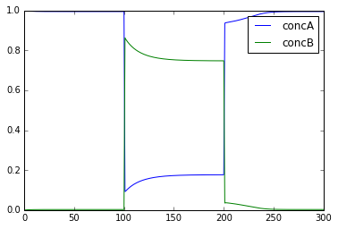

Scale Volumes
=============

File name: **scaleVolumes.py**

This script runs exactly the same model as in simpleBis.py, but it
automatically scales the volumes from 1e-19 down to smaller values.

Note how the simulation successively becomes noisier, until at very
small volumes there are spontaneous state transitions.

**Code:**

.. hidden-code-block:: python
    :linenos:
    :label: Show/Hide code

    #########################################################################
    ## This program is part of 'MOOSE', the
    ## Messaging Object Oriented Simulation Environment.
    ##           Copyright (C) 2013 Upinder S. Bhalla. and NCBS
    ## It is made available under the terms of the
    ## GNU Lesser General Public License version 2.1
    ## See the file COPYING.LIB for the full notice.
    #########################################################################
    
    import math
    import pylab
    import numpy
    import moose
    
    def makeModel():
    		# create container for model
    		model = moose.Neutral( 'model' )
    		compartment = moose.CubeMesh( '/model/compartment' )
    		compartment.volume = 1e-20
    		# the mesh is created automatically by the compartment
    		mesh = moose.element( '/model/compartment/mesh' ) 
    
    		# create molecules and reactions
    		a = moose.Pool( '/model/compartment/a' )
    		b = moose.Pool( '/model/compartment/b' )
    		c = moose.Pool( '/model/compartment/c' )
    		enz1 = moose.Enz( '/model/compartment/b/enz1' )
    		enz2 = moose.Enz( '/model/compartment/c/enz2' )
    		cplx1 = moose.Pool( '/model/compartment/b/enz1/cplx' )
    		cplx2 = moose.Pool( '/model/compartment/c/enz2/cplx' )
    		reac = moose.Reac( '/model/compartment/reac' )
    
    		# connect them up for reactions
    		moose.connect( enz1, 'sub', a, 'reac' )
    		moose.connect( enz1, 'prd', b, 'reac' )
    		moose.connect( enz1, 'enz', b, 'reac' )
    		moose.connect( enz1, 'cplx', cplx1, 'reac' )
    
    		moose.connect( enz2, 'sub', b, 'reac' )
    		moose.connect( enz2, 'prd', a, 'reac' )
    		moose.connect( enz2, 'enz', c, 'reac' )
    		moose.connect( enz2, 'cplx', cplx2, 'reac' )
    
    		moose.connect( reac, 'sub', a, 'reac' )
    		moose.connect( reac, 'prd', b, 'reac' )
    
    		# connect them up to the compartment for volumes
    		#for x in ( a, b, c, cplx1, cplx2 ):
    		#			moose.connect( x, 'mesh', mesh, 'mesh' )
    
    		# Assign parameters
    		a.concInit = 1
    		b.concInit = 0
    		c.concInit = 0.01
    		enz1.kcat = 0.4
    		enz1.Km = 4
    		enz2.kcat = 0.6
    		enz2.Km = 0.01
    		reac.Kf = 0.001
    		reac.Kb = 0.01
    
    		# Create the output tables
    		graphs = moose.Neutral( '/model/graphs' )
    		outputA = moose.Table ( '/model/graphs/concA' )
    		outputB = moose.Table ( '/model/graphs/concB' )
    
    		# connect up the tables
    		moose.connect( outputA, 'requestOut', a, 'getConc' );
    		moose.connect( outputB, 'requestOut', b, 'getConc' );
    
    		# Schedule the whole lot
    		moose.setClock( 4, 0.01 ) # for the computational objects
    		moose.setClock( 8, 1.0 ) # for the plots
    		# The wildcard uses # for single level, and ## for recursive.
    		moose.useClock( 4, '/model/compartment/##', 'process' )
    		moose.useClock( 8, '/model/graphs/#', 'process' )
    
    def displayPlots():
    		for x in moose.wildcardFind( '/model/graphs/conc#' ):
    				t = numpy.arange( 0, x.vector.size, 1 ) #sec
    				pylab.plot( t, x.vector, label=x.name )
    
    def main():
    
        """
        This example illustrates how to run a model at different volumes.
        The key line is just to set the volume of the compartment::
    
            compt.volume = vol
    
        If everything
        else is set up correctly, then this change propagates through to all
        reactions molecules.
    
        For a deterministic reaction one would not see any change in output 
        concentrations.
        For a stochastic reaction illustrated here, one sees the level of 
        'noise' 
        changing, even though the concentrations are similar up to a point.
        This example creates a bistable model having two enzymes and a reaction.
        One of the enzymes is autocatalytic.
        This model is set up within the script rather than using an external 
        file.
        The model is set up to run using the GSSA (Gillespie Stocahstic systems
        algorithim) method in MOOSE.
    
        To run the example, run the script
    
            ``python scaleVolumes.py``
    
        and close the plots every cycle to see the outcome of stochastic
        calculations at ever smaller volumes, keeping concentrations the same.
        """
        makeModel()
        moose.seed( 11111 )
        gsolve = moose.Gsolve( '/model/compartment/gsolve' )
        stoich = moose.Stoich( '/model/compartment/stoich' )
        compt = moose.element( '/model/compartment' );
        stoich.compartment = compt
        stoich.ksolve = gsolve
        stoich.path = "/model/compartment/##"
        moose.setClock( 5, 1.0 ) # clock for the solver
        moose.useClock( 5, '/model/compartment/gsolve', 'process' )
        a = moose.element( '/model/compartment/a' )
    
        for vol in ( 1e-19, 1e-20, 1e-21, 3e-22, 1e-22, 3e-23, 1e-23 ):
            # Set the volume
            compt.volume = vol
            print('vol = {}, a.concInit = {}, a.nInit = {}'.format( vol, a.concInit, a.nInit))
            print('Close graph to go to next plot\n')
    
            moose.reinit()
            moose.start( 100.0 ) # Run the model for 100 seconds.
    
            a = moose.element( '/model/compartment/a' )
            b = moose.element( '/model/compartment/b' )
    
            # move most molecules over to b
            b.conc = b.conc + a.conc * 0.9
            a.conc = a.conc * 0.1
            moose.start( 100.0 ) # Run the model for 100 seconds.
    
            # move most molecules back to a
            a.conc = a.conc + b.conc * 0.99
            b.conc = b.conc * 0.01
            moose.start( 100.0 ) # Run the model for 100 seconds.
    
            # Iterate through all plots, dump their contents to data.plot.
            displayPlots()
            pylab.show()
    
        quit()
    
    # Run the 'main' if this script is executed standalone.
    if __name__ == '__main__':
    	main()
|
**Output:**

.. parsed-literal::

    vol = 1e-19, a.concInit = 1.0, a.nInit = 60221.415
    

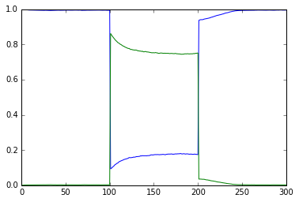

.. parsed-literal::

    vol = 1e-20, a.concInit = 1.0, a.nInit = 6022.1415
    

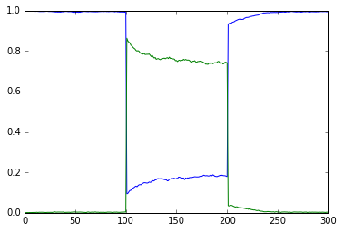

.. parsed-literal::

    vol = 1e-21, a.concInit = 1.0, a.nInit = 602.21415
    

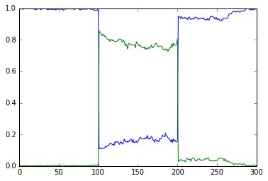

.. parsed-literal::

    vol = 3e-22, a.concInit = 1.0, a.nInit = 180.664245
    

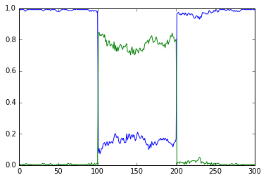

.. parsed-literal::

    vol = 1e-22, a.concInit = 1.0, a.nInit = 60.221415
    

.. image:: ../../../images/sV5.png

.. parsed-literal::

    vol = 3e-23, a.concInit = 1.0, a.nInit = 18.0664245
    

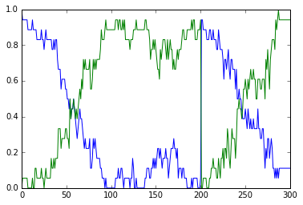

.. parsed-literal::

    vol = 1e-23, a.concInit = 1.0, a.nInit = 6.0221415
    

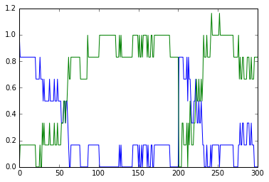

Strong Bistable System
======================

File name: **strongBis.py**

This example illustrates a particularly strong, that is, parametrically
robust bistable system. The model topology is symmetric between
molecules **b** and **c**. We have both positive feedback of molecules
**b** and **c** onto themselves, and also inhibition of **b** by **c**
and vice versa.

.. image:: ../../../images/strongBis.png

Open the python file to see what is happening. The simulation starts at
a symmetric point and the model settles at precisely the balance point
where **a**, **b**, and **c** are at the same concentration. At t= 100
we apply a small molecular 'tap' to push it over to a state where **c**
is larger. This is stable. At t = 210 we apply a moderate push to show
that it is now very stably in this state, and the system rebounds to its
original levels. At t = 320 we apply a strong push to take it over to a
state where **b** is larger. At t = 430 we give it a strong push to take
it back to the **c** dominant state.

**Code:**

.. hidden-code-block:: python
    :linenos:
    :label: Show/Hide code

    #########################################################################
    ## This program is part of 'MOOSE', the
    ## Messaging Object Oriented Simulation Environment.
    ##           Copyright (C) 2014 Upinder S. Bhalla. and NCBS
    ## It is made available under the terms of the
    ## GNU Lesser General Public License version 2.1
    ## See the file COPYING.LIB for the full notice.
    #########################################################################
    
    import moose
    import matplotlib.pyplot as plt
    import matplotlib.image as mpimg
    import pylab
    import numpy
    import sys
    
    def main():
    
            solver = "gsl"  # Pick any of gsl, gssa, ee..
            #solver = "gssa"  # Pick any of gsl, gssa, ee..
            #moose.seed( 1234 ) # Needed if stochastic.
            mfile = '../../genesis/M1719.g'
            runtime = 100.0
            if ( len( sys.argv ) >= 2 ):
                    solver = sys.argv[1]
            modelId = moose.loadModel( mfile, 'model', solver )
            # Increase volume so that the stochastic solver gssa 
            # gives an interesting output
            compt = moose.element( '/model/kinetics' )
            compt.volume = 0.2e-19 
            r = moose.element( '/model/kinetics/equil' )
    
            moose.reinit()
            moose.start( runtime ) 
            r.Kf *= 1.1 # small tap to break symmetry
            moose.start( runtime/10 ) 
            r.Kf = r.Kb
            moose.start( runtime ) 
    
            r.Kb *= 2.0 # Moderate push does not tip it back.
            moose.start( runtime/10 ) 
            r.Kb = r.Kf
            moose.start( runtime ) 
    
            r.Kb *= 5.0 # Strong push does tip it over
            moose.start( runtime/10 ) 
            r.Kb = r.Kf
            moose.start( runtime ) 
            r.Kf *= 5.0 # Strong push tips it back.
            moose.start( runtime/10 ) 
            r.Kf = r.Kb
            moose.start( runtime ) 
    
    
            # Display all plots.
            img = mpimg.imread( 'strongBis.png' )
            fig = plt.figure( figsize=(12, 10 ) )
            png = fig.add_subplot( 211 )
            imgplot = plt.imshow( img )
            ax = fig.add_subplot( 212 )
            x = moose.wildcardFind( '/model/#graphs/conc#/#' )
            dt = moose.element( '/clock' ).tickDt[18]
            t = numpy.arange( 0, x[0].vector.size, 1 ) * dt
            ax.plot( t, x[0].vector, 'r-', label=x[0].name )
            ax.plot( t, x[1].vector, 'g-', label=x[1].name )
            ax.plot( t, x[2].vector, 'b-', label=x[2].name )
            plt.ylabel( 'Conc (mM)' )
            plt.xlabel( 'Time (seconds)' )
            pylab.legend()
            pylab.show()
    
    # Run the 'main' if this script is executed standalone.
    if __name__ == '__main__':
            main()
|
**Output:**

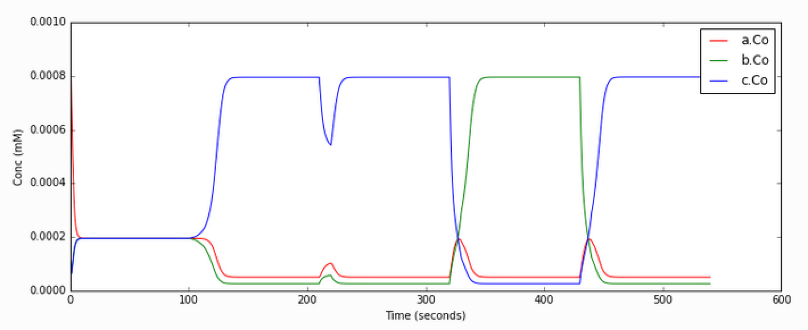

MAPK Feedback Model
===================

File name: **mapkFB.py**

This example illustrates loading, and running a kinetic model for a much
more complex bistable positive feedback system, defined in kkit format.
This is based on Bhalla, Ram and Iyengar, Science 2002.

The core of this model is a positive feedback loop comprising of the
MAPK cascade, PLA2, and PKC. It receives PDGF and Ca2+ as inputs.

.. image:: ../../../images/mapkFB.png

This model is quite a large one and due to some stiffness in its
equations, it takes about 30 seconds to execute. Note that this is still
200 times faster than the events it models.

The simulation illustrated here shows how the model starts out in a
state of low activity. It is induced to 'turn on' when a a PDGF stimulus
is given for 400 seconds, starting at t = 500s. After it has settled to
the new 'on' state, the model is made to 'turn off' by setting the
system calcium levels to zero. This inhibition starts at t = 2900 and
goes on for 500 s.

Note that this is a somewhat unphysiological manipulation! Following
this the model settles back to the same 'off' state it was in
originally.

**Code:**

.. hidden-code-block:: python
    :linenos:
    :label: Show/Hide code

    #########################################################################
    ## This program is part of 'MOOSE', the
    ## Messaging Object Oriented Simulation Environment.
    ##           Copyright (C) 2014 Upinder S. Bhalla. and NCBS
    ## It is made available under the terms of the
    ## GNU Lesser General Public License version 2.1
    ## See the file COPYING.LIB for the full notice.
    #########################################################################
    
    import moose
    import matplotlib.pyplot as plt
    import matplotlib.image as mpimg
    import pylab
    import numpy
    import sys
    import os
    
    scriptDir = os.path.dirname( os.path.realpath( __file__ ) )
    
    def main():
        """
    This example illustrates loading, and running a kinetic model
    for a bistable positive feedback system, defined in kkit format.
    This is based on Bhalla, Ram and Iyengar, Science 2002.
    
    The core of this model is a positive feedback loop comprising of
    the MAPK cascade, PLA2, and PKC. It receives PDGF and Ca2+ as
    inputs.
    
    This model is quite a large one and due to some stiffness in its
    equations, it runs somewhat slowly.
    
    The simulation illustrated here shows how the model starts out in
    a state of low activity. It is induced to 'turn on' when a
    a PDGF stimulus is given for 400 seconds.
    After it has settled to the new 'on' state, model is made to
    'turn off'
    by setting the system calcium levels to zero for a while. This
    is a somewhat unphysiological manipulation!
    
        """
    
        solver = "gsl"  # Pick any of gsl, gssa, ee..
        #solver = "gssa"  # Pick any of gsl, gssa, ee..
        mfile = os.path.join( scriptDir, '..', '..', 'genesis' , 'acc35.g' )
        runtime = 2000.0
        if ( len( sys.argv ) == 2 ):
            solver = sys.argv[1]
        modelId = moose.loadModel( mfile, 'model', solver )
        # Increase volume so that the stochastic solver gssa
        # gives an interesting output
        compt = moose.element( '/model/kinetics' )
        compt.volume = 5e-19
    
        moose.reinit()
        moose.start( 500 )
        moose.element( '/model/kinetics/PDGFR/PDGF' ).concInit = 0.0001
        moose.start( 400 )
        moose.element( '/model/kinetics/PDGFR/PDGF' ).concInit = 0.0
        moose.start( 2000 )
        moose.element( '/model/kinetics/Ca' ).concInit = 0.0
        moose.start( 500 )
        moose.element( '/model/kinetics/Ca' ).concInit = 0.00008
        moose.start( 2000 )
    
        # Display all plots.
        img = mpimg.imread( 'mapkFB.png' )
        fig = plt.figure( figsize=(12, 10 ) )
        png = fig.add_subplot( 211 )
        imgplot = plt.imshow( img )
        ax = fig.add_subplot( 212 )
        x = moose.wildcardFind( '/model/#graphs/conc#/#' )
        t = numpy.arange( 0, x[0].vector.size, 1 ) * x[0].dt
        ax.plot( t, x[0].vector, 'b-', label=x[0].name )
        ax.plot( t, x[1].vector, 'c-', label=x[1].name )
        ax.plot( t, x[2].vector, 'r-', label=x[2].name )
        ax.plot( t, x[3].vector, 'm-', label=x[3].name )
        plt.ylabel( 'Conc (mM)' )
        plt.xlabel( 'Time (seconds)' )
        pylab.legend()
        pylab.show()
    
    # Run the 'main' if this script is executed standalone.
    if __name__ == '__main__':
            main()
|

**Output:**

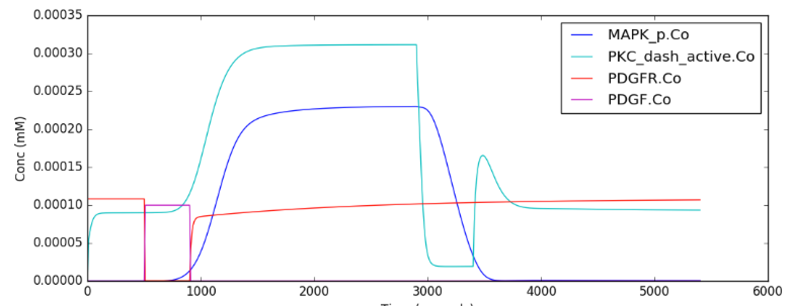

Propogation of a Bistable System
================================

File name: **propagationBis.py**

All the above models have been well-mixed, that is point or non-spatial
models. Bistables do interesting things when they are dispersed in
space. This is illustrated in this example. Here we have a tapering
cylinder, that is a pseudo 1-dimensional reaction-diffusion system.
Every point in this cylinder has the bistable system from the strongBis
example.

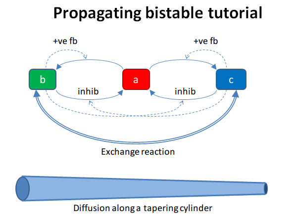

The example has two stages. First it starts out with the model in the
unstable transition point, and introduces a small symmetry-breaking
perturbation at one end. This rapidly propagates through the entire
length model, leaving molecule **b** at a higher value than **c**.

At t = 100 we carry out a different manipulation. We flip the
concentrations of molecules b and c for the left half of the model, and
then just let it run. Now we have opposing bistable states on either
half. In the middle, the two systems battle it out. Molecule **c** from
the left side diffuses over to the right, and tries to inhibit **b**,
and vice versa. However we have a small asymmetry due to the tapering of
the cylinder. As there is a slightly larger volume on the left, the
transition point gradually advances to the right, as molecule **b**
yields to the slightly larger amounts of molecule **c**.

**Code:**

.. hidden-code-block:: python
    :linenos:
    :label: Show/Hide code

    #########################################################################
    ## This program is part of 'MOOSE', the
    ## Messaging Object Oriented Simulation Environment.
    ##           Copyright (C) 2014 Upinder S. Bhalla. and NCBS
    ## It is made available under the terms of the
    ## GNU Lesser General Public License version 2.1
    ## See the file COPYING.LIB for the full notice.
    #########################################################################
    
    """
    This example illustrates propagation of state flips in a 
    linear 1-dimensional reaction-diffusion system. It uses a 
    bistable system loaded in from a kkit definition file, and
    places this in a tapering cylinder for pseudo 1-dimentionsional 
    diffusion.
    
    This example illustrates a number of features of reaction-diffusion
    calculations. 
    
    First, it shows how to set up such systems. Key steps are to create
    the compartment and define its voxelization, then create the Ksolve, 
    Dsolve, and Stoich. Then we assign stoich.compartment, ksolve and
    dsolve in that order. Finally we assign the path of the Stoich.
    
    For running the model, we start by introducing
    a small symmetry-breaking increment of concInit
    of the molecule **b** in the last compartment on the cylinder. The model
    starts out with molecules at equal concentrations, so that the system would
    settle to the unstable fixed point. This symmetry breaking leads
    to the last compartment moving towards the state with an 
    increased concentration of **b**,
    and this effect propagates to all other compartments.
    
    Once the model has settled to the state where **b** is high throughout, 
    we simply exchange the concentrations of **b** with **c** in the left
    half of the cylinder. This introduces a brief transient at the junction,
    which soon settles to a smooth crossover.
    
    Finally, as we run the simulation, the tapering geometry comes into play.
    Since the left hand side has a larger diameter than the right, the
    state on the left gradually wins over and the transition point slowly
    moves to the right.
    
    """
    
    import math
    import numpy
    import matplotlib.pyplot as plt
    import matplotlib.image as mpimg
    import moose
    import sys
    
    def makeModel():
                    # create container for model
                    r0 = 1e-6        # m
                    r1 = 0.5e-6        # m. Note taper.
                    num = 200
                    diffLength = 1e-6 # m
                    comptLength = num * diffLength        # m
                    diffConst = 20e-12 # m^2/sec
                    concA = 1 # millimolar
                    diffDt = 0.02  # for the diffusion
                    chemDt = 0.2   # for the reaction
                    mfile = '../../genesis/M1719.g'
    
                    model = moose.Neutral( 'model' )
                    compartment = moose.CylMesh( '/model/kinetics' )
    
                    # load in model
                    modelId = moose.loadModel( mfile, '/model', 'ee' )
                    a = moose.element( '/model/kinetics/a' )
                    b = moose.element( '/model/kinetics/b' )
                    c = moose.element( '/model/kinetics/c' )
    
                    ac = a.concInit
                    bc = b.concInit
                    cc = c.concInit
    
                    compartment.r0 = r0
                    compartment.r1 = r1
                    compartment.x0 = 0
                    compartment.x1 = comptLength
                    compartment.diffLength = diffLength
                    assert( compartment.numDiffCompts == num )
    
                    # Assign parameters
                    for x in moose.wildcardFind( '/model/kinetics/##[ISA=PoolBase]' ):
                        #print 'pools: ', x, x.name
                        x.diffConst = diffConst
    
                    # Make solvers
                    ksolve = moose.Ksolve( '/model/kinetics/ksolve' )
                    dsolve = moose.Dsolve( '/model/dsolve' )
                    # Set up clocks.
                    moose.setClock( 10, diffDt )
                    for i in range( 11, 17 ):
                        moose.setClock( i, chemDt )
    
                    stoich = moose.Stoich( '/model/kinetics/stoich' )
                    stoich.compartment = compartment
                    stoich.ksolve = ksolve
                    stoich.dsolve = dsolve
                    stoich.path = "/model/kinetics/##"
                    print(('dsolve.numPools, num = ', dsolve.numPools, num))
                    b.vec[num-1].concInit *= 1.01 # Break symmetry.
    
    def main():
                    runtime = 100
                    displayInterval = 2
                    makeModel()
                    dsolve = moose.element( '/model/dsolve' )
                    moose.reinit()
                    #moose.start( runtime ) # Run the model for 10 seconds.
    
                    a = moose.element( '/model/kinetics/a' )
                    b = moose.element( '/model/kinetics/b' )
                    c = moose.element( '/model/kinetics/c' )
    
                    img = mpimg.imread( 'propBis.png' )
                    #imgplot = plt.imshow( img )
                    #plt.show()
    
                    plt.ion()
                    fig = plt.figure( figsize=(12,10) )
                    png = fig.add_subplot(211)
                    imgplot = plt.imshow( img )
                    ax = fig.add_subplot(212)
                    ax.set_ylim( 0, 0.001 )
                    plt.ylabel( 'Conc (mM)' )
                    plt.xlabel( 'Position along cylinder (microns)' )
                    pos = numpy.arange( 0, a.vec.conc.size, 1 )
                    line1, = ax.plot( pos, a.vec.conc, 'r-', label='a' )
                    line2, = ax.plot( pos, b.vec.conc, 'g-',  label='b' )
                    line3, = ax.plot( pos, c.vec.conc, 'b-', label='c' )
                    timeLabel = plt.text(60, 0.0009, 'time = 0')
                    plt.legend()
                    fig.canvas.draw()
    
                    for t in range( displayInterval, runtime, displayInterval ):
                        moose.start( displayInterval )
                        line1.set_ydata( a.vec.conc )
                        line2.set_ydata( b.vec.conc )
                        line3.set_ydata( c.vec.conc )
                        timeLabel.set_text( "time = %d" % t )
                        fig.canvas.draw()
    
                    print('Swapping concs of b and c in half the cylinder')
                    for i in range( b.numData/2 ):
                        temp = b.vec[i].conc
                        b.vec[i].conc = c.vec[i].conc
                        c.vec[i].conc = temp
    
                    newruntime = 200
                    for t in range( displayInterval, newruntime, displayInterval ):
                        moose.start( displayInterval )
                        line1.set_ydata( a.vec.conc )
                        line2.set_ydata( b.vec.conc )
                        line3.set_ydata( c.vec.conc )
                        timeLabel.set_text( "time = %d" % (t + runtime) )
                        fig.canvas.draw()
    
                    print( "Hit 'enter' to exit" )
                    sys.stdin.read(1)
    
    
    
    # Run the 'main' if this script is executed standalone.
    if __name__ == '__main__':
            main()

|

**Output:**

Steady-state Finder
===================

File name: **findSteadyState**

This is an example of how to use an internal MOOSE solver to find steady
states of a system very rapidly. The method starts from a random
position in state space that obeys mass conservation. It then finds the
nearest steady state and reports it. If it does this enough times it
should find all the steady states.

We illustrate this process for 50 attempts to find the steady states. It
does find all of them. Each time it plots and prints the values, though
the plotting is not necessary.

The printout shows the concentrations of all molecules in the first 5
columns. Then it prints the type of solution, and the numbers of
negative and positive eigenvalues. In all cases the calculations are
successful, though it takes different numbers of iterations to arrive at
the steady state. In some models it would be necessary to put a cap on
the number of iterations, if the system is not able to find a steady
state.

In this example we run the bistable model using the ODE solver right at
the end, and manually enforce transitions to show where the target
steady states are.

For more information on the algorithm used, look in the comments within
the main method of the code below.

**Code:**

.. hidden-code-block:: python
    :linenos:
    :label: Show/Hide code

    #########################################################################
    ## This program is part of 'MOOSE', the
    ## Messaging Object Oriented Simulation Environment.
    ##           Copyright (C) 2013 Upinder S. Bhalla. and NCBS
    ## It is made available under the terms of the
    ## GNU Lesser General Public License version 2.1
    ## See the file COPYING.LIB for the full notice.
    #########################################################################
    
    from __future__ import print_function
    
    import math
    import pylab
    import numpy
    import moose
    
    def main():
        """
        This example sets up the kinetic solver and steady-state finder, on
        a bistable model of a chemical system. The model is set up within the
        script.
        The algorithm calls the steady-state finder 50 times with different
        (randomized) initial conditions, as follows:
    
        * Set up the random initial condition that fits the conservation laws
        * Run for 2 seconds. This should not be mathematically necessary, but
          for obscure numerical reasons it makes it much more likely that the
          steady state solver will succeed in finding a state.
        * Find the fixed point
        * Print out the fixed point vector and various diagnostics.
        * Run for 10 seconds. This is completely unnecessary, and is done here
          just so that the resultant graph will show what kind of state has
          been  found.
    
        After it does all this, the program runs for 100 more seconds on the
        last found fixed point (which turns out to be a saddle node), then
        is hard-switched in the script to the first attractor basin from which
        it runs for another 100 seconds till it settles there, and then
        is hard-switched yet again to the second attractor and runs for 400
        seconds.
    
        Looking at the output you will see many features of note:
    
        * the first attractor (stable point) and the saddle point (unstable
          fixed point) are both found quite often. But the second
          attractor is found just once.
          It has a very small basin of attraction.
        * The values found for each of the fixed points match well with the
          values found by running the system to steady-state at the end.
        * There are a large number of failures to find a fixed point. These are
          found and reported in the diagnostics. They show up on the plot
          as cases where the 10-second runs are not flat.
    
        If you wanted to find fixed points in a production model, you would
        not need to do the 10-second runs, and you would need to eliminate the
        cases where the state-finder failed. Then you could identify the good
        points and keep track of how many of each were found.
    
        There is no way to guarantee that all fixed points have been found
        using this algorithm! If there are points in an obscure corner of state
        space (as for the singleton second attractor convergence in this
        example) you may have to iterate very many times to find them.
    
        You may wish to sample concentration space logarithmically rather than
        linearly.
        """
        compartment = makeModel()
        ksolve = moose.Ksolve( '/model/compartment/ksolve' )
        stoich = moose.Stoich( '/model/compartment/stoich' )
        stoich.compartment = compartment
        stoich.ksolve = ksolve
        stoich.path = "/model/compartment/##"
        state = moose.SteadyState( '/model/compartment/state' )
    
        moose.reinit()
        state.stoich = stoich
        state.showMatrices()
        state.convergenceCriterion = 1e-6
        moose.seed( 111 ) # Used when generating the samples in state space
    
        for i in range( 0, 50 ):
            getState( ksolve, state )
    
        # Now display the states of the system at more length to compare.
        moose.start( 100.0 ) # Run the model for 100 seconds.
    
        a = moose.element( '/model/compartment/a' )
        b = moose.element( '/model/compartment/b' )
    
        # move most molecules over to b
        b.conc = b.conc + a.conc * 0.9
        a.conc = a.conc * 0.1
        moose.start( 100.0 ) # Run the model for 100 seconds.
    
        # move most molecules back to a
        a.conc = a.conc + b.conc * 0.99
        b.conc = b.conc * 0.01
        moose.start( 400.0 ) # Run the model for 200 seconds.
    
        # Iterate through all plots, dump their contents to data.plot.
        displayPlots()
    
        quit()
    
    def makeModel():
        """ This function creates a bistable reaction system using explicit
        MOOSE calls rather than load from a file
        """
        # create container for model
        model = moose.Neutral( 'model' )
        compartment = moose.CubeMesh( '/model/compartment' )
        compartment.volume = 1e-15
        # the mesh is created automatically by the compartment
        mesh = moose.element( '/model/compartment/mesh' )
    
        # create molecules and reactions
        a = moose.Pool( '/model/compartment/a' )
        b = moose.Pool( '/model/compartment/b' )
        c = moose.Pool( '/model/compartment/c' )
        enz1 = moose.Enz( '/model/compartment/b/enz1' )
        enz2 = moose.Enz( '/model/compartment/c/enz2' )
        cplx1 = moose.Pool( '/model/compartment/b/enz1/cplx' )
        cplx2 = moose.Pool( '/model/compartment/c/enz2/cplx' )
        reac = moose.Reac( '/model/compartment/reac' )
    
        # connect them up for reactions
        moose.connect( enz1, 'sub', a, 'reac' )
        moose.connect( enz1, 'prd', b, 'reac' )
        moose.connect( enz1, 'enz', b, 'reac' )
        moose.connect( enz1, 'cplx', cplx1, 'reac' )
    
        moose.connect( enz2, 'sub', b, 'reac' )
        moose.connect( enz2, 'prd', a, 'reac' )
        moose.connect( enz2, 'enz', c, 'reac' )
        moose.connect( enz2, 'cplx', cplx2, 'reac' )
    
        moose.connect( reac, 'sub', a, 'reac' )
        moose.connect( reac, 'prd', b, 'reac' )
    
        # Assign parameters
        a.concInit = 1
        b.concInit = 0
        c.concInit = 0.01
        enz1.kcat = 0.4
        enz1.Km = 4
        enz2.kcat = 0.6
        enz2.Km = 0.01
        reac.Kf = 0.001
        reac.Kb = 0.01
    
        # Create the output tables
        graphs = moose.Neutral( '/model/graphs' )
        outputA = moose.Table2 ( '/model/graphs/concA' )
        outputB = moose.Table2 ( '/model/graphs/concB' )
        outputC = moose.Table2 ( '/model/graphs/concC' )
        outputCplx1 = moose.Table2 ( '/model/graphs/concCplx1' )
        outputCplx2 = moose.Table2 ( '/model/graphs/concCplx2' )
    
        # connect up the tables
        moose.connect( outputA, 'requestOut', a, 'getConc' );
        moose.connect( outputB, 'requestOut', b, 'getConc' );
        moose.connect( outputC, 'requestOut', c, 'getConc' );
        moose.connect( outputCplx1, 'requestOut', cplx1, 'getConc' );
        moose.connect( outputCplx2, 'requestOut', cplx2, 'getConc' );
    
        return compartment
    
    def displayPlots():
        for x in moose.wildcardFind( '/model/graphs/conc#' ):
                t = numpy.arange( 0, x.vector.size, 1 ) #sec
                pylab.plot( t, x.vector, label=x.name )
        pylab.legend()
        pylab.show()
    
    def getState( ksolve, state ):
        """ This function finds a steady state starting from a random
        initial condition that is consistent with the stoichiometry rules
        and the original model concentrations.
        """
        scale = 1.0 / ( 1e-15 * 6.022e23 )
        state.randomInit() # Randomize init conditions, subject to stoichiometry
        moose.start( 2.0 ) # Run the model for 2 seconds.
        state.settle() # This function finds the steady states.
        for x in ksolve.nVec[0]:
            print( "{:.2f}".format( x * scale ), end=' ')
    
        print( "Type={} NegEig={} PosEig={} status={} {} Iter={:2d}".format( state.stateType, state.nNegEigenvalues, state.nPosEigenvalues, state.solutionStatus, state.status, state.nIter))
        moose.start( 10.0 ) # Run model for 10 seconds, just for display
    
    
    # Run the 'main' if this script is executed standalone.
    if __name__ == '__main__':
        main()

|

**Output:**

.. parsed-literal::

    0.92 0.05 0.00 0.01 0.01 Type=2 NegEig=2 PosEig=1 status=0 success Iter=16
    0.92 0.05 0.00 0.01 0.01 Type=2 NegEig=2 PosEig=1 status=0 success Iter=29
    0.18 0.75 0.00 0.03 0.01 Type=0 NegEig=3 PosEig=0 status=0 success Iter=10
    0.18 0.75 0.00 0.03 0.01 Type=0 NegEig=3 PosEig=0 status=0 success Iter=26
    0.18 0.75 0.00 0.03 0.01 Type=0 NegEig=3 PosEig=0 status=0 success Iter=27
    0.92 0.05 0.00 0.01 0.01 Type=2 NegEig=2 PosEig=1 status=0 success Iter=30
    0.18 0.75 0.00 0.03 0.01 Type=0 NegEig=3 PosEig=0 status=0 success Iter=12
    0.92 0.05 0.00 0.01 0.01 Type=2 NegEig=2 PosEig=1 status=0 success Iter=29
    0.18 0.75 0.00 0.03 0.01 Type=0 NegEig=3 PosEig=0 status=0 success Iter=12
    0.92 0.05 0.00 0.01 0.01 Type=2 NegEig=2 PosEig=1 status=0 success Iter=41
    0.18 0.75 0.00 0.03 0.01 Type=0 NegEig=3 PosEig=0 status=0 success Iter=29
    0.18 0.75 0.00 0.03 0.01 Type=0 NegEig=3 PosEig=0 status=0 success Iter=18
    0.18 0.75 0.00 0.03 0.01 Type=0 NegEig=3 PosEig=0 status=0 success Iter=27
    0.18 0.75 0.00 0.03 0.01 Type=0 NegEig=3 PosEig=0 status=0 success Iter=14
    0.18 0.75 0.00 0.03 0.01 Type=0 NegEig=3 PosEig=0 status=0 success Iter=12
    0.18 0.75 0.00 0.03 0.01 Type=0 NegEig=3 PosEig=0 status=0 success Iter=19
    0.18 0.75 0.00 0.03 0.01 Type=0 NegEig=3 PosEig=0 status=0 success Iter= 6
    0.18 0.75 0.00 0.03 0.01 Type=0 NegEig=3 PosEig=0 status=0 success Iter=14
    0.18 0.75 0.00 0.03 0.01 Type=0 NegEig=3 PosEig=0 status=0 success Iter=23
    0.18 0.75 0.00 0.03 0.01 Type=0 NegEig=3 PosEig=0 status=0 success Iter=25
    0.18 0.75 0.00 0.03 0.01 Type=0 NegEig=3 PosEig=0 status=0 success Iter=16
    0.18 0.75 0.00 0.03 0.01 Type=0 NegEig=3 PosEig=0 status=0 success Iter= 5
    0.92 0.05 0.00 0.01 0.01 Type=2 NegEig=2 PosEig=1 status=0 success Iter=43
    0.92 0.05 0.00 0.01 0.01 Type=2 NegEig=2 PosEig=1 status=0 success Iter= 9
    0.92 0.05 0.00 0.01 0.01 Type=2 NegEig=2 PosEig=1 status=0 success Iter=43
    0.92 0.05 0.00 0.01 0.01 Type=2 NegEig=2 PosEig=1 status=0 success Iter=29
    0.18 0.75 0.00 0.03 0.01 Type=0 NegEig=3 PosEig=0 status=0 success Iter=27
    0.18 0.75 0.00 0.03 0.01 Type=0 NegEig=3 PosEig=0 status=0 success Iter= 9
    0.18 0.75 0.00 0.03 0.01 Type=0 NegEig=3 PosEig=0 status=0 success Iter=12
    0.92 0.05 0.00 0.01 0.01 Type=2 NegEig=2 PosEig=1 status=0 success Iter=24
    0.92 0.05 0.00 0.01 0.01 Type=2 NegEig=2 PosEig=1 status=0 success Iter=26
    0.18 0.75 0.00 0.03 0.01 Type=0 NegEig=3 PosEig=0 status=0 success Iter=14
    0.92 0.05 0.00 0.01 0.01 Type=2 NegEig=2 PosEig=1 status=0 success Iter=14
    0.18 0.75 0.00 0.03 0.01 Type=0 NegEig=3 PosEig=0 status=0 success Iter=10
    0.18 0.75 0.00 0.03 0.01 Type=0 NegEig=3 PosEig=0 status=0 success Iter=13
    0.18 0.75 0.00 0.03 0.01 Type=0 NegEig=3 PosEig=0 status=0 success Iter=26
    0.18 0.75 0.00 0.03 0.01 Type=0 NegEig=3 PosEig=0 status=0 success Iter=21
    0.18 0.75 0.00 0.03 0.01 Type=0 NegEig=3 PosEig=0 status=0 success Iter=26
    0.18 0.75 0.00 0.03 0.01 Type=0 NegEig=3 PosEig=0 status=0 success Iter=24
    0.18 0.75 0.00 0.03 0.01 Type=0 NegEig=3 PosEig=0 status=0 success Iter=24
    0.92 0.05 0.00 0.01 0.01 Type=2 NegEig=2 PosEig=1 status=0 success Iter=18
    0.18 0.75 0.00 0.03 0.01 Type=0 NegEig=3 PosEig=0 status=0 success Iter=26
    0.18 0.75 0.00 0.03 0.01 Type=5 NegEig=4 PosEig=0 status=0 success Iter=13
    0.18 0.75 0.00 0.03 0.01 Type=0 NegEig=3 PosEig=0 status=0 success Iter=23
    0.92 0.05 0.00 0.01 0.01 Type=2 NegEig=2 PosEig=1 status=0 success Iter=24
    0.18 0.75 0.00 0.03 0.01 Type=0 NegEig=3 PosEig=0 status=0 success Iter= 8
    0.18 0.75 0.00 0.03 0.01 Type=0 NegEig=3 PosEig=0 status=0 success Iter=18
    0.18 0.75 0.00 0.03 0.01 Type=0 NegEig=3 PosEig=1 status=0 success Iter=21
    0.99 0.00 0.01 0.00 0.00 Type=0 NegEig=3 PosEig=0 status=0 success Iter=15
    0.92 0.05 0.00 0.01 0.01 Type=2 NegEig=2 PosEig=1 status=0 success Iter=29

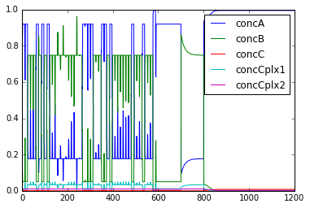

Dose Response (Under construction)
==================================

File name: **doseResponse.py**

This example generates a doseResponse plot for a bistable system,
against a control parameter (dose) that takes the system in and out
again from the bistable regime. Like the previous example, it uses the
steady-state solver to find the stable points for each value of the
control parameter. Unfortunately it doesn't work right now. Seems like
the kcat scaling isn't being registered.

**Code:**

.. hidden-code-block:: python
    :linenos:
    :label: Show/Hide code

    ## Makes and plots the dose response curve for bistable models
    ## Author: Sahil Moza
    ## June 26, 2014
    
    import moose
    import pylab
    import numpy as np
    from matplotlib import pyplot as plt
    
    def setupSteadyState(simdt,plotDt):
    
        ksolve = moose.Ksolve( '/model/kinetics/ksolve' )
        stoich = moose.Stoich( '/model/kinetics/stoich' )
        stoich.compartment = moose.element('/model/kinetics')
    
        stoich.ksolve = ksolve
        #ksolve.stoich = stoich
        stoich.path = "/model/kinetics/##"
        state = moose.SteadyState( '/model/kinetics/state' )
       
        #### Set clocks here
        #moose.useClock(4, "/model/kinetics/##[]", "process")
        #moose.setClock(4, float(simdt))
        #moose.setClock(5, float(simdt))
        #moose.useClock(5, '/model/kinetics/ksolve', 'process' )
        #moose.useClock(8, '/model/graphs/#', 'process' )
        #moose.setClock(8, float(plotDt))
     
        moose.reinit()
    
        state.stoich = stoich
        state.showMatrices()
        state.convergenceCriterion = 1e-8
        
        return ksolve, state
    
    def parseModelName(fileName):
        pos1=fileName.rfind('/')
        pos2=fileName.rfind('.')
        directory=fileName[:pos1]
        prefix=fileName[pos1+1:pos2]
        suffix=fileName[pos2+1:len(fileName)]
        return directory, prefix, suffix
    
    # Solve for the steady state
    def getState( ksolve, state, vol):
          scale = 1.0 / ( vol * 6.022e23 )
          moose.reinit
          state.randomInit() # Removing random initial condition to systematically make Dose reponse curves.
          moose.start( 2.0 ) # Run the model for 2 seconds.
          state.settle()
          
          vector = []
          a = moose.element( '/model/kinetics/a' ).conc
          for x in ksolve.nVec[0]:
              vector.append( x * scale)
          moose.start( 10.0 ) # Run model for 10 seconds, just for display
          failedSteadyState = any([np.isnan(x) for x in vector])
          
          if not (failedSteadyState):
               return state.stateType, state.solutionStatus, a, vector
    
    
    def main():
        # Setup parameters for simulation and plotting
        simdt= 1e-2
        plotDt= 1
    
        # Factors to change in the dose concentration in log scale
        factorExponent = 10  ## Base: ten raised to some power.
        factorBegin = -20
        factorEnd = 21
        factorStepsize = 1
        factorScale = 10.0 ## To scale up or down the factors
    
        # Load Model and set up the steady state solver.
        # model = sys.argv[1] # To load model from a file.
        model = './19085.cspace'
        modelPath, modelName, modelType = parseModelName(model)
        outputDir = modelPath
        
        modelId = moose.loadModel(model, 'model', 'ee')
        dosePath = '/model/kinetics/b/DabX' # The dose entity
    
        ksolve, state = setupSteadyState( simdt, plotDt)
        vol = moose.element( '/model/kinetics' ).volume
        iterInit = 100
        solutionVector = []
        factorArr = []
        
        enz = moose.element(dosePath)
        init = enz.kcat # Dose parameter
        
        # Change Dose here to .
        for factor in range(factorBegin, factorEnd, factorStepsize ):
            scale = factorExponent ** (factor/factorScale) 
            enz.kcat = init * scale     
            print( "scale={:.3f}\tkcat={:.3f}".format( scale, enz.kcat) )
            for num in range(iterInit):
                stateType, solStatus, a, vector = getState( ksolve, state, vol)
                if solStatus == 0:
                    #solutionVector.append(vector[0]/sum(vector))
                    solutionVector.append(a)
                    factorArr.append(scale)   
                    
        joint = np.array([factorArr, solutionVector])
        joint = joint[:,joint[1,:].argsort()]
        
        # Plot dose response. 
        fig0 = plt.figure()
        pylab.semilogx(joint[0,:],joint[1,:],marker="o",label = 'concA')
        pylab.xlabel('Dose')
        pylab.ylabel('Response')
        pylab.suptitle('Dose-Reponse Curve for a bistable system')
        
        pylab.legend(loc=3)
        #plt.savefig(outputDir + "/" + modelName +"_doseResponse" + ".png")
        plt.show()
        #plt.close(fig0)
        quit()
        
    
    
    if __name__ == '__main__':
         main()
|
**Output:**

.. parsed-literal::

    scale=0.010	kcat=0.004
    scale=0.013	kcat=0.005
    scale=0.016	kcat=0.006
    scale=0.020	kcat=0.007
    scale=0.025	kcat=0.009
    scale=0.032	kcat=0.011
    scale=0.040	kcat=0.014
    scale=0.050	kcat=0.018
    scale=0.063	kcat=0.023
    scale=0.079	kcat=0.029
    scale=0.100	kcat=0.036
    scale=0.126	kcat=0.045
    scale=0.158	kcat=0.057
    scale=0.200	kcat=0.072
    scale=0.251	kcat=0.091
    scale=0.316	kcat=0.114
    scale=0.398	kcat=0.144
    scale=0.501	kcat=0.181
    scale=0.631	kcat=0.228
    scale=0.794	kcat=0.287
    scale=1.000	kcat=0.361
    scale=1.259	kcat=0.454
    scale=1.585	kcat=0.572
    scale=1.995	kcat=0.720
    scale=2.512	kcat=0.907
    scale=3.162	kcat=1.142
    scale=3.981	kcat=1.437
    scale=5.012	kcat=1.809
    scale=6.310	kcat=2.278
    scale=7.943	kcat=2.868
    scale=10.000	kcat=3.610
    scale=12.589	kcat=4.545
    scale=15.849	kcat=5.722
    scale=19.953	kcat=7.203
    scale=25.119	kcat=9.068
    scale=31.623	kcat=11.416
    scale=39.811	kcat=14.372
    scale=50.119	kcat=18.093
    scale=63.096	kcat=22.778
    scale=79.433	kcat=28.676
    scale=100.000	kcat=36.101

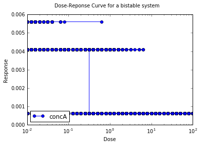

