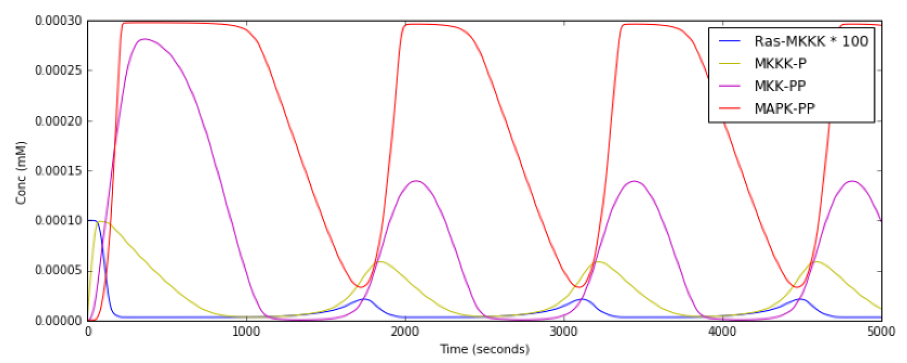
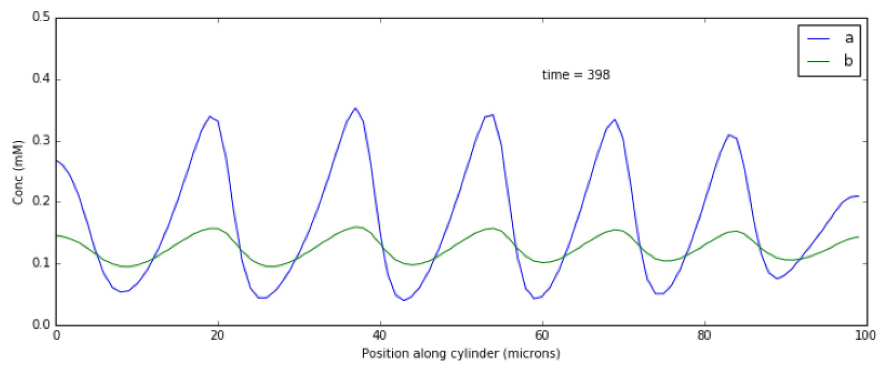
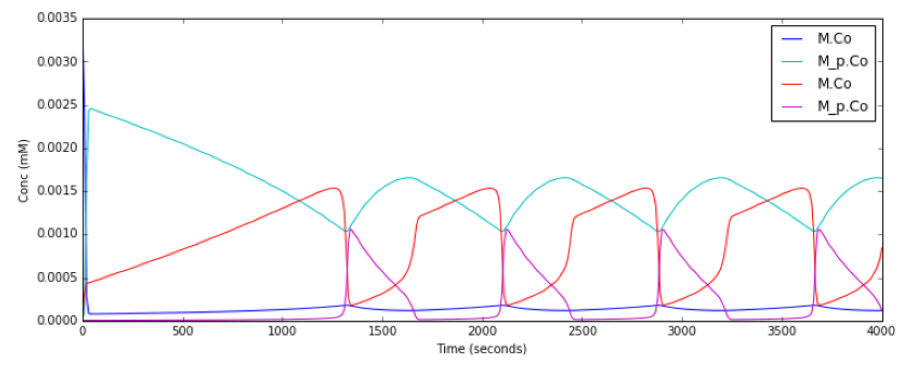
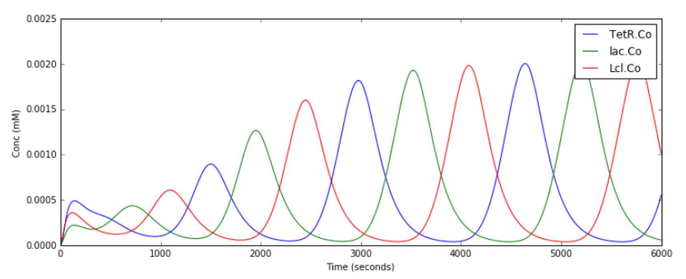

********************
Chemical Oscillators
********************

`Chemical Oscillators <https://en.wikipedia.org/wiki/Chemical_clock>`_, also known as chemical clocks, are chemical systems in which the concentrations of one or more reactants undergoes periodic changes. 

These Oscillatory reactions can be modelled using moose. The examples below demonstrate different types of chemical oscillators, as well as how they can be simulated using moose. Each example has a short description, the code used in the simulation, and the default (gsl solver) output of the code.

Each example can be found as a python file within the main moose folder under 
::

    (...)/moose/moose-examples/tutorials/ChemicalOscillators

In order to run the example, run the script
::

    python filename.py

in command line, where ``filename.py`` is the name of the python file you would like to run. The filenames of each example are written in **bold** at the beginning of their respective sections, and the files themselves can be found in the aformentioned directory.

In chemical models that use solvers, there are optional arguments that allow you to specify which solver you would like to use.
:: 

    python filename.py [gsl | gssa | ee]

Where ``gsl`` is Gnu Scientific Library's deterministic solver, ``gssa`` stands for Gillespie stochastic simulation algorithm, and ``ee`` is the exponential euler algorithm.

All the following examples can be run with either of the three solvers, which in some cases produces a different outcome. However, simply running the file without the optional argument will by default use the ``gsl`` solver. These ``gsl`` outputs are the ones shown below. 

|
|

Slow Feedback Oscillator
========================

File name: **slowFbOsc.py**

This example illustrates loading, and running a kinetic model for a
delayed -ve feedback oscillator, defined in kkit format. The model is
one by Boris N. Kholodenko from Eur J Biochem. (2000) 267(6):1583-8

.. image:: ../../../images/Kholodenko_tut.png

This model has a high-gain MAPK stage, whose effects are visible whem
one looks at the traces from successive stages in the plots. The
upstream pools have small early peaks, and the downstream pools have
large delayed ones. The negative feedback step is mediated by a simple
binding reaction of the end-product of oscillation with an upstream
activator.

We use the gsl solver here. The model already defines some plots and
sets the runtime to 4000 seconds. The model does not really play nicely
with the GSSA solver, since it involves some really tiny amounts of the
MAPKKK.

Things to do with the model:

::

    - Look at model once it is loaded in::

            moose.le( '/model' )
            moose.showfields( '/model/kinetics/MAPK/MAPK' )

    - Behold the amplification properties of the cascade. Could do this by blocking the feedback step and giving a small pulse input.
    - Suggest which parameters you would alter to change the period of the oscillator:
        - Concs of various molecules, for example::
            
            ras_MAPKKKK = moose.element( '/model/kinetics/MAPK/Ras_dash_MKKKK' )
            moose.showfields( ras_MAPKKKK )
            ras_MAPKKKK.concInit = 1e-5
        - Feedback reaction rates
        - Rates of all the enzymes::

            for i in moose.wildcardFind( '/##[ISA=EnzBase]'):
                    i.kcat *= 10.0

**Code:**

.. hidden-code-block:: python
    :linenos:
    :label: Show/Hide code

    #########################################################################
    ## This program is part of 'MOOSE', the
    ## Messaging Object Oriented Simulation Environment.
    ##           Copyright (C) 2014 Upinder S. Bhalla. and NCBS
    ## It is made available under the terms of the
    ## GNU Lesser General Public License version 2.1
    ## See the file COPYING.LIB for the full notice.
    #########################################################################
    
    import moose
    import matplotlib.pyplot as plt
    import matplotlib.image as mpimg
    import pylab
    import numpy
    import sys
    
    def main():
    
        solver = "gsl"
        mfile = '../../genesis/Kholodenko.g'
        runtime = 5000.0
        if ( len( sys.argv ) >= 2 ):
            solver = sys.argv[1]
        modelId = moose.loadModel( mfile, 'model', solver )
        dt = moose.element( '/clock' ).tickDt[18]
        moose.reinit()
        moose.start( runtime ) 
    
        # Display all plots.
        img = mpimg.imread( 'Kholodenko_tut.png' )
        fig = plt.figure( figsize=( 12, 10 ) )
        png = fig.add_subplot( 211 )
        imgplot = plt.imshow( img )
        ax = fig.add_subplot( 212 )
        x = moose.wildcardFind( '/model/#graphs/conc#/#' )
        t = numpy.arange( 0, x[0].vector.size, 1 ) * dt
        ax.plot( t, x[0].vector * 100, 'b-', label='Ras-MKKK * 100' )
        ax.plot( t, x[1].vector, 'y-', label='MKKK-P' )
        ax.plot( t, x[2].vector, 'm-', label='MKK-PP' )
        ax.plot( t, x[3].vector, 'r-', label='MAPK-PP' )
        plt.ylabel( 'Conc (mM)' )
        plt.xlabel( 'Time (seconds)' )
        pylab.legend()
        pylab.show()
    
    # Run the 'main' if this script is executed standalone.
    if __name__ == '__main__':
    	main()

|
**Output:**

|
|

Turing Pattern Oscillator in One Dimension
==========================================

File name: **TuringOneDim.py**

This example illustrates how to set up a oscillatory Turing pattern in
1-D using reaction diffusion calculations. Reaction system is:

::

    s ---a---> a  // s goes to a, catalyzed by a.
    s ---a---> b  // s goes to b, catalyzed by a.
    a ---b---> s  // a goes to s, catalyzed by b.
    b -------> s  // b is degraded irreversibly to s.

in sum, **a** has a positive feedback onto itself and also forms **b**.
**b** has a negative feedback onto **a**. Finally, the diffusion
constant for **a** is 1/10 that of **b**.

.. image:: ../../../images/turingPatternTut.png

This chemical system is present in a 1-dimensional (cylindrical)
compartment. The entire reaction-diffusion system is set up within the
script.

**Code:**

.. hidden-code-block:: python
    :linenos:
    :label: Show/Hide code

    #########################################################################
    ## This program is part of 'MOOSE', the
    ## Messaging Object Oriented Simulation Environment.
    ##           Copyright (C) 2014 Upinder S. Bhalla. and NCBS
    ## It is made available under the terms of the
    ## GNU Lesser General Public License version 2.1
    ## See the file COPYING.LIB for the full notice.
    #########################################################################
    
    import math
    import numpy
    import matplotlib.pyplot as plt
    import matplotlib.image as mpimg
    import moose
    
    def makeModel():
        
        # create container for model
        r0 = 1e-6	# m
        r1 = 1e-6	# m
        num = 100
        diffLength = 1e-6 # m
        len = num * diffLength	# m
        diffConst = 5e-12 # m^2/sec
        motorRate = 1e-6 # m/sec
        concA = 1 # millimolar
        dt4 = 0.02  # for the diffusion
        dt5 = 0.2   # for the reaction
    
        model = moose.Neutral( 'model' )
        compartment = moose.CylMesh( '/model/compartment' )
        compartment.r0 = r0
        compartment.r1 = r1
        compartment.x0 = 0
        compartment.x1 = len
        compartment.diffLength = diffLength
        
        assert( compartment.numDiffCompts == num )
    
        # create molecules and reactions
        a = moose.Pool( '/model/compartment/a' )
        b = moose.Pool( '/model/compartment/b' )
        s = moose.Pool( '/model/compartment/s' )
        e1 = moose.MMenz( '/model/compartment/e1' )
        e2 = moose.MMenz( '/model/compartment/e2' )
        e3 = moose.MMenz( '/model/compartment/e3' )
        r1 = moose.Reac( '/model/compartment/r1' )
        moose.connect( e1, 'sub', s, 'reac' )
        moose.connect( e1, 'prd', a, 'reac' )
        moose.connect( a, 'nOut', e1, 'enzDest' )
        e1.Km = 1
        e1.kcat = 1
    
        moose.connect( e2, 'sub', s, 'reac' )
        moose.connect( e2, 'prd', b, 'reac' )
        moose.connect( a, 'nOut', e2, 'enzDest' )
        e2.Km = 1
        e2.kcat = 0.5
    
        moose.connect( e3, 'sub', a, 'reac' )
        moose.connect( e3, 'prd', s, 'reac' )
        moose.connect( b, 'nOut', e3, 'enzDest' )
        e3.Km = 0.1
        e3.kcat = 1
    
        moose.connect( r1, 'sub', b, 'reac' )
        moose.connect( r1, 'prd', s, 'reac' )
        r1.Kf = 0.3 # 1/sec
        r1.Kb = 0 # 1/sec
    
        # Assign parameters
        a.diffConst = diffConst/10
        b.diffConst = diffConst
        s.diffConst = 0
    
        # Make solvers
        ksolve = moose.Ksolve( '/model/compartment/ksolve' )
        dsolve = moose.Dsolve( '/model/dsolve' )
        # Set up clocks. The dsolver to know before assigning stoich
        moose.setClock( 4, dt4 )
        moose.setClock( 5, dt5 )
        moose.useClock( 4, '/model/dsolve', 'process' )
        # Ksolve must be scheduled after dsolve.
        moose.useClock( 5, '/model/compartment/ksolve', 'process' )
    
        stoich = moose.Stoich( '/model/compartment/stoich' )
        stoich.compartment = compartment
        stoich.ksolve = ksolve
        stoich.dsolve = dsolve
        stoich.path = "/model/compartment/##"
        assert( dsolve.numPools == 3 )
        a.vec.concInit = [0.1]*num
        a.vec[0].concInit *= 1.2 # slight perturbation at one end.
        b.vec.concInit = [0.1]*num
        s.vec.concInit = [1]*num
    
    def displayPlots():
        a = moose.element( '/model/compartment/a' )
        b = moose.element( '/model/compartment/b' )
        pos = numpy.arange( 0, a.vec.conc.size, 1 )
        pylab.plot( pos, a.vec.conc, label='a' )
        pylab.plot( pos, b.vec.conc, label='b' )
        pylab.legend()
        pylab.show()
    
    def main():
        runtime = 400
        displayInterval = 2
        makeModel()
        dsolve = moose.element( '/model/dsolve' )
        moose.reinit()
        #moose.start( runtime ) # Run the model for 10 seconds.
    
        a = moose.element( '/model/compartment/a' )
        b = moose.element( '/model/compartment/b' )
        s = moose.element( '/model/compartment/s' )
    
        img = mpimg.imread( 'turingPatternTut.png' )
        #imgplot = plt.imshow( img )
        #plt.show()
    
        plt.ion()
        fig = plt.figure( figsize=(12,10) )
        png = fig.add_subplot(211)
        imgplot = plt.imshow( img )
        ax = fig.add_subplot(212)
        ax.set_ylim( 0, 0.5 )
        plt.ylabel( 'Conc (mM)' )
        plt.xlabel( 'Position along cylinder (microns)' )
        pos = numpy.arange( 0, a.vec.conc.size, 1 )
        line1, = ax.plot( pos, a.vec.conc, label='a' )
        line2, = ax.plot( pos, b.vec.conc, label='b' )
        timeLabel = plt.text(60, 0.4, 'time = 0')
        plt.legend()
        fig.canvas.draw()
    
        for t in range( displayInterval, runtime, displayInterval ):
            moose.start( displayInterval )
            line1.set_ydata( a.vec.conc )
            line2.set_ydata( b.vec.conc )
            timeLabel.set_text( "time = %d" % t )
            fig.canvas.draw()
    
        print( "Hit 'enter' to exit" )
        raw_input( )
    
    
    
    # Run the 'main' if this script is executed standalone.
    if __name__ == '__main__':
    	main()

|

**Output:**

|
|

Relaxation Oscillator
=====================

File name: **relaxationOsc.py**

This example illustrates a **Relaxation Oscillator**. This is an
oscillator built around a switching reaction, which tends to flip into
one or other state and stay there. The relaxation bit comes in because
once it is in state 1, a slow (relaxation) process begins which
eventually flips it into state 2, and vice versa.

.. image:: ../../../images/relaxOsc_tut.png

The model is based on Bhalla, Biophys J. 2011. It is defined in kkit
format. It uses the deterministic gsl solver by default. You can specify
the stochastic Gillespie solver on the command line

::

    ``python relaxationOsc.py gssa``

Things to do with the model:

::

    * Figure out what determines its frequency. You could change
      the initial concentrations of various model entities::
            
        ma = moose.element( '/model/kinetics/A/M' )
        ma.concInit *= 1.5

      Alternatively, you could scale the rates of molecular traffic
      between the compartments::

        exo = moose.element( '/model/kinetics/exo' )
        endo = moose.element( '/model/kinetics/endo' )
        exo.Kf *= 1.0
        endo.Kf *= 1.0

    * Play with stochasticity. The standard thing here is to scale the
      volume up and down::

        compt.volume = 1e-18 
        compt.volume = 1e-20 
        compt.volume = 1e-21 

**Code:**

.. hidden-code-block:: python
    :linenos:
    :label: Show/Hide code

    #########################################################################
    ## This program is part of 'MOOSE', the
    ## Messaging Object Oriented Simulation Environment.
    ##           Copyright (C) 2014 Upinder S. Bhalla. and NCBS
    ## It is made available under the terms of the
    ## GNU Lesser General Public License version 2.1
    ## See the file COPYING.LIB for the full notice.
    #########################################################################
    
    import moose
    import matplotlib.pyplot as plt
    import matplotlib.image as mpimg
    import pylab
    import numpy
    import sys
    
    def main():
        
        solver = "gsl"  # Pick any of gsl, gssa, ee..
        #solver = "gssa"  # Pick any of gsl, gssa, ee..
        mfile = '../../genesis/OSC_Cspace.g'
        runtime = 4000.0
        if ( len( sys.argv ) >= 2 ):
                solver = sys.argv[1]
        modelId = moose.loadModel( mfile, 'model', solver )
        # Increase volume so that the stochastic solver gssa 
        # gives an interesting output
        compt = moose.element( '/model/kinetics' )
        compt.volume = 1e-19 
        dt = moose.element( '/clock' ).tickDt[18] # 18 is the plot clock.
    
        moose.reinit()
        moose.start( runtime ) 
    
        # Display all plots.
        img = mpimg.imread( 'relaxOsc_tut.png' )
        fig = plt.figure( figsize=(12, 10 ) )
        png = fig.add_subplot( 211 )
        imgplot = plt.imshow( img )
        ax = fig.add_subplot( 212 )
        x = moose.wildcardFind( '/model/#graphs/conc#/#' )
        t = numpy.arange( 0, x[0].vector.size, 1 ) * dt
        ax.plot( t, x[0].vector, 'b-', label=x[0].name )
        ax.plot( t, x[1].vector, 'c-', label=x[1].name )
        ax.plot( t, x[2].vector, 'r-', label=x[2].name )
        ax.plot( t, x[3].vector, 'm-', label=x[3].name )
        plt.ylabel( 'Conc (mM)' )
        plt.xlabel( 'Time (seconds)' )
        pylab.legend()
        pylab.show()
    
    # Run the 'main' if this script is executed standalone.
    if __name__ == '__main__':
    	main()

|

**Output:**

|
|

Repressilator
=============

File name: **repressilator.py**

This example illustrates the classic **Repressilator** model, based on
Elowitz and Liebler, Nature 2000. The model has the basic architecture

.. image:: ../../../images/repressillatorOsc.png

where **TetR**, **Lac**, and **Lcl** are genes whose products repress
eachother. The circle symbol indicates inhibition. The model uses the
Gillespie (stochastic) method by default but you can run it using a
deterministic method by saying ``python repressillator.py gsl``

Good things to do with this model include:

::

    * Ask what it would take to change period of repressillator:
            
        * Change inhibitor rates::

            inhib = moose.element( '/model/kinetics/TetR_gene/inhib_reac' )
            moose.showfields( inhib )
            inhib.Kf *= 0.1

        * Change degradation rates::

            degrade = moose.element( '/model/kinetics/TetR_gene/TetR_degradation' )
            degrade.Kf *= 10.0
    * Run in stochastic mode:
                
        * Change volumes, figure out how many molecules are present::

            lac = moose.element( '/model/kinetics/lac_gene/lac' )
            print lac.n``

        * Find when it becomes hopelessly unreliable with small volumes.

**Code:**

.. hidden-code-block:: python
    :linenos:
    :label: Show/Hide code

    #########################################################################
    ## This program is part of 'MOOSE', the
    ## Messaging Object Oriented Simulation Environment.
    ##           Copyright (C) 2014 Upinder S. Bhalla. and NCBS
    ## It is made available under the terms of the
    ## GNU Lesser General Public License version 2.1
    ## See the file COPYING.LIB for the full notice.
    #########################################################################
    
    import moose
    import matplotlib.pyplot as plt
    import matplotlib.image as mpimg
    import pylab
    import numpy
    import sys
    
    def main():
       
        #solver = "gsl"  # Pick any of gsl, gssa, ee..
        solver = "gssa"  # Pick any of gsl, gssa, ee..
        mfile = '../../genesis/Repressillator.g'
        runtime = 6000.0
        if ( len( sys.argv ) >= 2 ):
            solver = sys.argv[1]
        modelId = moose.loadModel( mfile, 'model', solver )
        # Increase volume so that the stochastic solver gssa 
        # gives an interesting output
        compt = moose.element( '/model/kinetics' )
        compt.volume = 1e-19 
        dt = moose.element( '/clock' ).tickDt[18]
    
        moose.reinit()
        moose.start( runtime ) 
    
        # Display all plots.
        img = mpimg.imread( 'repressillatorOsc.png' )
        fig = plt.figure( figsize=(12, 10 ) )
        png = fig.add_subplot( 211 )
        imgplot = plt.imshow( img )
        ax = fig.add_subplot( 212 )
        x = moose.wildcardFind( '/model/#graphs/conc#/#' )
        plt.ylabel( 'Conc (mM)' )
        plt.xlabel( 'Time (seconds)' )
        for x in moose.wildcardFind( '/model/#graphs/conc#/#' ):
            t = numpy.arange( 0, x.vector.size, 1 ) * dt
            pylab.plot( t, x.vector, label=x.name )
        pylab.legend()
        pylab.show()
    
    # Run the 'main' if this script is executed standalone.
    if __name__ == '__main__':
    	main()

|

**Output:**

