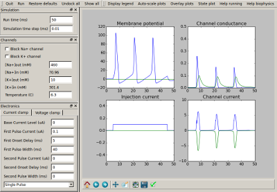
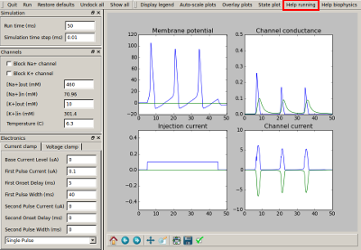

****************
Squid giant axon
****************

This tutorial is an interactive graphical simulation of a squid giant axon,
closely based on the 'Squid' demo by Mark Nelson which ran in GENESIS.

The `squid giant axon <https://en.wikipedia.org/wiki/Squid_giant_axon>`_ is a very large axon that plays a role in the water jet propulsion systems of squid. 

Alan Hodgkin, Andrew Huxley, and John Eccles won the nobel prize in physiology or medicine for their pioneering work on the squid axon. Hodgin and Huxley were the first to qualitatively describe action potentials within neurons. The large diameter of the squid giant axon (0.5 mm to 1 mm) allowed them to affix electrodes and voltage clamps to precisely measure the action potential as it travelled through the axon. They later went on to mathematically describe this in an equation that paved the road for mathematical and computational biology's development. 

This tutorial models the Hodglin-Huxley equation within a neat graphical interface that allows one to change different parameters and see how it affects the resulting action potential. 

   The GUI of the simulation.

The tutorial can be run from within the ``.../moose/moose-examples/squid`` directory by running
::

    python squid_demo.py

in command line from within the directory. 

Once the model loads, you can access the inbuilt documentation by clicking on ``Help running`` in the top right of the window as shown below 

   The "Help running" tab is highlighted in red

The page that pops up will take you through using the GUI, changing the parameters and understanding the model. 

For more details on the biophysics behind the model, you can click on ``Help biophysics`` tab to the immediate right of the ``Help running`` tab (note that for smaller default window sizes, the tab might not be visible and can be accessed by clicking the ``>>`` on the top right corner of the GUI).
