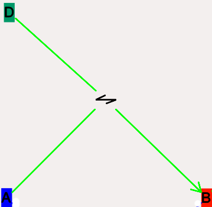
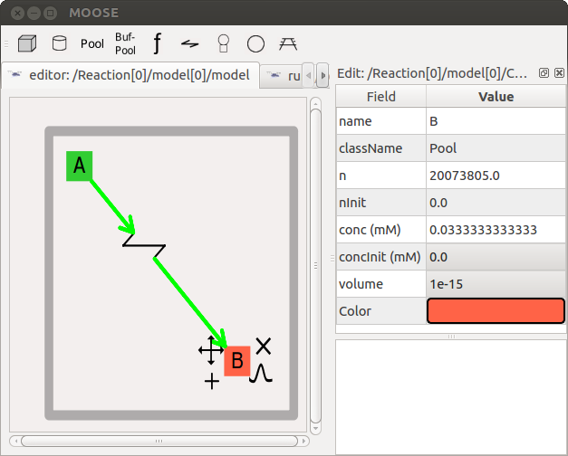

--------------

Kinetikit 12: Interface for chemical kinetic models in MOOSEGUI
===============================================================

Upinder Bhalla, Harsha Rani

Feb 25 2016.

--------------

-  `Introduction <#introduction>`_

-  `**TODO** What are chemical kinetic
   models? <#todo-what-are-chemical-kinetic-models>`_

   -  `Levels of model <#levels-of-model>`_
   -  `Numerical methods <#numerical-methods>`_

-  `Using Kinetikit 12 <#using-kinetikit-12>`_

   -  `Overview <#overview>`_
   -  `Model layout and icons <#model-layout-and-icons>`_

      -  `Compartment <#compartment>`_
      -  `Pool <#pool>`_
      -  `Buffered pools <#buffered-pools>`_
      -  `Reaction <#reaction>`_
      -  `Mass-action enzymes <#mass-action-enzymes>`_
      -  `Michaelis-Menten Enzymes <#michaelis-menten-enzymes>`_
      -  `Function <#function>`_

   -  `Model operations <#model-operations>`_
   -  `Model Building <#model-building>`_

`Introduction <#TOC>`_
----------------------

Kinetikit 12 is a graphical interface for doing chemical kinetic
modeling in MOOSE. It is derived in part from Kinetikit, which was the
graphical interface used in GENESIS for similar models. Kinetikit, also
known as kkit, was at version 11 with GENESIS. Here we start with
Kinetikit 12.

`**TODO** What are chemical kinetic models? <#TOC>`_
----------------------------------------------------

Much of neuronal computation occurs through chemical signaling. For
example, many forms of synaptic plasticity begin with calcium influx
into the synapse, followed by calcium binding to calmodulin, and then
calmodulin activation of numerous enzymes. These events can be
represented in chemical terms:

    4 Ca2+ + CaM <===> Ca4.CaM

Such chemical equations can be modeled through standard Ordinary
Differential Equations, if we ignore space:

    d[Ca]/dt = −4Kf ∗ [Ca]4 ∗ [CaM] + 4Kb ∗ [Ca4.CaM] d[CaM]/dt = −Kf ∗
    [Ca]4 ∗ [CaM] + Kb ∗ [Ca4.CaM] d[Ca4.CaM]/dt = Kf ∗ [Ca]4 ∗ [CaM] −
    Kb ∗ [Ca4.CaM]

MOOSE models these chemical systems. This help document describes how to
do such modelling using the graphical interface, Kinetikit 12.

`Levels of model <#TOC>`_
~~~~~~~~~~~~~~~~~~~~~~~~~

Chemical kinetic models can be simple well-stirred (or point) models, or
they could have multiple interacting compartments, or they could include
space explicitly using reaction-diffusion. In addition such models could
be solved either deterministically, or using a stochastic formulation.
At present Kinetikit handles compartmental models but does not compute
diffusion within the compartments, though MOOSE itself can do this at
the script level. Kkit12 will do deterministic as well as stochastic
chemical calculations.

`Numerical methods <#TOC>`_
~~~~~~~~~~~~~~~~~~~~~~~~~~~

-  **Deterministic**: Adaptive timestep 5th order Runge-Kutta-Fehlberg
   from the GSL (GNU Scientific Library).
-  **Stochastic**: Optimized Gillespie Stochastic Systems Algorithm,
   custom implementation.

`Using Kinetikit 12 <#TOC>`_
----------------------------

`Overview <#TOC>`_
~~~~~~~~~~~~~~~~~~

-  Load models using **``File -> Load model``**. A reaction schematic
   for the chemical system appears in the **``Editor view``** tab.
-  View parameters in **``Editor view``** tab by clicking on icons, and
   looking at entries in **``Properties``** table to the right.
-  Edit parameters by changing their values in the **``Properties``**
   table.
-  From Run View, Pools can be plotted by clicking on their icons and
   dragging the icons onto the plot Window. Presently only concentration
   is plottable.
-  Run models using **``Run``** button.
-  Select numerical method using options under **``Preferences``**
   button in simulation control.
-  Save plots using the icons at the bottom of the **``Plot Window``**.

Most of these operations are detailed in other sections, and are shared
with other aspects of the MOOSE simulation interface. Here we focus on
the Kinetikit-specific items.

`Model layout and icons <#TOC>`_
~~~~~~~~~~~~~~~~~~~~~~~~~~~~~~~~

When you are in the **``Model View``** (``Editor``) tab you will see a collection of
icons, arrows, and grey boxes surrounding these. This is a schematic of
the reaction scheme being modeled. You can view and change parameters,
and change the layout of the model.

.. figure:: ../../images/Moose1.png
   :align: center
   :alt: 

Resizing the model layout and icons:

-  **Zoom**: Comma and period keys. Alternatively, the mouse scroll
   wheel or vertical scroll line on the track pad will cause the display
   to zoom in and out.
-  **Pan**: The arrow keys move the display left, right, up, and down.
-  **Entire Model View**: Pressing the **``a``** key will fit the entire
   model into the entire field of view.
-  **Resize Icons**: Angle bracket keys, that is, **``<``** and
   **``>``** or **``+``** and **``-``**. This resizes the icons while
   leaving their positions on the screen layout more or less the same.
-  **Original Model View**: Presing the **``A``** key (capital ``A``)
   will revert to the original model view including the original icon
   scaling.

`Compartment <#TOC>`_
^^^^^^^^^^^^^^^^^^^^^

The *compartment* in moose is usually a contiguous domain in which a
certain set of chemical reactions and molecular species occur. The
definition is very closely related to that of a cell-biological
compartment. Examples include the extracellular space, the cell
membrane, the cytosol, and the nucleus. Compartments can be nested, but
of course you cannot put a bigger compartment into a smaller one.

-  **Icon**: Grey boundary around a set of reactions.
-  **Moving Compartments**: Click and drag on the boundary.
-  **Resizing Compartment boundary**: Happens automatically when
   contents are repositioned, so that the boundary just contains
   contents.
-  **Compartment editable parameters**:

   -  **``name``**: The name of the compartment.
   -  **``size``**: This is the volume, surface area or length of the
      compartment, depending on its type.

-  **Compartment fixed parameters**:

   -  **``numDimensions``**: This specifies whether the compartment is a
      volume, a 2-D surface, or if it is just being represented as a
      length.

`Pool <#TOC>`_
^^^^^^^^^^^^^^

This is the set of molecules of a given species within a compartment.
Different chemical states of the same molecule are in different pools.

-  **Icon**: |image0| Colored rectangle with pool name in it.
-  **Moving pools**: Click and drag.
-  **Pool editable parameters**:

   -  **``name``**: Name of the pool
   -  **``n``**: Number of molecules in the pool
   -  **``nInit``**: Initial number of molecules in the pool. ``n`` gets
      set to this value when the ``reinit`` operation is done.
   -  **``conc``**: Concentration of the molecules in the pool.

          conc = n \* unit\_scale\_factor / (NA \* vol)

   -  **``concInit``**: Initial concentration of the molecules in the
      pool.

          concInit = nInit \* unit\_scale\_factor / (NA \* vol) ``conc``
          is set to this value when the ``reinit`` operation is done.

-  **Pool fixed parameters**

   -  **``size``**: Derived from the compartment that holds the pool.
      Specifies volume, surface area or length of the holding
      compartment.

`Buffered pools <#TOC>`_
^^^^^^^^^^^^^^^^^^^^^^^^

Some pools are set to a fixed ``n``, that is number of molecules, and
therefore a fixed concentration, throughout a simulation. These are
buffered pools.

-  **Icon**: |image1| Colored rectangle with pool name in it.
-  **Moving Buffered pools**: Click and drag.
-  **Buffered Pool editable parameters**

   -  **``name``**: Name of the pool
   -  **``nInit``**: Fixed number of molecules in the pool. ``n`` gets
      set to this value throughout the run.
   -  **``concInit``**: Fixed concentration of the molecules in the
      pool.

          concInit = nInit \* unit\_scale\_factor / (NA \* vol) ``conc``
          is set to this value throughout the run.

-  **Pool fixed parameters**:

   -  **``n``**: Number of molecules in the pool. Derived from
      ``nInit``.
   -  **``conc``**: Concentration of molecules in the pool. Derived from
      ``concInit``.
   -  **``size``**: Derived from the compartment that holds the pool.
      Specifies volume, surface area or length of the holding
      compartment.

`Reaction <#TOC>`_
^^^^^^^^^^^^^^^^^^

These are conversion reactions between sets of pools. They are
reversible, but you can set either of the rates to zero to get
irreversibility. In the illustration below, **``D``** and **``A``** are
substrates, and **``B``** is the product of the reaction. This is
indicated by the direction of the green arrow.

-  **Icon**: |image2| Reversible reaction arrow.
-  **Moving Reactions**: Click and drag.
-  **Reaction editable parameters**:

   -  name : Name of reaction
   -  K\ :sub:`f`\  : Forward rate of reaction, in
      ``concentration/time`` units. This is the normal way to express
      and manipulate the reaction rate.
   -  k\ :sub:`f`\  : Forward rate of reaction, in ``number/time``
      units. This is used internally for computations, but is
      volume-dependent and should not be used to manipulate the reaction
      rate unless you really know what you are doing.
   -  K\ :sub:`b`\  : Backward rate of reaction, in
      ``concentration/time`` units. This is the normal way to express
      and manipulate the reaction rate.
   -  k\ :sub:`b`\  : Backward rate of reaction, in ``number/time``
      units. This is used internally for computations, but is
      volume-dependent and should not be used to manipulate the reaction
      rate unless you really know what you are doing.

-  **Reaction fixed parameters**:

   -  **numProducts**: Number of product molecules.
   -  **numSubstrates**: Number of substrates molecules.

`Mass-action enzymes <#TOC>`_
^^^^^^^^^^^^^^^^^^^^^^^^^^^^^

These are enzymes that model the chemical equations

    E + S <===> E.S -> E + P

Note that the second reaction is irreversible. Note also that
mass-action enzymes include a pool to represent the **``E.S``**
(enzyme-substrate) complex. In the example below, the enzyme pool is
named **``MassActionEnz``**, the substrate is **``C``**, and the product
is **``E``**. The direction of the enzyme reaction is indicated by the
red arrows.

.. figure:: ../../images/MassActionEnzReac.png
   :align: center
   :alt: 

-  **Icon**: |image3| Colored ellipse atop a small square. The ellipse
   represents the enzyme. The small square represents **``E.S``**, the
   enzyme-substrate complex. The ellipse icon has the same color as the
   enzyme pool **``E``**. It is connected to the enzyme pool **``E``**
   with a straight line of the same color.

   The ellipse icon sits on a continuous, typically curved arrow in red,
   from the substrate to the product.

   A given enzyme pool can have any number of enzyme activities, since
   the same enzyme might catalyze many reactions.

-  **Moving Enzymes**: Click and drag on the ellipse.
-  **Enzyme editable parameters**

   -  name : Name of enzyme.
   -  K\ :sub:`m`\  : Michaelis-Menten value for enzyme, in
      ``concentration`` units.
   -  k\ :sub:`cat`\  : Production rate of enzyme, in ``1/time`` units.
      Equal to k\ :sub:`3`\ , the rate of the second, irreversible
      reaction.
   -  k\ :sub:`1`\  : Forward rate of the **E+S** reaction, in number
      and ``1/time`` units. This is what is used in the internal
      calculations.
   -  k\ :sub:`2`\ : Backward rate of the **E+S** reaction, in
      ``1/time`` units. Used in internal calculations.
   -  k\ :sub:`3`\ : Forward rate of the **E.S -> E + P** reaction, in
      ``1/time`` units. Equivalent to k\ :sub:`cat`\ . Used in internal
      calculations.
   -  ratio: This is equal to k\ :sub:`2`\ /k\ :sub:`3`\ . Needed to
      define the internal rates in terms of K\ :sub:`m`\  and
      k\ :sub:`cat`\ . I usually use a value of 4.

-  **Enzyme-substrate-complex editable parameters**: These are identical
   to those of any other pool.

   -  **name**: Name of the **``E.S``** complex. Defaults to
      **``<enzymeName>_cplx``**.
   -  **n**: Number of molecules in the pool
   -  **nInit**: Initial number of molecules in the complex. ``n`` gets
      set to this value when the ``reinit`` operation is done.
   -  **conc**: Concentration of the molecules in the pool.

          conc = n \* unit\_scale\_factor / (NA \* vol)

   -  **``concInit``**: Initial concentration of the molecules in the
      pool.

          concInit = nInit \* unit\_scale\_factor / (NA \* vol) ``conc``
          is set to this value when the ``reinit`` operation is done.

-  **Enzyme-substrate-complex fixed parameters**:

   -  **size**: Derived from the compartment that holds the pool.
      Specifies volume, surface area or length of the holding
      compartment. Note that the Enzyme-substrate-complex is assumed to
      be in the same compartment as the enzyme molecule.

`Michaelis-Menten Enzymes <#TOC>`_
^^^^^^^^^^^^^^^^^^^^^^^^^^^^^^^^^^

These are enzymes that obey the Michaelis-Menten equation

    V = Vmax \* [S] / ( Km + [S] ) = kcat \* [Etot] \* [S] / ( Km + [S]
    )

where

-  V\ :sub:`max`\  is the maximum rate of the enzyme
-  [Etot] is the total amount of the enzyme
-  K\ :sub:`m`\  is the Michaelis-Menten constant
-  S is the substrate.

Nominally these enzymes model the same chemical equation as the
mass-action enzyme:

    E + S <===> E.S -> E + P

but they make the assumption that the **``E.S``** is in a
quasi-steady-state with **``E``** and **``S``**, and they also ignore
sequestration of the enzyme into the complex. So there is no
representation of the **``E.S``** complex. In the example below, the
enzyme pool is named **``MM_Enz``**, the substrate is **``E``**, and the
product is **``F``**. The direction of the enzyme reaction is indicated
by the red arrows.

.. figure:: ../../images/MM_EnzReac.png
   :align: center
   :alt: 

-  **Icon**: |image4| Colored ellipse. The ellipse represents the enzyme
   The ellipse icon has the same color as the enzyme **``MM_Enz``**. It
   is connected to the enzyme pool **``MM_Enz``** with a straight line
   of the same color. The ellipse icon sits on a continuous, typically
   curved arrow in red, from the substrate to the product. A given
   enzyme pool can have any number of enzyme activities, since the same
   enzyme might catalyze many reactions.
-  **Moving Enzymes**: Click and drag.
-  **Enzyme editable parameters**:

   -  name: Name of enzyme.
   -  K\ :sub:`m`\ : Michaelis-Menten value for enzyme, in
      ``concentration`` units.
   -  k\ :sub:`cat`\ : Production rate of enzyme, in ``1/time`` units.
      Equal to k\ :sub:`3`\ , the rate of the second, irreversible
      reaction.

`Function <#TOC>`_
^^^^^^^^^^^^^^^^^^

Function objects can be used to evaluate expressions with arbitrary
number of variables and constants. We can assign expression of the form:

f(c0, c1, ..., cM, x0, x1, ..., xN, y0,..., yP )

where ci‘s are constants and xi‘s and yi‘s are variables.

It can parse mathematical expression defining a function and evaluate it
and/or its derivative for specified variable values. The variables can
be input from other moose objects. In case of arbitrary variable names,
the source message must have the variable name as the first argument.

-  **Icon**: Colored rectangle with pool name. This is **``ƒ``** in the
   example image below. The input pools **``A``** and **``B``** connect
   to the **ƒ** with blue arrows. The function ouput's to BuffPool

`Model operations <#TOC>`_
~~~~~~~~~~~~~~~~~~~~~~~~~~

-  **Loading models**: **``File -> Load Model -> select from dialog``**.
   This operation makes the previously loaded model disable and loads
   newly selected models in **``Model View``**
-  **New**: **``File -> New -> Model name``**. This opens a empty widget
   for model building
-  **Saving models**: **``File -> Save Model -> select from dialog``**.
-  **Changing numerical methods**: **``Preference->Chemical tab``** item
   from Simulation Control. Currently supports:

   -  Runge Kutta: This is the Runge-Kutta-Fehlberg implementation from
      the GNU Scientific Library (GSL). It is a fifth order variable
      timestep explicit method. Works well for most reaction systems
      except if they have very stiff reactions.
   -  Gillespie: Optimized Gillespie stochastic systems algorithm,
      custom implementation. This uses variable timesteps internally.
      Note that it slows down with increasing numbers of molecules in
      each pool. It also slows down, but not so badly, if the number of
      reactions goes up.
   -  Exponential Euler:This methods computes the solution of partial
      and ordinary differential equations.

`Model building <#TOC>`_
~~~~~~~~~~~~~~~~~~~~~~~~

-  The Edit Widget includes various menu options and model icons on the
   top.\* Use the mouse buttton to click and drag icons from toolbar to
   Edit Widget, two things will happen, icon will appear in the editor
   widget and a object editor will pop up with lots of parameters with
   respect to moose object. Rules:

   ::

      *    Firstly Compartment has to be created.
       (At present only single compartment model is allowed)

   -  Enzyme should be dropped on a pool as parent and function should
      be dropped on buffPool for output

   -  Drag in pool's and reaction on to the editor widget, now one can
      set up a reaction.Click on mooseObject drag the mouse (a black dotted line for ExpectedConnection will appear)
      to any object for connection.
      E.g Pool to reaction and reaction to pool. Pool to function and function to Pool.
      Specific connection type gets specific colored arrow. E.g.
      Green color arrow for specifying connection between reactant and
      product for reaction. Second order reaction can also be done by
      repeating the connection over again
   -  Each connection can be deleted and using rubberband selection each moose object can be deleted
   -  When clicked on pool object 4 icons comes up

      |delete| : This deletes the object, its associated connection and if its enzyme's parent then enzyme and its associated connection is also deleted.

      |clone|  : Clones the object

      |move|   : Object can be moved around

      |plot|   : Plot the object in plotWidget at Graph 1

      Note: Missing icon means the operation is not permitted 

.. figure:: ../../images/Chemical_run.png
   :align: center
   :alt: 

-  From run widget, pools are draggable to plot window for plotting.
   (Currently **``conc``** is plotted as default field) Plots are
   color-coded as per in model.
-  Model can be run by clicking start button. One can stop button in
   mid-stream and start up again without affectiong the calculations.
   The reset button clears the simulation.

.. |image0| image:: ../../images/Pool.png
.. |image1| image:: ../../images/BufPool.png
.. |image2| image:: ../../images/KkitReacIcon.png
.. |image3| image:: ../../images/MassActionEnzIcon.png
.. |image4| image:: ../../images/MM_EnzIcon.png
.. |delete| image:: ../../images/delete.png
.. |clone| image:: ../../images/clone.png
.. |move| image:: ../../images/move.png
.. |plot| image:: ../../images/plot.png